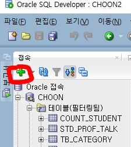
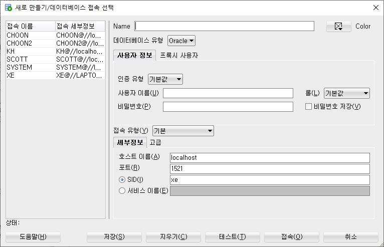

# JDBC 복습

> # Setting
> ## 1. Oracle 데이터베이스 연결

- 데이터베이스 유저를 만든다.
  - 사용 데이터베이스 DBMS: Oracle 11g xe
  - 데이터베이스 tool: Oracle SQL Developer

  - CHOON2 계정을 만든다.
    ```sql
    -- CHOON2 계정을 만든다.
    CREATE USER CHOON2 IDENTIFIED BY CHOON2;

    -- CHOON2은 SYSTEM계정으로부터 RESOURCE(자원)과 CONNECT(연결) 권한을  받는다.
    GRANT RESOURCE, CONNECT TO CHOON2;
    ```

  - CHOON2 계정을 등록한다.
    - `접속` 사이드 창의 **초록색 +** 클릭
      

    - 새로만들기 / 데이터베이스 접속 창
      
      - 아래의 사진과 같은 창에서 입력한다
        - Name: CHOON2 (등록한 데이터베이스 호칭)
        - 사용자이름: CHOON2 (등록한 데이터베이스 유저 이름)
        - 비밀번호: CHOON2   (등록한 데이터베이스 유저 비밀번호)
        - 테스트 버튼을 누를 때 왼쪽 하단 `상태`가 `성공`이 나오면 된다.


- sql파일을 워크스페이스에 끌은 뒤(또는 sql파일을 열어서) 쿼리 실행.
- 테이블을 만들어놓으면 세팅 끝

<br>

> ## 2. java eclipse setting

- 새로운 워크스페이스를 만들 때마다 인코딩방식을 변경해야한다.
- 워크스페이스의 변경이 없다면
  - 새로운 자바프로젝트를 생성할 때마다 ojdbc6을 추가해야한다.

- Ojdbc6을 찾는다.
  - windows10 : `C:\oraclexe\app\oracle\product\11.2.0\server\jdbc\lib` 에 Ojdbc6.jar 파일을 복사하여, 이클립스 워크스페이스 경로에 붙여넣는다.

- 텍스트파일 인코딩 변경하기
  - eclipse의 `Windows` 창
  - `WorkSpace` 클릭
  - `Text file encoding` 에서  `Other 라디오(동그라미)버튼`클릭
    - `UTF-8`로 변경한다.
  - `Apply 버튼` 클릭

- Spelling `utf-8` 로 변경
  - eclipse `Windows`창에서 `spelling` 검색
  - Spelling은 General > Editors > Text Editors > Spelling 에 위치함.
  - `Encoding`은 `Default(UTF-8)`을 선택한다.
  - `Apply and Close 버튼` 클릭

- 자바프로젝트에 ojdbc6.jar 파일을 추가한다.
  - Package Explorer에서 생성된 자바프로젝트 우클릭 > Properties
  - `Java Build Path 좌측탭` 클릭
  - `Libraries 탭` 클릭
  - `Add External JARs ..` 버튼 클릭
  - 복사해놓은 ojdbc6.jar 파일을 업로드.
  - `Apply and Close 버튼` 클릭


<hr>


> ## 3. JDBC 실습 1


<hr>

> ## 4. JDBC 실습 2
