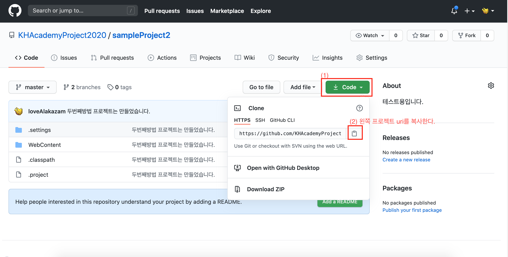
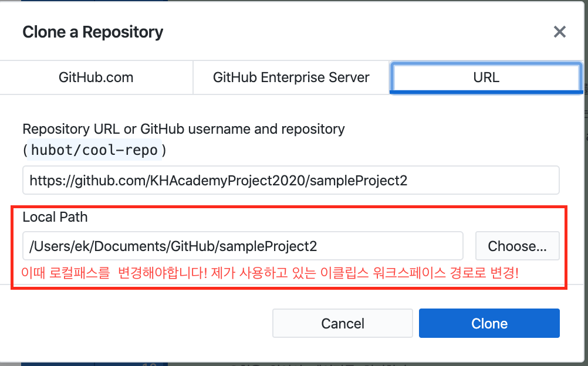
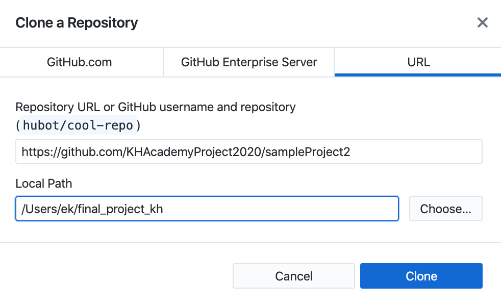
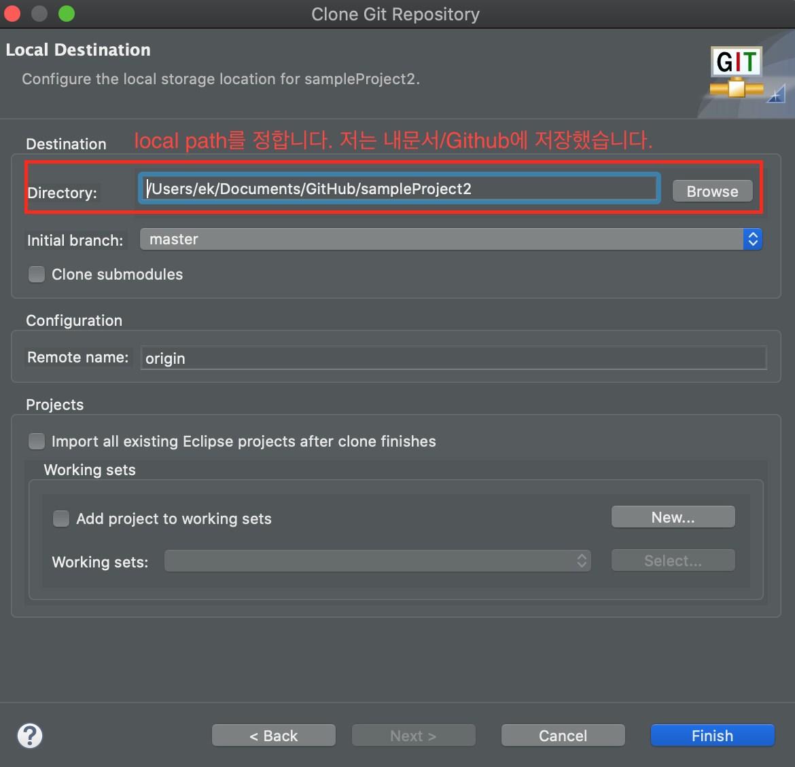
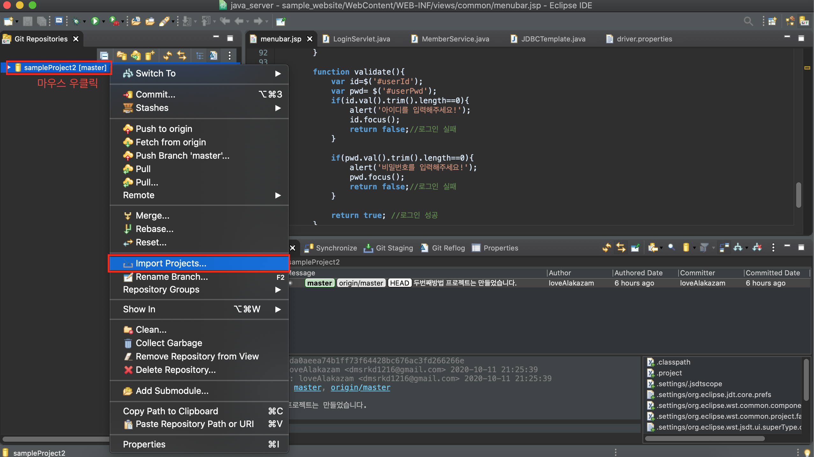
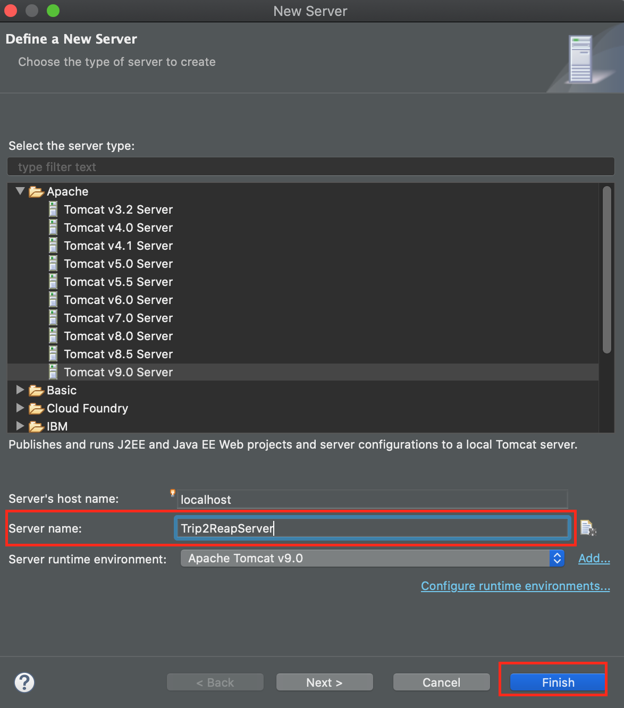
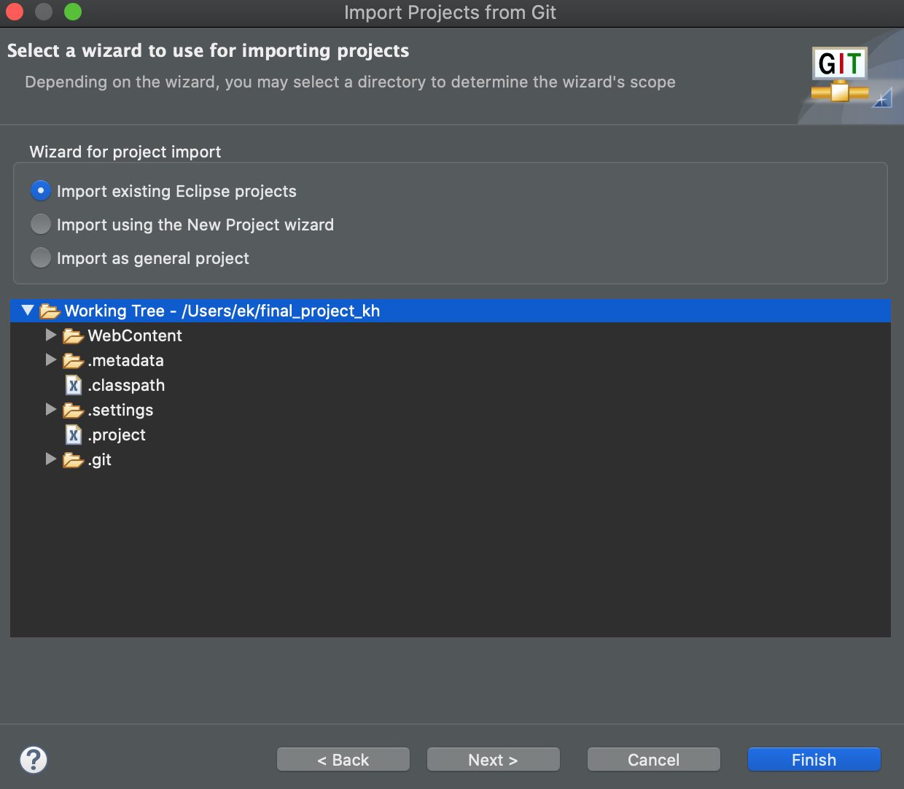
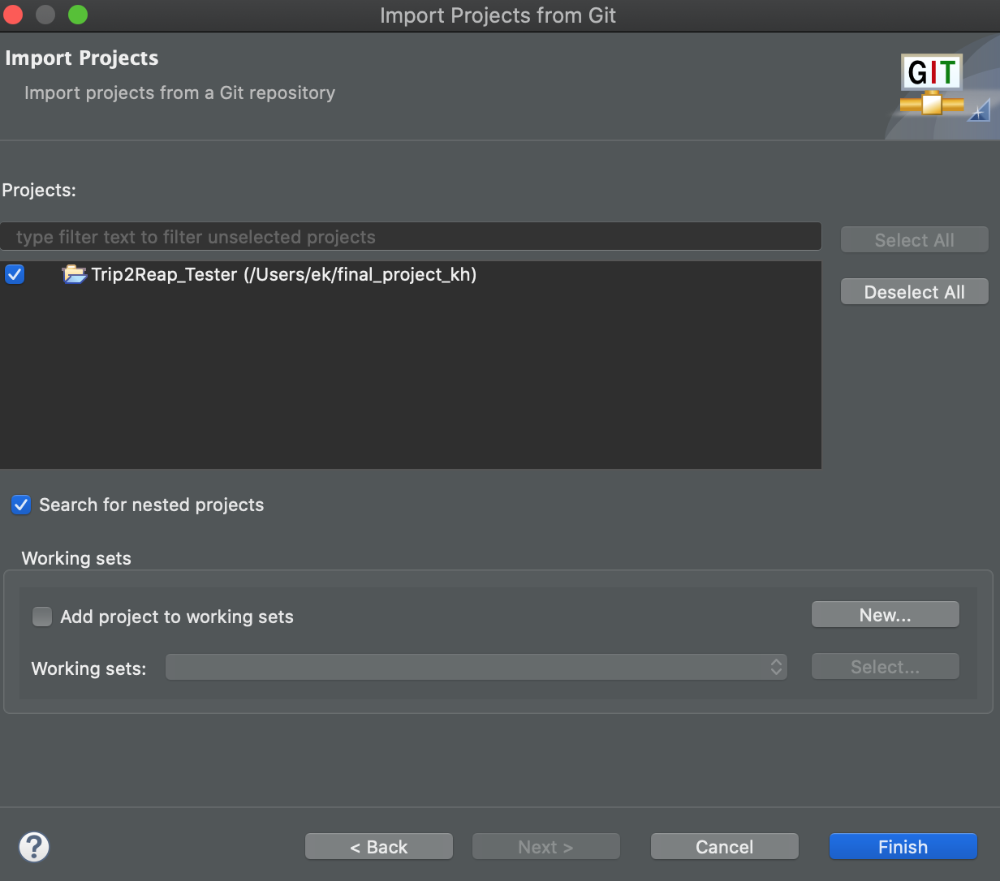

# Github과 이클립스 프로젝트 연결하기

 

# 방법1 - eclipse내에서 프로젝트와 git 연결하여 공동 프로젝트 작업하기.

- eclipse에서 프로젝트를 git과 연결한다.
- 장점: 연결과정이 어렵고, 팀원마다 각각 연결해야된다. 한번 연결하면 동시작업이 용이.
- 이 방법으로 시도하다가 ~내 필기자료 다 날라갔다...ㅠ.ㅠ~

- #### 참고자료
  - [eclipse프로젝트를 github에 연동해서 형상관리하기-준스파파](https://junspapa-itdev.tistory.com/46)

  - [Java프로젝트에 Github에 쉽게 연동하기(with Eclipse)- 프로삽질러 개발로그](https://d-e-v.tistory.com/3)

  - [Github에 있는 자바프로젝트를 이클립스에 import시키기](https://zgundam.tistory.com/161)
    - 기쁨, 규호, 수진L, 수진K 가 봐야될 부분입니다.

- #### **주의사항**

> ## 1. 이클립스 프로젝트를 Github와 연결하기 - 프로삽질러 개발로그 참고

> ## 2. Github에 있는 자바프로젝트를 이클립스에 받는 방법 - zgundam 티스토리블로그 참고

### 1. 새 폴더를 만듭니다.

- 이 새 폴더(final_project_kh)는 앞으로 여러분이 사용하게 될 eclipse workspace 입니다.
- 제가 만든 새폴더의 디렉토리 경로는 `/Users/ek/final_project_kh`이고,
- eclipse workspace 경로입니다.

 

- 깃허브 래포지토리를 이클립스프로젝트를 다운로드하는 방법은 3가지가 있습니다.
  - (방법1) github desktop을 이용
  - (방법2) git bash를 이용

  

- 방법은 각자가 편하다고 생각하는 방법으로 하면됩니다. 저는 (방법1)로 진행하겠습니다.

### 2. (방법1) 깃허브 desktop을 이용하는 방법

- (1) 초록색버튼 Code 클릭
- (2) Open with Github Desktop

  

### 3. local path를 이클립스 workspace 경로로 설정하기

 

 

- clone repository를 성공시킨 모습은 아래와 같습니다!

  

### 4. 이클립스를 켭니다.

- local path를 찾습니다. 저의 local path는 `/Users/ek/final_project_kh` 입니다.

 

- 언어 encoding/spelling 설정이 잘되어 있는지 확인해주세요!
  - ### [windows10 - encoding/spelling 세팅](# 4-3 eclipse 인코딩 설정하기)
  - mac os는 기본언어가 utf-8이라서 윈도우와 다르게 따로 설정할 필요없습니다.

  

### 5. github에 있는 자바 프로젝트 import하기

- ### (1) Project Explorer에서 `import projects...` 클릭!
- ### (2) `Git` > `Projects from Git` 클릭 후 Next
- ### (3) `Existing local repository` 클릭 후 Next
- ### (4) `Add` 클릭 > Browse클릭
  - Directory는 local path 디렉토리경로를 올립니다. (저의경우는, `/Users/ek/final_project_kh` 네요.)
  - Search results에 나오는 .git을 체크!
  - 아래 사진처럼 나와야됩니다!
- ### (5) Finish버튼 클릭

 

 

- ### (6) 아래 사진처럼 나왔다면, next버튼 클릭

 

- ### (7) `import existing Eclipse project` 선택 후 next 버튼 클릭

 

- ### (8) 사진처럼 프로젝트가 존재하면, Finish버튼 클릭!

### 6.

  

# 방법2 - githubDesktop을 이용하여 프로젝트와 연결하여 공동 프로젝트 작업하기.

- loveAlakazam(최은강)이 제안한 방법
- 장점: githubDesktop만 있다면, 연결과정이 쉽다. 그러나 인코딩 표현이 달라지면 깨질 가능성이 높다.

> ## Github Desktop 설치하기

## 1. [Github desktop 설치 페이지](https://desktop.github.com/)

## 2. **`Download for Windows(64bit)`** 버튼 클릭

- ### :point_down: github desktop 화면
- 단, **github계정으로 로그인해야합니다!**

  

## 3. Final-Project Repository 연결하기.

> ### 3-1 상단메뉴 **`File`**  클릭
> ### 3-2 **`Clone Repository`** 클릭

 

> ### 3-3 `Final-Project` 프로젝트 클론하여 **로컬저장소** 만들기

  

 

- ### `로컬 저장소` 위치는 사진에서 보이는 것과 같이 **`내문서/Github`** 으로 해주세요.

- ### **즉, `Local path`를 변경하지 말고, 그대로 두세요.**

 

- **로컬 저장소** 와 **원격 저장소**
  - **로컬 저장소**: 개인 컴퓨터(로컬)에서 코드 저장소를 의미합니다.
  - **원격 저장소**: 깃헙 웹사이트 코드 저장소를 의미합니다. 즉 로컬저장소에서 코드를 push하면 원격저장소에 저장이 됩니다.

  

## 4. 샘플 프로젝트(`Sample_WebProject`) 불러오기

> ### 4-1 연결 후, 로컬저장소 확인하기.
  - 제 로컬 저장소 위치는 **`내문서/Github/Final-Project`** 입니다.

 

> ### 4-2 eclipse를 켜서 `Sample_WebProject`를 엽니다.

 

- 샘플 프로젝트 위치(**`로컬저장소 위치`**)는 **`내문서/Github/Final-Project/Sample_WebProject`** 입니다.
  - 샘플은 연동방법을 숙지하기 위해서 만들어놓은 임시 프로젝트입니다!

 

- Final 프로젝트 최종코드는 `내문서/Github/Final-Project/Trip2reap_TeamCode` 입니다.

  

> ### 4-3 eclipse 인코딩 설정하기

- #### `Window` 상단 탭 메뉴 > `Preferences`

 

- ### 검색란에 `encoding` 입력후, **Encoding을 `ISO 10646/Unicode(UTF-8)`로 설정**

- ### General > Workspace
  - `Apply` 버튼 클릭

 

- ### Web > CSS Files
  - `Apply` 버튼 클릭

 

- ### Web > HTML Files
  - `Apply` 버튼 클릭

 

- ### Web > JSP Files
  - `Apply and Close` 버튼 클릭

 

- ### 검색란에 `spelling` 입력 후, **Encoding을 `UTF-8`로 설정**

  

## 5. Github Pushing하기

- index.jsp 파일에 코드를 추가 및 수정 하거나
- 새로운 파일을 만들어보세요.
- 그 다음에 Github Desktop에서 commit을 눌러주세요.

 

 

- 저는 errorPage.jsp를 추가했습니다.
- ### 수정되거나 새로운 파일이 추가되면, `Package Explorer`을 보면 파일이나 프로젝트에 **`?`** 표시가 뜹니다.
- ### 즉, 파일 수정과 추가가 일어났으며, 변경사항이 생겼으므로 *커밋을 해야한다*는 걸 의미해요.

 

- Github Desktop 변동내용

 

- ### 먼저 다른 사람이 공동작업을 할 수 있으니, **`Fetch Origin`** 버튼을 눌러서 **pull**합시다.

 

- ###  **`Fetch Origin`** 버튼을 눌렀음에도 **`pull`** 이 없으면, **push**를 해도 됩니다.

- ### commit버튼을 누르면 **`push`** 버튼을 누르라고 떠요.

 

**push**란?

- **업로드**를 의미합니다.
- 로컬컴퓨터에서 작성한 코드를 [원격저장소](https://github.com/KHAcademyProject2020/Final-Project)에 올립니다.
- 즉, **원격 저장소**는 모든 코드작성자들의 최종산물이라고 보면됩니다.
  - 김기쁨, 김수진, 이수진, 이규호, 최은강 5명이 올린 전체코드가 [원격저장소](https://github.com/KHAcademyProject2020/Final-Project)에 있습니다.

## 6. 다른사람 코드를 Pull 받기

- `Fetch Origin` 클릭

- `pull`이 존재하면, 버튼 클릭!

- **`pull`** 은 **다운로드**를 의미합니다.

## 7. Merge

- 여러사람이 공동작업을 할 때, **코드를 합치는 것** 을 의미합니다.
- 주의사항은 *pull을 안한 상태에서, 동시에 작업한 코드를 push하면 충돌이 일어납니다!*
