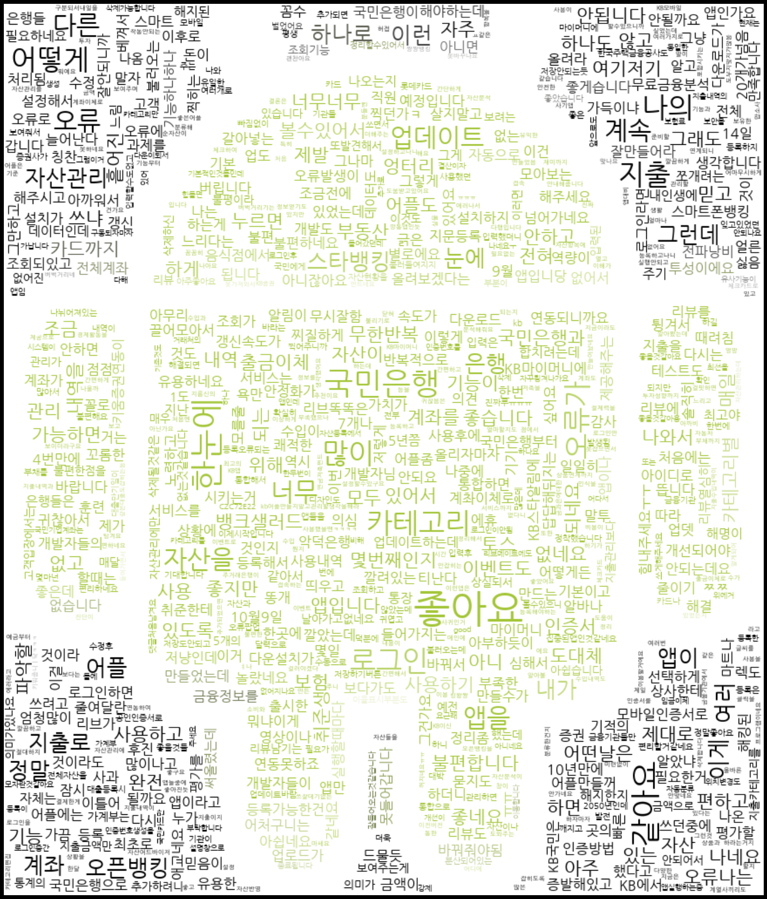
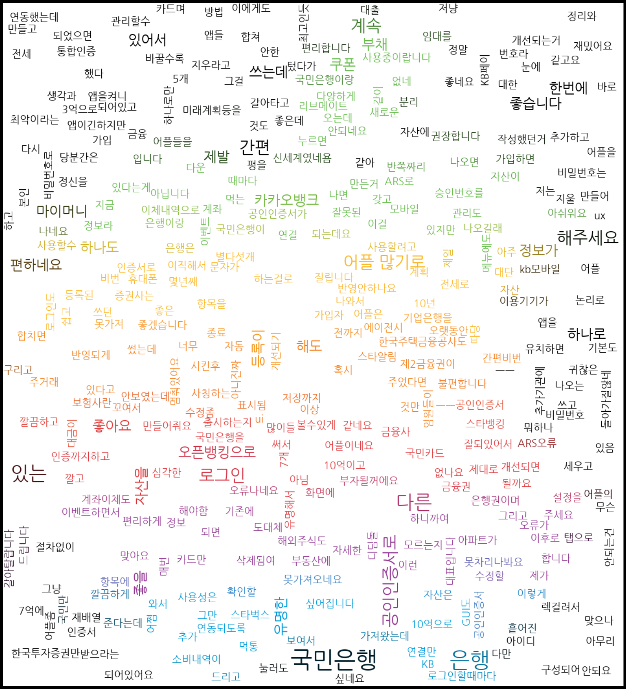

# WordCloud 만들기

```python

import matplotlib.pyplot as plt
%matplotlib inline
from wordcloud import WordCloud, STOPWORDS, ImageColorGenerator
from PIL import Image
import pandas as pd
import numpy as np
import os

def getImageColors(maskImgPath):
    maskMatrix= np.array(Image.open(maskImgPath))
    return maskMatrix

def makeWordClouds(imageMatrix, inputFilePath):
    df_sheet= pd.read_excel(inputFilePath)
    review_lists=list(df_sheet['내용'])
    review_txt=' '.join(review_lists)
    
    #word cloud를 만든다.
    wc= WordCloud(font_path="./NanumGothic.ttf",
                  min_font_size=1,
                  max_font_size=45, 
                  max_words=2000,
                  background_color='white',
                  mask=imageMatrix)
    
    wc.generate(review_txt)
    f=plt.figure(figsize=(30,30))
    
    plt.imshow(wc.recolor(color_func=ImageColorGenerator(imageMatrix)),
               interpolation='bilinear')
    plt.axis('off')
    plt.show()
```


> ### 안드로이드 마스크로 워드클라우드 만든 결과




<BR>

> ### 애플 로고 마스크로 워드클라우드 만든 결과


