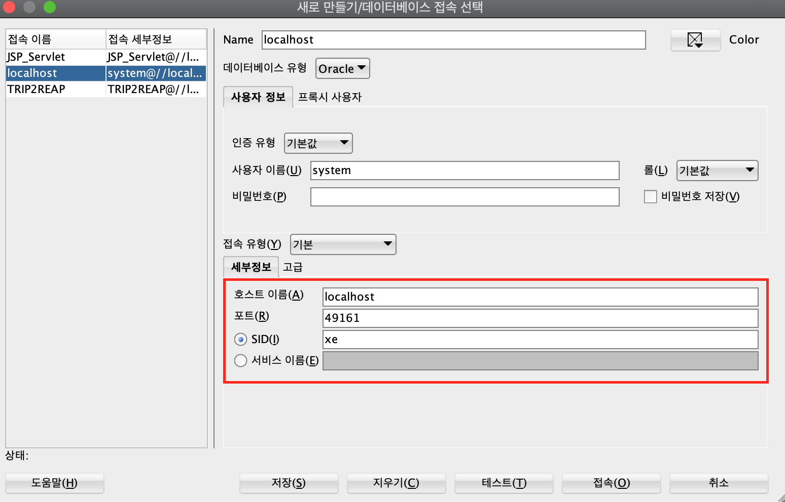

> ## 하나의 스프링프로젝트에 2개 이상의 데이터베이스를 연결할 수 있을까?

<br>

# 🧐  문제 상황 설명

- 팀원들은 모두 windows os이다. 그래서 oracle url이 `jdbc:oracle:thin:@localhost:1521:xe` 로 등록됐다.

- 그러나 나는 맥북을 사용한다. 나는 **49161** 포트번호를 사용한다. 왜냐하면 도커를 연결해서 sqldeveloper을 사용하기 때문이다.

- 나는 데이터베이스와 관련된 부분에서는 모두 에러메시지가 뜬다!

<br>




<br>

- 발생하는 에러메시지는 다음과 같다. 정말길다!

```
11월 10, 2020 11:06:31 오후 org.apache.catalina.core.StandardWrapperValve invoke
SEVERE: 경로 [/reap]의 컨텍스트 내의 서블릿 [reviewServlet]을(를) 위한 Servlet.service() 호출이, 근본 원인(root cause)과 함께, 예외 [Request processing failed; nested exception is org.mybatis.spring.MyBatisSystemException: nested exception is org.apache.ibatis.exceptions.PersistenceException: 
### Error querying database.  Cause: org.springframework.jdbc.CannotGetJdbcConnectionException: Failed to obtain JDBC Connection; nested exception is org.apache.commons.dbcp.SQLNestedException: Cannot create PoolableConnectionFactory (IO 오류: The Network Adapter could not establish the connection)
### The error may exist in mapper/review-mapper.xml
### The error may involve reviewMapper.getListCount
### The error occurred while executing a query
### Cause: org.springframework.jdbc.CannotGetJdbcConnectionException: Failed to obtain JDBC Connection; nested exception is org.apache.commons.dbcp.SQLNestedException: Cannot create PoolableConnectionFactory (IO 오류: The Network Adapter could not establish the connection)]을(를) 발생시켰습니다.
java.net.ConnectException: Connection refused (Connection refused)
	at java.base/java.net.PlainSocketImpl.socketConnect(Native Method)
	at java.base/java.net.AbstractPlainSocketImpl.doConnect(AbstractPlainSocketImpl.java:399)
	at java.base/java.net.AbstractPlainSocketImpl.connectToAddress(AbstractPlainSocketImpl.java:242)
	at java.base/java.net.AbstractPlainSocketImpl.connect(AbstractPlainSocketImpl.java:224)
	at java.base/java.net.SocksSocketImpl.connect(SocksSocketImpl.java:403)
	at java.base/java.net.Socket.connect(Socket.java:608)
	at oracle.net.nt.TcpNTAdapter.connect(TcpNTAdapter.java:150)
	at oracle.net.nt.ConnOption.connect(ConnOption.java:133)
	at oracle.net.nt.ConnStrategy.execute(ConnStrategy.java:370)
	at oracle.net.resolver.AddrResolution.resolveAndExecute(AddrResolution.java:434)
	at oracle.net.ns.NSProtocol.establishConnection(NSProtocol.java:687)
	at oracle.net.ns.NSProtocol.connect(NSProtocol.java:247)
	at oracle.jdbc.driver.T4CConnection.connect(T4CConnection.java:1102)
	at oracle.jdbc.driver.T4CConnection.logon(T4CConnection.java:320)
	at oracle.jdbc.driver.PhysicalConnection.<init>(PhysicalConnection.java:546)
	at oracle.jdbc.driver.T4CConnection.<init>(T4CConnection.java:236)
	at oracle.jdbc.driver.T4CDriverExtension.getConnection(T4CDriverExtension.java:32)
	at oracle.jdbc.driver.OracleDriver.connect(OracleDriver.java:521)
	at org.apache.commons.dbcp.DriverConnectionFactory.createConnection(DriverConnectionFactory.java:38)
	at org.apache.commons.dbcp.PoolableConnectionFactory.makeObject(PoolableConnectionFactory.java:582)
	at org.apache.commons.dbcp.BasicDataSource.validateConnectionFactory(BasicDataSource.java:1556)
	at org.apache.commons.dbcp.BasicDataSource.createPoolableConnectionFactory(BasicDataSource.java:1545)
	at org.apache.commons.dbcp.BasicDataSource.createDataSource(BasicDataSource.java:1388)
	at org.apache.commons.dbcp.BasicDataSource.getConnection(BasicDataSource.java:1044)
	at org.springframework.jdbc.datasource.DataSourceUtils.fetchConnection(DataSourceUtils.java:158)
	at org.springframework.jdbc.datasource.DataSourceUtils.doGetConnection(DataSourceUtils.java:116)
	at org.springframework.jdbc.datasource.DataSourceUtils.getConnection(DataSourceUtils.java:79)
	at org.mybatis.spring.transaction.SpringManagedTransaction.openConnection(SpringManagedTransaction.java:82)
	at org.mybatis.spring.transaction.SpringManagedTransaction.getConnection(SpringManagedTransaction.java:68)
	at org.apache.ibatis.executor.BaseExecutor.getConnection(BaseExecutor.java:336)
	at org.apache.ibatis.executor.SimpleExecutor.prepareStatement(SimpleExecutor.java:86)
	at org.apache.ibatis.executor.SimpleExecutor.doQuery(SimpleExecutor.java:62)
	at org.apache.ibatis.executor.BaseExecutor.queryFromDatabase(BaseExecutor.java:324)
	at org.apache.ibatis.executor.BaseExecutor.query(BaseExecutor.java:156)
	at org.apache.ibatis.executor.CachingExecutor.query(CachingExecutor.java:109)
	at org.apache.ibatis.executor.CachingExecutor.query(CachingExecutor.java:83)
	at org.apache.ibatis.session.defaults.DefaultSqlSession.selectList(DefaultSqlSession.java:147)
	at org.apache.ibatis.session.defaults.DefaultSqlSession.selectList(DefaultSqlSession.java:140)
	at org.apache.ibatis.session.defaults.DefaultSqlSession.selectOne(DefaultSqlSession.java:76)
	at org.apache.ibatis.session.defaults.DefaultSqlSession.selectOne(DefaultSqlSession.java:70)
	at java.base/jdk.internal.reflect.NativeMethodAccessorImpl.invoke0(Native Method)
	at java.base/jdk.internal.reflect.NativeMethodAccessorImpl.invoke(NativeMethodAccessorImpl.java:62)
	at java.base/jdk.internal.reflect.DelegatingMethodAccessorImpl.invoke(DelegatingMethodAccessorImpl.java:43)
	at java.base/java.lang.reflect.Method.invoke(Method.java:566)
	at org.mybatis.spring.SqlSessionTemplate$SqlSessionInterceptor.invoke(SqlSessionTemplate.java:433)
	at com.sun.proxy.$Proxy8.selectOne(Unknown Source)
	at org.mybatis.spring.SqlSessionTemplate.selectOne(SqlSessionTemplate.java:158)
	at trip.two.reap.review.model.dao.ReviewDAO.getListCount(ReviewDAO.java:17)
	at trip.two.reap.review.model.service.ReviewServiceImpl.getListCount(ReviewServiceImpl.java:24)
	at trip.two.reap.review.controller.ReviewController.reviewList(ReviewController.java:32)
	at java.base/jdk.internal.reflect.NativeMethodAccessorImpl.invoke0(Native Method)
	at java.base/jdk.internal.reflect.NativeMethodAccessorImpl.invoke(NativeMethodAccessorImpl.java:62)
	at java.base/jdk.internal.reflect.DelegatingMethodAccessorImpl.invoke(DelegatingMethodAccessorImpl.java:43)
	at java.base/java.lang.reflect.Method.invoke(Method.java:566)
	at org.springframework.web.method.support.InvocableHandlerMethod.doInvoke(InvocableHandlerMethod.java:190)
	at org.springframework.web.method.support.InvocableHandlerMethod.invokeForRequest(InvocableHandlerMethod.java:138)
	at org.springframework.web.servlet.mvc.method.annotation.ServletInvocableHandlerMethod.invokeAndHandle(ServletInvocableHandlerMethod.java:105)
	at org.springframework.web.servlet.mvc.method.annotation.RequestMappingHandlerAdapter.invokeHandlerMethod(RequestMappingHandlerAdapter.java:878)
	at org.springframework.web.servlet.mvc.method.annotation.RequestMappingHandlerAdapter.handleInternal(RequestMappingHandlerAdapter.java:792)
	at org.springframework.web.servlet.mvc.method.AbstractHandlerMethodAdapter.handle(AbstractHandlerMethodAdapter.java:87)
	at org.springframework.web.servlet.DispatcherServlet.doDispatch(DispatcherServlet.java:1040)
	at org.springframework.web.servlet.DispatcherServlet.doService(DispatcherServlet.java:943)
	at org.springframework.web.servlet.FrameworkServlet.processRequest(FrameworkServlet.java:1006)
	at org.springframework.web.servlet.FrameworkServlet.doGet(FrameworkServlet.java:898)
	at javax.servlet.http.HttpServlet.service(HttpServlet.java:626)
	at org.springframework.web.servlet.FrameworkServlet.service(FrameworkServlet.java:883)
	at javax.servlet.http.HttpServlet.service(HttpServlet.java:733)
	at org.apache.catalina.core.ApplicationFilterChain.internalDoFilter(ApplicationFilterChain.java:231)
	at org.apache.catalina.core.ApplicationFilterChain.doFilter(ApplicationFilterChain.java:166)
	at org.apache.tomcat.websocket.server.WsFilter.doFilter(WsFilter.java:53)
	at org.apache.catalina.core.ApplicationFilterChain.internalDoFilter(ApplicationFilterChain.java:193)
	at org.apache.catalina.core.ApplicationFilterChain.doFilter(ApplicationFilterChain.java:166)
	at org.springframework.web.filter.CharacterEncodingFilter.doFilterInternal(CharacterEncodingFilter.java:201)
	at org.springframework.web.filter.OncePerRequestFilter.doFilter(OncePerRequestFilter.java:119)
	at org.apache.catalina.core.ApplicationFilterChain.internalDoFilter(ApplicationFilterChain.java:193)
	at org.apache.catalina.core.ApplicationFilterChain.doFilter(ApplicationFilterChain.java:166)
	at org.apache.catalina.core.StandardWrapperValve.invoke(StandardWrapperValve.java:202)
	at org.apache.catalina.core.StandardContextValve.invoke(StandardContextValve.java:96)
	at org.apache.catalina.authenticator.AuthenticatorBase.invoke(AuthenticatorBase.java:541)
	at org.apache.catalina.core.StandardHostValve.invoke(StandardHostValve.java:139)
	at org.apache.catalina.valves.ErrorReportValve.invoke(ErrorReportValve.java:92)
	at org.apache.catalina.valves.AbstractAccessLogValve.invoke(AbstractAccessLogValve.java:690)
	at org.apache.catalina.core.StandardEngineValve.invoke(StandardEngineValve.java:74)
	at org.apache.catalina.connector.CoyoteAdapter.service(CoyoteAdapter.java:343)
	at org.apache.coyote.http11.Http11Processor.service(Http11Processor.java:373)
	at org.apache.coyote.AbstractProcessorLight.process(AbstractProcessorLight.java:65)
	at org.apache.coyote.AbstractProtocol$ConnectionHandler.process(AbstractProtocol.java:868)
	at org.apache.tomcat.util.net.NioEndpoint$SocketProcessor.doRun(NioEndpoint.java:1589)
	at org.apache.tomcat.util.net.SocketProcessorBase.run(SocketProcessorBase.java:49)
	at java.base/java.util.concurrent.ThreadPoolExecutor.runWorker(ThreadPoolExecutor.java:1128)
	at java.base/java.util.concurrent.ThreadPoolExecutor$Worker.run(ThreadPoolExecutor.java:628)
	at org.apache.tomcat.util.threads.TaskThread$WrappingRunnable.run(TaskThread.java:61)
	at java.base/java.lang.Thread.run(Thread.java:834)
```


<br>

- 그렇다면 스프링프로젝트에서는 2개이상의 데이터베이스를 등록할 수 없는걸까?
- 나는 그러면 맥으로는 같이 프로젝트를 못하는 걸까? 😭

<br>

> # 시도 1

- 그러면 **`root-context.xml`** 에서 id를 다르게하여 sqlSession을 추가해보자


- ## root-context.xml 에 이미 등록된 bean 태그

- OS가 윈도우일 때는 이대로 둬도 동작에 있어서 문제가 없다!

```xml
<!-- DataSource등록  -->
<bean class="org.apache.commons.dbcp.BasicDataSource" id="dataSource" destroy-method="close">
		<property name="driverClassName" value="oracle.jdbc.driver.OracleDriver"/>
		<property name="url" value="jdbc:oracle:thin:@localhost:1521:xe"/>
		<property name="username" value="TRIP2REAP"/>
		<property name="password" value="TRIP2REAP"/>
</bean>

<!-- sqlSession 빈 등록  -->
<bean id="sqlSession" class="org.mybatis.spring.SqlSessionFactoryBean">
	<property name="configLocation" value="classpath:mybatis-config.xml"/>
	<property name="dataSource" ref="dataSource"/>
</bean>
<bean id="sqlSessionTemplate" class="org.mybatis.spring.SqlSessionTemplate">
	<constructor-arg ref="sqlSession"/>
</bean>

<bean id="transactionManager" class="org.springframework.jdbc.datasource.DataSourceTransactionManager">
	<property name="dataSource" ref="dataSource"></property>
</bean> 
```

<br><br>

- **`root-context.xml`** 에 맥북용으로 추가한 bean
- id와 ref에 기존에 값과 다르게 하였다.

```xml
<!-- DataSource for MAC OS -->
<bean class="org.apache.commons.dbcp.BasicDataSource" id="dataSourceMacOS" destroy-method="close">
		<property name="driverClassName" value="oracle.jdbc.driver.OracleDriver"/>
		<property name="url" value="jdbc:oracle:thin:@localhost:49161:xe"/>
		<property name="username" value="TRIP2REAP"/>
		<property name="password" value="TRIP2REAP"/>
</bean>	


<!--sqlSession bean for Mac OS  -->
<bean id="sqlSessionMacOS" class="org.mybatis.spring.SqlSessionFactoryBean">
	<property name="configLocation" value="classpath:mybatis-config.xml"/>
	<property name="dataSource" ref="dataSourceMacOS"/>
</bean>
<bean id="sqlSessionTemplateMacOS" class="org.mybatis.spring.SqlSessionTemplate">
	<constructor-arg ref="sqlSessionMacOS"/>
</bean>

<bean id="transactionManagerMacOS" class="org.springframework.jdbc.datasource.DataSourceTransactionManager">
	<property name="dataSource" ref="dataSourceMacOS"></property>
</bean>
```

<br>


- 데이터베이스에 있는 테이블들과 시퀀스를 모두 추가하여 commit까지 했다.
- `root-context.xml`에 macOS를 위한 SqlSession bean들을 추가하였다.
- 이후 발생하는 에러메시지는 다음과 같다. (에러메시지의 길이가 더 길어졌다!!)

```
ERROR: org.springframework.web.servlet.DispatcherServlet - Context initialization failed
org.springframework.beans.factory.UnsatisfiedDependencyException: Error creating bean with name 'memberController': Unsatisfied dependency expressed through field 'mService'; nested exception is org.springframework.beans.factory.UnsatisfiedDependencyException: Error creating bean with name 'mService': Unsatisfied dependency expressed through field 'sqlSession'; nested exception is org.springframework.beans.factory.NoUniqueBeanDefinitionException: No qualifying bean of type 'org.mybatis.spring.SqlSessionTemplate' available: expected single matching bean but found 2: sqlSessionTemplate,sqlSessionTemplateMacOS
	at org.springframework.beans.factory.annotation.AutowiredAnnotationBeanPostProcessor$AutowiredFieldElement.inject(AutowiredAnnotationBeanPostProcessor.java:643)
	at org.springframework.beans.factory.annotation.InjectionMetadata.inject(InjectionMetadata.java:130)
	at org.springframework.beans.factory.annotation.AutowiredAnnotationBeanPostProcessor.postProcessProperties(AutowiredAnnotationBeanPostProcessor.java:399)
	at org.springframework.beans.factory.support.AbstractAutowireCapableBeanFactory.populateBean(AbstractAutowireCapableBeanFactory.java:1420)
	at org.springframework.beans.factory.support.AbstractAutowireCapableBeanFactory.doCreateBean(AbstractAutowireCapableBeanFactory.java:593)
	at org.springframework.beans.factory.support.AbstractAutowireCapableBeanFactory.createBean(AbstractAutowireCapableBeanFactory.java:516)
	at org.springframework.beans.factory.support.AbstractBeanFactory.lambda$doGetBean$0(AbstractBeanFactory.java:324)
	at org.springframework.beans.factory.support.DefaultSingletonBeanRegistry.getSingleton(DefaultSingletonBeanRegistry.java:234)
	at org.springframework.beans.factory.support.AbstractBeanFactory.doGetBean(AbstractBeanFactory.java:322)
	at org.springframework.beans.factory.support.AbstractBeanFactory.getBean(AbstractBeanFactory.java:202)
	at org.springframework.beans.factory.support.DefaultListableBeanFactory.preInstantiateSingletons(DefaultListableBeanFactory.java:897)
	at org.springframework.context.support.AbstractApplicationContext.finishBeanFactoryInitialization(AbstractApplicationContext.java:879)
	at org.springframework.context.support.AbstractApplicationContext.refresh(AbstractApplicationContext.java:551)
	at org.springframework.web.servlet.FrameworkServlet.configureAndRefreshWebApplicationContext(FrameworkServlet.java:702)
	at org.springframework.web.servlet.FrameworkServlet.createWebApplicationContext(FrameworkServlet.java:668)
	at org.springframework.web.servlet.FrameworkServlet.createWebApplicationContext(FrameworkServlet.java:716)
	at org.springframework.web.servlet.FrameworkServlet.initWebApplicationContext(FrameworkServlet.java:591)
	at org.springframework.web.servlet.FrameworkServlet.initServletBean(FrameworkServlet.java:530)
	at org.springframework.web.servlet.HttpServletBean.init(HttpServletBean.java:170)
	at javax.servlet.GenericServlet.init(GenericServlet.java:158)
	at org.apache.catalina.core.StandardWrapper.initServlet(StandardWrapper.java:1134)
	at org.apache.catalina.core.StandardWrapper.loadServlet(StandardWrapper.java:1089)
	at org.apache.catalina.core.StandardWrapper.load(StandardWrapper.java:983)
	at org.apache.catalina.core.StandardContext.loadOnStartup(StandardContext.java:4864)
	at org.apache.catalina.core.StandardContext.startInternal(StandardContext.java:5173)
	at org.apache.catalina.util.LifecycleBase.start(LifecycleBase.java:183)
	at org.apache.catalina.core.ContainerBase$StartChild.call(ContainerBase.java:1384)
	at org.apache.catalina.core.ContainerBase$StartChild.call(ContainerBase.java:1374)
	at java.base/java.util.concurrent.FutureTask.run(FutureTask.java:264)
	at org.apache.tomcat.util.threads.InlineExecutorService.execute(InlineExecutorService.java:75)
	at java.base/java.util.concurrent.AbstractExecutorService.submit(AbstractExecutorService.java:140)
	at org.apache.catalina.core.ContainerBase.startInternal(ContainerBase.java:909)
	at org.apache.catalina.core.StandardHost.startInternal(StandardHost.java:841)
	at org.apache.catalina.util.LifecycleBase.start(LifecycleBase.java:183)
	at org.apache.catalina.core.ContainerBase$StartChild.call(ContainerBase.java:1384)
	at org.apache.catalina.core.ContainerBase$StartChild.call(ContainerBase.java:1374)
	at java.base/java.util.concurrent.FutureTask.run(FutureTask.java:264)
	at org.apache.tomcat.util.threads.InlineExecutorService.execute(InlineExecutorService.java:75)
	at java.base/java.util.concurrent.AbstractExecutorService.submit(AbstractExecutorService.java:140)
	at org.apache.catalina.core.ContainerBase.startInternal(ContainerBase.java:909)
	at org.apache.catalina.core.StandardEngine.startInternal(StandardEngine.java:262)
	at org.apache.catalina.util.LifecycleBase.start(LifecycleBase.java:183)
	at org.apache.catalina.core.StandardService.startInternal(StandardService.java:421)
	at org.apache.catalina.util.LifecycleBase.start(LifecycleBase.java:183)
	at org.apache.catalina.core.StandardServer.startInternal(StandardServer.java:930)
	at org.apache.catalina.util.LifecycleBase.start(LifecycleBase.java:183)
	at org.apache.catalina.startup.Catalina.start(Catalina.java:738)
	at java.base/jdk.internal.reflect.NativeMethodAccessorImpl.invoke0(Native Method)
	at java.base/jdk.internal.reflect.NativeMethodAccessorImpl.invoke(NativeMethodAccessorImpl.java:62)
	at java.base/jdk.internal.reflect.DelegatingMethodAccessorImpl.invoke(DelegatingMethodAccessorImpl.java:43)
	at java.base/java.lang.reflect.Method.invoke(Method.java:566)
	at org.apache.catalina.startup.Bootstrap.start(Bootstrap.java:342)
	at org.apache.catalina.startup.Bootstrap.main(Bootstrap.java:473)
Caused by: org.springframework.beans.factory.UnsatisfiedDependencyException: Error creating bean with name 'mService': Unsatisfied dependency expressed through field 'sqlSession'; nested exception is org.springframework.beans.factory.NoUniqueBeanDefinitionException: No qualifying bean of type 'org.mybatis.spring.SqlSessionTemplate' available: expected single matching bean but found 2: sqlSessionTemplate,sqlSessionTemplateMacOS
	at org.springframework.beans.factory.annotation.AutowiredAnnotationBeanPostProcessor$AutowiredFieldElement.inject(AutowiredAnnotationBeanPostProcessor.java:643)
	at org.springframework.beans.factory.annotation.InjectionMetadata.inject(InjectionMetadata.java:130)
	at org.springframework.beans.factory.annotation.AutowiredAnnotationBeanPostProcessor.postProcessProperties(AutowiredAnnotationBeanPostProcessor.java:399)
	at org.springframework.beans.factory.support.AbstractAutowireCapableBeanFactory.populateBean(AbstractAutowireCapableBeanFactory.java:1420)
	at org.springframework.beans.factory.support.AbstractAutowireCapableBeanFactory.doCreateBean(AbstractAutowireCapableBeanFactory.java:593)
	at org.springframework.beans.factory.support.AbstractAutowireCapableBeanFactory.createBean(AbstractAutowireCapableBeanFactory.java:516)
	at org.springframework.beans.factory.support.AbstractBeanFactory.lambda$doGetBean$0(AbstractBeanFactory.java:324)
	at org.springframework.beans.factory.support.DefaultSingletonBeanRegistry.getSingleton(DefaultSingletonBeanRegistry.java:234)
	at org.springframework.beans.factory.support.AbstractBeanFactory.doGetBean(AbstractBeanFactory.java:322)
	at org.springframework.beans.factory.support.AbstractBeanFactory.getBean(AbstractBeanFactory.java:202)
	at org.springframework.beans.factory.config.DependencyDescriptor.resolveCandidate(DependencyDescriptor.java:276)
	at org.springframework.beans.factory.support.DefaultListableBeanFactory.doResolveDependency(DefaultListableBeanFactory.java:1307)
	at org.springframework.beans.factory.support.DefaultListableBeanFactory.resolveDependency(DefaultListableBeanFactory.java:1227)
	at org.springframework.beans.factory.annotation.AutowiredAnnotationBeanPostProcessor$AutowiredFieldElement.inject(AutowiredAnnotationBeanPostProcessor.java:640)
	... 52 more
Caused by: org.springframework.beans.factory.NoUniqueBeanDefinitionException: No qualifying bean of type 'org.mybatis.spring.SqlSessionTemplate' available: expected single matching bean but found 2: sqlSessionTemplate,sqlSessionTemplateMacOS
	at org.springframework.beans.factory.config.DependencyDescriptor.resolveNotUnique(DependencyDescriptor.java:220)
	at org.springframework.beans.factory.support.DefaultListableBeanFactory.doResolveDependency(DefaultListableBeanFactory.java:1285)
	at org.springframework.beans.factory.support.DefaultListableBeanFactory.resolveDependency(DefaultListableBeanFactory.java:1227)
	at org.springframework.beans.factory.annotation.AutowiredAnnotationBeanPostProcessor$AutowiredFieldElement.inject(AutowiredAnnotationBeanPostProcessor.java:640)
	... 65 more
11월 11, 2020 1:48:26 오전 org.apache.catalina.core.ApplicationContext log
SEVERE: 서블릿 [appServlet]을(를) 위한 Servlet.init() 호출이 예외를 발생시켰습니다.
org.springframework.beans.factory.UnsatisfiedDependencyException: Error creating bean with name 'memberController': Unsatisfied dependency expressed through field 'mService'; nested exception is org.springframework.beans.factory.UnsatisfiedDependencyException: Error creating bean with name 'mService': Unsatisfied dependency expressed through field 'sqlSession'; nested exception is org.springframework.beans.factory.NoUniqueBeanDefinitionException: No qualifying bean of type 'org.mybatis.spring.SqlSessionTemplate' available: expected single matching bean but found 2: sqlSessionTemplate,sqlSessionTemplateMacOS
	at org.springframework.beans.factory.annotation.AutowiredAnnotationBeanPostProcessor$AutowiredFieldElement.inject(AutowiredAnnotationBeanPostProcessor.java:643)
	at org.springframework.beans.factory.annotation.InjectionMetadata.inject(InjectionMetadata.java:130)
	at org.springframework.beans.factory.annotation.AutowiredAnnotationBeanPostProcessor.postProcessProperties(AutowiredAnnotationBeanPostProcessor.java:399)
	at org.springframework.beans.factory.support.AbstractAutowireCapableBeanFactory.populateBean(AbstractAutowireCapableBeanFactory.java:1420)
	at org.springframework.beans.factory.support.AbstractAutowireCapableBeanFactory.doCreateBean(AbstractAutowireCapableBeanFactory.java:593)
	at org.springframework.beans.factory.support.AbstractAutowireCapableBeanFactory.createBean(AbstractAutowireCapableBeanFactory.java:516)
	at org.springframework.beans.factory.support.AbstractBeanFactory.lambda$doGetBean$0(AbstractBeanFactory.java:324)
	at org.springframework.beans.factory.support.DefaultSingletonBeanRegistry.getSingleton(DefaultSingletonBeanRegistry.java:234)
	at org.springframework.beans.factory.support.AbstractBeanFactory.doGetBean(AbstractBeanFactory.java:322)
	at org.springframework.beans.factory.support.AbstractBeanFactory.getBean(AbstractBeanFactory.java:202)
	at org.springframework.beans.factory.support.DefaultListableBeanFactory.preInstantiateSingletons(DefaultListableBeanFactory.java:897)
	at org.springframework.context.support.AbstractApplicationContext.finishBeanFactoryInitialization(AbstractApplicationContext.java:879)
	at org.springframework.context.support.AbstractApplicationContext.refresh(AbstractApplicationContext.java:551)
	at org.springframework.web.servlet.FrameworkServlet.configureAndRefreshWebApplicationContext(FrameworkServlet.java:702)
	at org.springframework.web.servlet.FrameworkServlet.createWebApplicationContext(FrameworkServlet.java:668)
	at org.springframework.web.servlet.FrameworkServlet.createWebApplicationContext(FrameworkServlet.java:716)
	at org.springframework.web.servlet.FrameworkServlet.initWebApplicationContext(FrameworkServlet.java:591)
	at org.springframework.web.servlet.FrameworkServlet.initServletBean(FrameworkServlet.java:530)
	at org.springframework.web.servlet.HttpServletBean.init(HttpServletBean.java:170)
	at javax.servlet.GenericServlet.init(GenericServlet.java:158)
	at org.apache.catalina.core.StandardWrapper.initServlet(StandardWrapper.java:1134)
	at org.apache.catalina.core.StandardWrapper.loadServlet(StandardWrapper.java:1089)
	at org.apache.catalina.core.StandardWrapper.load(StandardWrapper.java:983)
	at org.apache.catalina.core.StandardContext.loadOnStartup(StandardContext.java:4864)
	at org.apache.catalina.core.StandardContext.startInternal(StandardContext.java:5173)
	at org.apache.catalina.util.LifecycleBase.start(LifecycleBase.java:183)
	at org.apache.catalina.core.ContainerBase$StartChild.call(ContainerBase.java:1384)
	at org.apache.catalina.core.ContainerBase$StartChild.call(ContainerBase.java:1374)
	at java.base/java.util.concurrent.FutureTask.run(FutureTask.java:264)
	at org.apache.tomcat.util.threads.InlineExecutorService.execute(InlineExecutorService.java:75)
	at java.base/java.util.concurrent.AbstractExecutorService.submit(AbstractExecutorService.java:140)
	at org.apache.catalina.core.ContainerBase.startInternal(ContainerBase.java:909)
	at org.apache.catalina.core.StandardHost.startInternal(StandardHost.java:841)
	at org.apache.catalina.util.LifecycleBase.start(LifecycleBase.java:183)
	at org.apache.catalina.core.ContainerBase$StartChild.call(ContainerBase.java:1384)
	at org.apache.catalina.core.ContainerBase$StartChild.call(ContainerBase.java:1374)
	at java.base/java.util.concurrent.FutureTask.run(FutureTask.java:264)
	at org.apache.tomcat.util.threads.InlineExecutorService.execute(InlineExecutorService.java:75)
	at java.base/java.util.concurrent.AbstractExecutorService.submit(AbstractExecutorService.java:140)
	at org.apache.catalina.core.ContainerBase.startInternal(ContainerBase.java:909)
	at org.apache.catalina.core.StandardEngine.startInternal(StandardEngine.java:262)
	at org.apache.catalina.util.LifecycleBase.start(LifecycleBase.java:183)
	at org.apache.catalina.core.StandardService.startInternal(StandardService.java:421)
	at org.apache.catalina.util.LifecycleBase.start(LifecycleBase.java:183)
	at org.apache.catalina.core.StandardServer.startInternal(StandardServer.java:930)
	at org.apache.catalina.util.LifecycleBase.start(LifecycleBase.java:183)
	at org.apache.catalina.startup.Catalina.start(Catalina.java:738)
	at java.base/jdk.internal.reflect.NativeMethodAccessorImpl.invoke0(Native Method)
	at java.base/jdk.internal.reflect.NativeMethodAccessorImpl.invoke(NativeMethodAccessorImpl.java:62)
	at java.base/jdk.internal.reflect.DelegatingMethodAccessorImpl.invoke(DelegatingMethodAccessorImpl.java:43)
	at java.base/java.lang.reflect.Method.invoke(Method.java:566)
	at org.apache.catalina.startup.Bootstrap.start(Bootstrap.java:342)
	at org.apache.catalina.startup.Bootstrap.main(Bootstrap.java:473)
Caused by: org.springframework.beans.factory.UnsatisfiedDependencyException: Error creating bean with name 'mService': Unsatisfied dependency expressed through field 'sqlSession'; nested exception is org.springframework.beans.factory.NoUniqueBeanDefinitionException: No qualifying bean of type 'org.mybatis.spring.SqlSessionTemplate' available: expected single matching bean but found 2: sqlSessionTemplate,sqlSessionTemplateMacOS
	at org.springframework.beans.factory.annotation.AutowiredAnnotationBeanPostProcessor$AutowiredFieldElement.inject(AutowiredAnnotationBeanPostProcessor.java:643)
	at org.springframework.beans.factory.annotation.InjectionMetadata.inject(InjectionMetadata.java:130)
	at org.springframework.beans.factory.annotation.AutowiredAnnotationBeanPostProcessor.postProcessProperties(AutowiredAnnotationBeanPostProcessor.java:399)
	at org.springframework.beans.factory.support.AbstractAutowireCapableBeanFactory.populateBean(AbstractAutowireCapableBeanFactory.java:1420)
	at org.springframework.beans.factory.support.AbstractAutowireCapableBeanFactory.doCreateBean(AbstractAutowireCapableBeanFactory.java:593)
	at org.springframework.beans.factory.support.AbstractAutowireCapableBeanFactory.createBean(AbstractAutowireCapableBeanFactory.java:516)
	at org.springframework.beans.factory.support.AbstractBeanFactory.lambda$doGetBean$0(AbstractBeanFactory.java:324)
	at org.springframework.beans.factory.support.DefaultSingletonBeanRegistry.getSingleton(DefaultSingletonBeanRegistry.java:234)
	at org.springframework.beans.factory.support.AbstractBeanFactory.doGetBean(AbstractBeanFactory.java:322)
	at org.springframework.beans.factory.support.AbstractBeanFactory.getBean(AbstractBeanFactory.java:202)
	at org.springframework.beans.factory.config.DependencyDescriptor.resolveCandidate(DependencyDescriptor.java:276)
	at org.springframework.beans.factory.support.DefaultListableBeanFactory.doResolveDependency(DefaultListableBeanFactory.java:1307)
	at org.springframework.beans.factory.support.DefaultListableBeanFactory.resolveDependency(DefaultListableBeanFactory.java:1227)
	at org.springframework.beans.factory.annotation.AutowiredAnnotationBeanPostProcessor$AutowiredFieldElement.inject(AutowiredAnnotationBeanPostProcessor.java:640)
	... 52 more
Caused by: org.springframework.beans.factory.NoUniqueBeanDefinitionException: No qualifying bean of type 'org.mybatis.spring.SqlSessionTemplate' available: expected single matching bean but found 2: sqlSessionTemplate,sqlSessionTemplateMacOS
	at org.springframework.beans.factory.config.DependencyDescriptor.resolveNotUnique(DependencyDescriptor.java:220)
	at org.springframework.beans.factory.support.DefaultListableBeanFactory.doResolveDependency(DefaultListableBeanFactory.java:1285)
	at org.springframework.beans.factory.support.DefaultListableBeanFactory.resolveDependency(DefaultListableBeanFactory.java:1227)
	at org.springframework.beans.factory.annotation.AutowiredAnnotationBeanPostProcessor$AutowiredFieldElement.inject(AutowiredAnnotationBeanPostProcessor.java:640)
	... 65 more

11월 11, 2020 1:48:26 오전 org.apache.catalina.core.StandardContext loadOnStartup
SEVERE: 웹 애플리케이션 [/reap] 내의 서블릿 [appServlet]이(가) load() 예외를 발생시켰습니다.
org.springframework.beans.factory.NoUniqueBeanDefinitionException: No qualifying bean of type 'org.mybatis.spring.SqlSessionTemplate' available: expected single matching bean but found 2: sqlSessionTemplate,sqlSessionTemplateMacOS
	at org.springframework.beans.factory.config.DependencyDescriptor.resolveNotUnique(DependencyDescriptor.java:220)
	at org.springframework.beans.factory.support.DefaultListableBeanFactory.doResolveDependency(DefaultListableBeanFactory.java:1285)
	at org.springframework.beans.factory.support.DefaultListableBeanFactory.resolveDependency(DefaultListableBeanFactory.java:1227)
	at org.springframework.beans.factory.annotation.AutowiredAnnotationBeanPostProcessor$AutowiredFieldElement.inject(AutowiredAnnotationBeanPostProcessor.java:640)
	at org.springframework.beans.factory.annotation.InjectionMetadata.inject(InjectionMetadata.java:130)
	at org.springframework.beans.factory.annotation.AutowiredAnnotationBeanPostProcessor.postProcessProperties(AutowiredAnnotationBeanPostProcessor.java:399)
	at org.springframework.beans.factory.support.AbstractAutowireCapableBeanFactory.populateBean(AbstractAutowireCapableBeanFactory.java:1420)
	at org.springframework.beans.factory.support.AbstractAutowireCapableBeanFactory.doCreateBean(AbstractAutowireCapableBeanFactory.java:593)
	at org.springframework.beans.factory.support.AbstractAutowireCapableBeanFactory.createBean(AbstractAutowireCapableBeanFactory.java:516)
	at org.springframework.beans.factory.support.AbstractBeanFactory.lambda$doGetBean$0(AbstractBeanFactory.java:324)
	at org.springframework.beans.factory.support.DefaultSingletonBeanRegistry.getSingleton(DefaultSingletonBeanRegistry.java:234)
	at org.springframework.beans.factory.support.AbstractBeanFactory.doGetBean(AbstractBeanFactory.java:322)
	at org.springframework.beans.factory.support.AbstractBeanFactory.getBean(AbstractBeanFactory.java:202)
	at org.springframework.beans.factory.config.DependencyDescriptor.resolveCandidate(DependencyDescriptor.java:276)
	at org.springframework.beans.factory.support.DefaultListableBeanFactory.doResolveDependency(DefaultListableBeanFactory.java:1307)
	at org.springframework.beans.factory.support.DefaultListableBeanFactory.resolveDependency(DefaultListableBeanFactory.java:1227)
	at org.springframework.beans.factory.annotation.AutowiredAnnotationBeanPostProcessor$AutowiredFieldElement.inject(AutowiredAnnotationBeanPostProcessor.java:640)
	at org.springframework.beans.factory.annotation.InjectionMetadata.inject(InjectionMetadata.java:130)
	at org.springframework.beans.factory.annotation.AutowiredAnnotationBeanPostProcessor.postProcessProperties(AutowiredAnnotationBeanPostProcessor.java:399)
	at org.springframework.beans.factory.support.AbstractAutowireCapableBeanFactory.populateBean(AbstractAutowireCapableBeanFactory.java:1420)
	at org.springframework.beans.factory.support.AbstractAutowireCapableBeanFactory.doCreateBean(AbstractAutowireCapableBeanFactory.java:593)
	at org.springframework.beans.factory.support.AbstractAutowireCapableBeanFactory.createBean(AbstractAutowireCapableBeanFactory.java:516)
	at org.springframework.beans.factory.support.AbstractBeanFactory.lambda$doGetBean$0(AbstractBeanFactory.java:324)
	at org.springframework.beans.factory.support.DefaultSingletonBeanRegistry.getSingleton(DefaultSingletonBeanRegistry.java:234)
	at org.springframework.beans.factory.support.AbstractBeanFactory.doGetBean(AbstractBeanFactory.java:322)
	at org.springframework.beans.factory.support.AbstractBeanFactory.getBean(AbstractBeanFactory.java:202)
	at org.springframework.beans.factory.support.DefaultListableBeanFactory.preInstantiateSingletons(DefaultListableBeanFactory.java:897)
	at org.springframework.context.support.AbstractApplicationContext.finishBeanFactoryInitialization(AbstractApplicationContext.java:879)
	at org.springframework.context.support.AbstractApplicationContext.refresh(AbstractApplicationContext.java:551)
	at org.springframework.web.servlet.FrameworkServlet.configureAndRefreshWebApplicationContext(FrameworkServlet.java:702)
	at org.springframework.web.servlet.FrameworkServlet.createWebApplicationContext(FrameworkServlet.java:668)
	at org.springframework.web.servlet.FrameworkServlet.createWebApplicationContext(FrameworkServlet.java:716)
	at org.springframework.web.servlet.FrameworkServlet.initWebApplicationContext(FrameworkServlet.java:591)
	at org.springframework.web.servlet.FrameworkServlet.initServletBean(FrameworkServlet.java:530)
	at org.springframework.web.servlet.HttpServletBean.init(HttpServletBean.java:170)
	at javax.servlet.GenericServlet.init(GenericServlet.java:158)
	at org.apache.catalina.core.StandardWrapper.initServlet(StandardWrapper.java:1134)
	at org.apache.catalina.core.StandardWrapper.loadServlet(StandardWrapper.java:1089)
	at org.apache.catalina.core.StandardWrapper.load(StandardWrapper.java:983)
	at org.apache.catalina.core.StandardContext.loadOnStartup(StandardContext.java:4864)
	at org.apache.catalina.core.StandardContext.startInternal(StandardContext.java:5173)
	at org.apache.catalina.util.LifecycleBase.start(LifecycleBase.java:183)
	at org.apache.catalina.core.ContainerBase$StartChild.call(ContainerBase.java:1384)
	at org.apache.catalina.core.ContainerBase$StartChild.call(ContainerBase.java:1374)
	at java.base/java.util.concurrent.FutureTask.run(FutureTask.java:264)
	at org.apache.tomcat.util.threads.InlineExecutorService.execute(InlineExecutorService.java:75)
	at java.base/java.util.concurrent.AbstractExecutorService.submit(AbstractExecutorService.java:140)
	at org.apache.catalina.core.ContainerBase.startInternal(ContainerBase.java:909)
	at org.apache.catalina.core.StandardHost.startInternal(StandardHost.java:841)
	at org.apache.catalina.util.LifecycleBase.start(LifecycleBase.java:183)
	at org.apache.catalina.core.ContainerBase$StartChild.call(ContainerBase.java:1384)
	at org.apache.catalina.core.ContainerBase$StartChild.call(ContainerBase.java:1374)
	at java.base/java.util.concurrent.FutureTask.run(FutureTask.java:264)
	at org.apache.tomcat.util.threads.InlineExecutorService.execute(InlineExecutorService.java:75)
	at java.base/java.util.concurrent.AbstractExecutorService.submit(AbstractExecutorService.java:140)
	at org.apache.catalina.core.ContainerBase.startInternal(ContainerBase.java:909)
	at org.apache.catalina.core.StandardEngine.startInternal(StandardEngine.java:262)
	at org.apache.catalina.util.LifecycleBase.start(LifecycleBase.java:183)
	at org.apache.catalina.core.StandardService.startInternal(StandardService.java:421)
	at org.apache.catalina.util.LifecycleBase.start(LifecycleBase.java:183)
	at org.apache.catalina.core.StandardServer.startInternal(StandardServer.java:930)
	at org.apache.catalina.util.LifecycleBase.start(LifecycleBase.java:183)
	at org.apache.catalina.startup.Catalina.start(Catalina.java:738)
	at java.base/jdk.internal.reflect.NativeMethodAccessorImpl.invoke0(Native Method)
	at java.base/jdk.internal.reflect.NativeMethodAccessorImpl.invoke(NativeMethodAccessorImpl.java:62)
	at java.base/jdk.internal.reflect.DelegatingMethodAccessorImpl.invoke(DelegatingMethodAccessorImpl.java:43)
	at java.base/java.lang.reflect.Method.invoke(Method.java:566)
	at org.apache.catalina.startup.Bootstrap.start(Bootstrap.java:342)
	at org.apache.catalina.startup.Bootstrap.main(Bootstrap.java:473)

11월 11, 2020 1:48:26 오전 org.apache.coyote.AbstractProtocol start
INFO: 프로토콜 핸들러 ["http-nio-19080"]을(를) 시작합니다.
11월 11, 2020 1:48:26 오전 org.apache.catalina.startup.Catalina start
INFO: 서버가 [7150] 밀리초 내에 시작되었습니다.
```


- ## 긴 에러메시지 중에서 근본적인 에러의 원인은?

- ### (발생 예외1 ) NoUniqueBeanDefinitionException

```
org.springframework.beans.factory.NoUniqueBeanDefinitionException: 
No qualifying bean of type 'org.mybatis.spring.SqlSessionTemplate' 
available: expected single matching bean but found 2: sqlSessionTemplate,sqlSessionTemplateMacOS
```

- sqlSession이 두 개 등록되어있다는 뜻!
	- ***`'org.mybatis.spring.SqlSessionTemplate'`*** 에는 하나만 해야되는데  **`sqlSessionTemplateMacOS`** 와 기존의 **`sqlSessionTemplate`**가 존재해서 싱글매칭이 안된다.

	- 여기서 알 수있는 깨달은 점은  `org.mybatis.spring.SqlSessionTemplate` 는 한개의 bean만 연결해야되는구나!


<br>

- ### (해결해볼 에러메시지 2) UnsatisfiedDependencyException

- NoUniqueBeanDefinitionException 으로 인해서 연쇄되어서 발생되는 예외이다.
- mService (MemberService 인스턴스) 를 불러오는데 실패했다.

```
Caused by
: org.springframework.beans.factory.UnsatisfiedDependencyException: Error creating bean with name 'mService'

: Unsatisfied dependency expressed through field 'sqlSession'; nested exception is org.springframework.beans.factory.NoUniqueBeanDefinitionException

: No qualifying bean of type 'org.mybatis.spring.SqlSessionTemplate' available: expected single matching bean but found 2: sqlSessionTemplate,sqlSessionTemplateMacOS

```

<br>

```
org.springframework.beans.factory.UnsatisfiedDependencyException: Error creating bean with name 'memberController': Unsatisfied dependency expressed through field 'mService'; nested exception is org.springframework.beans.factory.UnsatisfiedDependencyException:

Error creating bean with name 'mService': Unsatisfied dependency expressed through field 'sqlSession'; nested exception is org.springframework.beans.factory.NoUniqueBeanDefinitionException:

	No qualifying bean of type 'org.mybatis.spring.SqlSessionTemplate' available: expected single matching bean but found 2: sqlSessionTemplate,sqlSessionTemplateMacOS
	at org.springframework.beans.factory.annotation.AutowiredAnnotationBeanPostProcessor$AutowiredFieldElement.inject(AutowiredAnnotationBeanPostProcessor.java:643)
```

<br><br>

> # 시도 2

- (0) 서버를 이전 기록들을 클린 해보는 것을 적극 추천! (server 오른쪽마우스 클릭 => clean)
- (1) `root-context.xml`에서  Mac OS를 위한 DataSource bean은 등록하는데

```xml
<!--  Datasource for mac os -->
<bean class="org.apache.commons.dbcp.BasicDataSource" id="dataSourceMacOS" destroy-method="close">
		<property name="driverClassName" value="oracle.jdbc.driver.OracleDriver"/>
		<property name="url" value="jdbc:oracle:thin:@localhost:49161:xe"/>
		<property name="username" value="TRIP2REAP"/>
		<property name="password" value="TRIP2REAP"/>
</bean>
```

<br>

- (2) 그런데 sqlSession에서 `<property>` 만 추가하면 어떨까?

	- 문제점은 아래 xml코드와 같이 작성하면, `dataSource`가 중복된다고 에러가 뜬다.
	- 에러메시지: Multiple 'property' definitions for property 'dataSource'

```xml

<!-- sqlSession 빈 등록  -->
<bean id="sqlSession" class="org.mybatis.spring.SqlSessionFactoryBean">
	<property name="configLocation" value="classpath:mybatis-config.xml"/>
	<property name="dataSource" ref="dataSource"/>
	<property name="dataSource" ref="dataSourceMacOS"/>
</bean>

<bean id="sqlSessionTemplate" class="org.mybatis.spring.SqlSessionTemplate">
	<constructor-arg ref="sqlSession"/>
</bean>

<bean id="transactionManager" class="org.springframework.jdbc.datasource.DataSourceTransactionManager">
	<property name="dataSource" ref="dataSource"></property>
	<property name="dataSource" ref="dataSourceMacOS"></property>
</bean> 

```


<br>


- 참고해본 사이트 목록
    - [stack overflow - UnsatisfiedDependencyException: Error creating bean with name](https://stackoverflow.com/questions/41511511/unsatisfieddependencyexception-error-creating-bean-with-name)

    - [stack overflow - Spring with Mybatis: expected single matching bean but found 2](https://stackoverflow.com/questions/36184546/spring-with-mybatis-expected-single-matching-bean-but-found-2)

    - [OKKY-스프링에서 Mybatis multi-datasource 연동법입니다.](https://okky.kr/article/292353)

    - [Spring 다중 DataSource 설정하기](https://eastglow.github.io/back-end/2019/01/10/Spring-%EB%8B%A4%EC%A4%91-DataSource-%EC%84%A4%EC%A0%95%ED%95%98%EA%B8%B0.html)

    - [Spring -mybatis 연동 - 다중DB접속 + 트랜잭션 설정](https://roqkffhwk.tistory.com/117)
