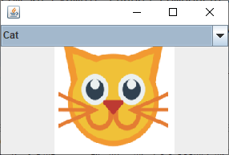
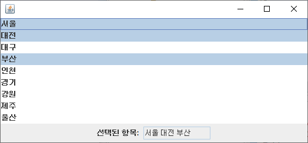
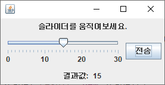
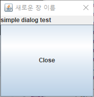
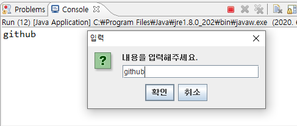
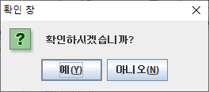
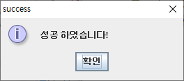
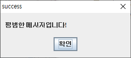
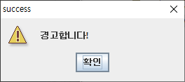
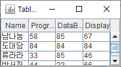

# GUI 만들기

- Container 만들기 -> 레이아웃 지정
- Component 만들기
- Container에 Component를 넣는다.
- 이미지 라벨

<hr>

> ##  콤보박스

- E_ComboBox.java

```java
package com.kh.example.chap03_component.view;

import java.awt.Image;
import java.awt.event.ActionEvent;
import java.awt.event.ActionListener;

import javax.swing.ImageIcon;
import javax.swing.JComboBox;
import javax.swing.JFrame;
import javax.swing.JLabel;

public class E_ComboBox {
	//ComboBox
	public void doComboBox() {
		JFrame frame = new JFrame();
		frame.setSize(300, 200); // 사이즈 가로:300, 세로 200

		String[] animals= {"Dog", "Cat", "Tiger"};

		//콜렉션 리스트를 이용하여 콤보박스 만들기
		JComboBox<String> animalList= new JComboBox<String>(animals);
		JLabel label = new JLabel();

		//처음 나오는 나오는 것을 지정.
		//먼저 Dog가 먼저 나옴. (0번인덱스 기반)
		//Cat이 먼저 나오도록하고 싶다면
		animalList.setSelectedIndex(1); // Cat은 animalList에서 1번 인덱스에 해당.

		// 콤보박스 이벤트 리스너
		// 콤보박스 - 맨먼저 넣은게 default로 되어서 나옴.
		animalList.addActionListener(new ActionListener() {
			@Override
			public void actionPerformed(ActionEvent e) {
				// e.getSource : 리턴타입 Object
				JComboBox cb= (JComboBox) e.getSource();

				// 아이템을 선택
				String name= (String) cb.getSelectedItem();

				// 이미지를 가져온다.
				Image img =new ImageIcon("image/"+name+".png").getImage().getScaledInstance(150, 150, 0);
				label.setIcon(new ImageIcon(img));
			}
		});

		//라벨을 가운데로 정렬
		label.setHorizontalAlignment(JLabel.CENTER);

		// 컴포넌트를 프레임에 추가. (기본레이아웃= BorderLayout)
		frame.add(animalList, "North");
		frame.add(label, "South");


		frame.setDefaultCloseOperation(JFrame.EXIT_ON_CLOSE);
		frame.setVisible(true);
	}
}
```

<BR>

- Run.java

```java
package com.kh.example.chap03_component.run;

import com.kh.example.chap03_component.view.E_ComboBox;

public class Run {
	public static void main(String [] args) {
		new E_ComboBox().doComboBox();
	}
}

```

<BR>

- 결과



<hr>

> # 리스트 컴포넌트

- F_List.java

```java
package com.kh.example.chap03_component.view;

import java.util.List;

import javax.swing.JFrame;
import javax.swing.JLabel;
import javax.swing.JList;
import javax.swing.JPanel;
import javax.swing.JTextField;
import javax.swing.event.ListSelectionEvent;
import javax.swing.event.ListSelectionListener;

public class F_List {
	//ComboBox
	public void doList() {
		JFrame frame =new JFrame();


		JPanel panel= new JPanel();
		String[] cities= {"서울", "대전", "대구", "부산", "인천", "경기", "강원", "제주", "울산"};

		// 리스트를 만들때, 배열을 통해서 만듦.
		// List 콜렉션을 이용한다.
		JList<String> list =new JList<String>(cities);

		JPanel resultPanel = new JPanel();
		JLabel label =new JLabel("선택된 항목: ");
		JTextField selected= new JTextField(10);
		selected.setEditable(false);

		//리스트를 선택했을때 이벤트 발생
		list.addListSelectionListener(new ListSelectionListener() {

			@Override
			public void valueChanged(ListSelectionEvent e) {
				List<String> l= list.getSelectedValuesList();
				String result="";
				for(int i=0; i<l.size(); i++) {
					result+=l.get(i)+"\n";
				}
				selected.setText(result);
			}
		});

		// label을 가운데 정렬
		label.setHorizontalAlignment(JLabel.CENTER);
		resultPanel.add(label);
		resultPanel.add(selected);

		frame.add(list,"North");
		frame.add(resultPanel, "Center");
		frame.pack(); //자동정렬

		//닫기버튼누르면 알아서 프로세스 종료.
		//프로세스 : 실행하는 프로그램
		frame.setDefaultCloseOperation(JFrame.EXIT_ON_CLOSE);
		frame.setVisible(true); //보이도록함.
	}
}
```

<br>

- F_List.java (add scroll bar)
```java
package com.kh.example.chap03_component.view;

import java.awt.Dimension;
import java.util.List;

import javax.swing.JFrame;
import javax.swing.JLabel;
import javax.swing.JList;
import javax.swing.JPanel;
import javax.swing.JScrollPane;
import javax.swing.JTextField;
import javax.swing.event.ListSelectionEvent;
import javax.swing.event.ListSelectionListener;

public class F_List {
	//ComboBox
	public void doList() {
		JFrame frame =new JFrame();


		JPanel panel= new JPanel();
		String[] cities= {"서울", "대전", "대구", "부산", "인천", "경기", "강원", "제주", "울산"};

		// 리스트를 만들때, 배열을 통해서 만듦.
		// List 콜렉션을 이용한다.
		JList<String> list =new JList<String>(cities);

		JPanel resultPanel = new JPanel();
		JLabel label =new JLabel("선택된 항목: ");
		JTextField selected= new JTextField(10);
		selected.setEditable(false); //수정할수 없으며, 읽기만 가능(read only)

		//리스트를 선택했을때 이벤트 발생
		list.addListSelectionListener(new ListSelectionListener() {

			@Override
			public void valueChanged(ListSelectionEvent e) {
				List<String> l= list.getSelectedValuesList();
				String result="";
				for(int i=0; i<l.size(); i++) {
					result+=l.get(i)+"\n";
				}
				selected.setText(result);
			}
		});

		// label을 가운데 정렬
		label.setHorizontalAlignment(JLabel.CENTER);
		resultPanel.add(label);
		resultPanel.add(selected);


		//스크롤바 삽입 //
		JScrollPane scroller= new JScrollPane(list); //리스트가 스크롤러안에
		scroller.setPreferredSize(new Dimension(200, 100));

		//스크롤러를 프레임안에 넣는다.
		frame.add(scroller,"North");


		frame.add(resultPanel, "Center");
		frame.pack(); //자동정렬

		//닫기버튼누르면 알아서 프로세스 종료.
		//프로세스 : 실행하는 프로그램
		frame.setDefaultCloseOperation(JFrame.EXIT_ON_CLOSE);
		frame.setVisible(true); //보이도록함.
	}
}

```

<br>

- border 추가
```java
		//border 넣기 - border색깔: pink/ border굵기: 5
		list.setBorder(BorderFactory.createLineBorder(Color.pink,5));
```

<br>

- setSelectionMode를 추가
  - SINGLE_SELECTION - 한개만 선택
  ```java
  //selection 넣기
	//한개씩만 선택한다. (Ctrl 키 눌러도 한개만 선택)
	list.setSelectionMode(ListSelectionModel.SINGLE_SELECTION);
  ```

  - 인접한 부분만 복수 선택
    - Ctrl키누르면 인접영역 복수 선택 가능.
    - 인접하지 않은 부분 선택하면, 다시 한 개로 선택됨.
  ```java
  list.setSelectionMode(ListSelectionModel.SINGLE_INTERVAL_SELECTION);
  ```

  - 여러개 선택 가능 (기본값)
  ```java
  list.setSelectionMode(ListSelectionModel.MULTIPLE_INTERVAL_SELECTION);
  ```

<br>

- (전체코드) F_List.java

```java
package com.kh.example.chap03_component.view;

import java.awt.Color;
import java.awt.Dimension;
import java.util.List;

import javax.swing.BorderFactory;
import javax.swing.JFrame;
import javax.swing.JLabel;
import javax.swing.JList;
import javax.swing.JPanel;
import javax.swing.JScrollPane;
import javax.swing.JTextField;
import javax.swing.ListSelectionModel;
import javax.swing.event.ListSelectionEvent;
import javax.swing.event.ListSelectionListener;

public class F_List {
	//ComboBox
	public void doList() {
		JFrame frame =new JFrame();


		JPanel panel= new JPanel();
		String[] cities= {"서울", "대전", "대구", "부산", "인천", "경기", "강원", "제주", "울산"};

		// 리스트를 만들때, 배열을 통해서 만듦.
		// List 콜렉션을 이용한다.
		JList<String> list =new JList<String>(cities);

		JPanel resultPanel = new JPanel();
		JLabel label =new JLabel("선택된 항목: ");
		JTextField selected= new JTextField(10);
		selected.setEditable(false); //수정할수 없으며, 읽기만 가능(read only)


		//리스트를 선택했을때 이벤트 발생
		list.addListSelectionListener(new ListSelectionListener() {

			@Override
			public void valueChanged(ListSelectionEvent e) {
				List<String> l= list.getSelectedValuesList();
				String result="";
				for(int i=0; i<l.size(); i++) {
					result+=l.get(i)+"\n";
				}
				selected.setText(result);
			}
		});

		// label을 가운데 정렬
		label.setHorizontalAlignment(JLabel.CENTER);
		resultPanel.add(label);
		resultPanel.add(selected);
		frame.add(resultPanel, "Center"); // 패널을 프레임에 넣는다.

		//스크롤바 삽입 //
		JScrollPane scroller= new JScrollPane(list); //리스트가 스크롤러안에
		scroller.setPreferredSize(new Dimension(200, 100));

		//스크롤러를 프레임안에 넣는다.
		frame.add(scroller,"North");


		//border 넣기
		list.setBorder(BorderFactory.createLineBorder(Color.pink,5));

		//selection 넣기
		//한개씩만 선택한다. (Ctrl 키 눌러도 한개만 선택)
//		list.setSelectionMode(ListSelectionModel.SINGLE_SELECTION);

		list.setSelectionMode(ListSelectionModel.SINGLE_INTERVAL_SELECTION);

//		list.setSelectionMode(ListSelectionModel.MULTIPLE_INTERVAL_SELECTION);


		frame.pack(); //자동정렬

		//닫기버튼누르면 알아서 프로세스 종료.
		//프로세스 : 실행하는 프로그램
		frame.setDefaultCloseOperation(JFrame.EXIT_ON_CLOSE);
		frame.setVisible(true); //보이도록함.
	}
}

```


<BR>

- Run.java
```java
package com.kh.example.chap03_component.run;

import com.kh.example.chap03_component.view.F_List;

public class Run {
	public static void main(String [] args) {
		new F_List().doList();
	}
}
```

<br>

- result
  - 스크롤바 삽입 이전
  


  - 스크롤바 삽입 이후
  

  - border 삽입 이후
  

<hr>


> ## Spinner
- Spinner
  - List(리스트 형식) Spinner
  - Number(숫자형식) Spinner
  - Date(날짜 형식) Spinner

- G_Spinner.java
```java
package com.kh.example.chap03_component.view;

import java.awt.event.ActionEvent;
import java.awt.event.ActionListener;
import java.util.Calendar;
import java.util.Date;

import javax.swing.JButton;
import javax.swing.JFrame;
import javax.swing.JLabel;
import javax.swing.JPanel;
import javax.swing.JSpinner;
import javax.swing.SpinnerDateModel;
import javax.swing.SpinnerListModel;
import javax.swing.SpinnerNumberModel;

public class G_Spinner {
	public void doSpinner() {
		JFrame frame= new JFrame();
		frame.setSize(500,120);

		JPanel panel= new JPanel();

		//1.(컴포넌트)  ListSpinner//
		String [] items= {"소설", "잡지", "전공서적", "여행", "취미생활"};

		// 리스트 모델 생성
		SpinnerListModel listModel= new SpinnerListModel(items);

		// 스피너에 리스트모델을 넣는다.
		JSpinner listSpinner =new JSpinner(listModel);

		//패널에 스피너를 담는다.
		panel.add(listSpinner);


		//2.(컴포넌트)  Number Spinner//

		//넘버 모델 생성
		SpinnerNumberModel numberModel= new SpinnerNumberModel(1,0,9,1);
		//시작값, 최솟값, 최댓값, 증가값
		//1부터 시작, 최솟값 0, 최댓값 9, 1씩 증가

		//Spinner을 만든다. - 모델을 spinner에 넣는다.
		JSpinner numberSpinner= new JSpinner(numberModel);

		//모델을 넣은 스피너를 패널에 넣는다.
		panel.add(numberSpinner);


		//3.(컴포넌트)  Date Spinner //
		Calendar calendar =Calendar.getInstance();
		Date today = calendar.getTime();
		//오늘부터 50년 감소한 날짜 시작날짜
		//오늘로부터 50년 이후 날짜를 끝으로 한다.
		calendar.add(Calendar.YEAR, -50); //현재 날짜에서 50년이 감소된 날짜가 calendar에 셋팅
		Date start= calendar.getTime(); //현재날짜에서 50년 이전 시간을 시작으로 한다.

		// calendar : 현재시각으로부터 50년이전으로 세팅되어있음.
		calendar.add(Calendar.YEAR, 100); //마지막- 오늘로부터 50년 이후 시각으로 세팅
		Date end=  calendar.getTime();

		//Date 모델 생성 - 시작값/ 최솟값/ 최댓값/ 증가값
		SpinnerDateModel dateModel= new SpinnerDateModel(today, start, end, Calendar.YEAR);

		//스피너에 모델을 만든다.
		JSpinner dateSpinner= new JSpinner(dateModel);

		//원하는 모양으로 나타내기 - YYYY/MM/dd
		dateSpinner.setEditor(new JSpinner.DateEditor(dateSpinner, "yyyy/MM/dd"));

		//패널에 스피너를 넣는다.
		panel.add(dateSpinner);

		//프레임에 패널을 넣는다./ 북쪽에
		frame.add(panel, "North");


		//(컴포넌트) 버튼 컴포넌트를 만든다
		JButton button =new JButton("Submit");
		panel.add(button, "North");

		// 텍스트
		JPanel resultPanel= new JPanel();
		JLabel text= new JLabel();
		resultPanel.add(text);

		//버튼 클릭할때 발생하는 이벤트 리스너//
		button.addActionListener(new ActionListener() {
			@Override
			public void actionPerformed(ActionEvent e) {
				String str= listSpinner.getValue() +", "
						+ numberSpinner.getValue() + ", "
						+ dateSpinner.getValue();

				text.setText(str);
			}
		});

		frame.add(resultPanel, "Center"); //중앙에 resultPanel을 넣는다.


		frame.setDefaultCloseOperation(JFrame.EXIT_ON_CLOSE);
		frame.setVisible(true);
	}
}

```

<br>

- Run.java
```java
package com.kh.example.chap03_component.run;

import com.kh.example.chap03_component.view.G_Spinner;

public class Run {
	public static void main(String [] args) {
		new G_Spinner().doSpinner();
	}
}
```

<br>

- 실행결과


<hr>


> ## Slider

- H_Slider.java
```java
package com.kh.example.chap03_component.view;

import java.awt.event.ActionEvent;
import java.awt.event.ActionListener;

import javax.swing.JButton;
import javax.swing.JFrame;
import javax.swing.JLabel;
import javax.swing.JPanel;
import javax.swing.JSlider;

public class H_Slider {
	public void doSlider() {
		JFrame frame= new JFrame();

		// 라벨 컴포넌트
		JPanel panel1= new JPanel();
		JLabel label= new JLabel("슬라이더를 움직여보세요.", JLabel.CENTER);
		panel1.add(label);

		// 슬라이더 컴포넌트
		JPanel panel2= new JPanel();
		JSlider slider =new JSlider(0,30,15); //최솟값, 최댓값, 기본값

		//눈금 만들기
		slider.setMajorTickSpacing(10); //큰눈금
		slider.setMinorTickSpacing(1);//작은눈금
		slider.setPaintTicks(true);

		slider.setPaintLabels(true);//버튼 위치에 따른 값을 라벨에 표현- 전송을 누르면 결과값이 표시.
		panel2.add(slider);


		//버튼 컴포넌트
		JButton button =new JButton("전송");
		panel2.add(button);


		//라벨 컴포넌트
		JPanel resultPanel =new JPanel();
		JLabel text= new JLabel("결과값: ");
		resultPanel.add(text);

		JLabel result =new JLabel();
		resultPanel.add(result);


		//버튼움직이면 이벤트 리스너를 만든다.
		button.addActionListener(new ActionListener() {

			@Override
			public void actionPerformed(ActionEvent e) {
				result.setText(slider.getValue()+ "");
			}
		});

		frame.add(panel1, "North"); // 라벨컴포넌트- 슬라이더를 움직여보세요
		frame.add(panel2, "Center");// 슬라이더 컴포넌트
		frame.add(resultPanel, "South");// 결과 컴포넌트


		frame.pack();

		frame.setDefaultCloseOperation(JFrame.EXIT_ON_CLOSE);
		frame.setVisible(true);
	}
}

```

- 실행결과




<hr>


> ## Dialog

- I_Dialog.java
```java
package com.kh.example.chap03_component.view;

import java.awt.Dialog;
import java.awt.event.ActionEvent;
import java.awt.event.ActionListener;

import javax.swing.JButton;
import javax.swing.JFrame;
import javax.swing.JLabel;
import javax.swing.JOptionPane;
import javax.swing.JPanel;

public class I_Dialog {
	public void doDialog() {
		JFrame frame= new JFrame("Dialog Practice");
		frame.setBounds(150, 250, 200, 200 );

		JPanel panel = new JPanel();
		JButton button1 =new JButton("Simple Dialog");
		panel.add(button1);

		Dialog dialog = new Dialog(frame, "새로운 창 이름");
		dialog.setBounds(150, 250, 200, 200);
		dialog.add(new JLabel("simple dialog test"), "North");

		//버튼을 누르면 Dialog가 띄우도록 해야한다.
		//부모창-frame창을 닫으면 dialog도 같이 닫아진다.
		button1.addActionListener(new ActionListener() {

			@Override
			public void actionPerformed(ActionEvent e) {
				dialog.setVisible(true);
			}
		});

		//버튼만들기
		JButton button2 =new JButton("Close");
		dialog.add(button2, "Center");

		//button2를 누르면 dialog만 닫아지도록 - 이벤트 리스너를 만든다.
		button2.addActionListener(new ActionListener() {

			@Override
			public void actionPerformed(ActionEvent e) {
				dialog.dispose();
			}
		});

		// 버튼만들기 - 쓸수 있는 다이얼로그 만들기
		JButton button3 =new JButton("Input Dialog");
		panel.add(button3);

		button3.addActionListener(new ActionListener() {

			@Override
			public void actionPerformed(ActionEvent e) {
				// 1. 입력 다이얼로그

				반환값 String
				String inputStr=JOptionPane.showInputDialog("내용을 입력해주세요.");
				System.out.println(inputStr);

				// 2. 확인 다이얼로그
				//null: 부모 component
				//message: dialog 메시지
				//title: 확인창
				//옵션
				int result2= JOptionPane.showConfirmDialog(null, "확인하시겠습니까?", "확인 창", JOptionPane.YES_NO_OPTION);
				System.out.println(result2);
				//예 버튼 클릭=yes: 0
				//아니오 버튼 클릭= no : 1

				int result3= JOptionPane.showConfirmDialog(null, "확인하시겠습니까?", "확인 창", JOptionPane.YES_NO_CANCEL_OPTION);
				System.out.println(result3);
				//예 버튼 클릭=yes: 0
				//아니오 버튼 클릭= no : 1
				//취소버튼 : 2

				// 3. 알림 다이얼로그
				JOptionPane.showMessageDialog(null, "실패하였습니다!", "refused", JOptionPane.ERROR_MESSAGE);
				JOptionPane.showMessageDialog(null, "성공 하였습니다!", "success", JOptionPane.INFORMATION_MESSAGE);
				JOptionPane.showMessageDialog(null, "평범한 메시지입니다!", "success", JOptionPane.PLAIN_MESSAGE);
				JOptionPane.showMessageDialog(null, "질문합니다!", "success", JOptionPane.QUESTION_MESSAGE);
				JOptionPane.showMessageDialog(null, "경고합니다!", "success", JOptionPane.WARNING_MESSAGE);

			}
		});

		frame.add(panel);
		frame.pack();
		frame.setDefaultCloseOperation(JFrame.EXIT_ON_CLOSE);
		frame.setVisible(true);
	}
}

```

### 결과
> - 버튼2 : 닫기(닫기 버튼을 누르면 같이 다이얼로그창이 닫아짐)



<br>

> - 입력(input dialog)



<br>

> - 확인(confirm dialog)

- Option: YES_NO_OPTION


<br>

- Option: YES_NO_CANCEL_OPTION


> - 알림(alarm dialog)







<hr>

> ## Table

- J_Table.java
```java
package com.kh.example.chap03_component.view;

import javax.swing.*;

public class J_Table {
	public void doTable() {
		JFrame frame= new JFrame("Table Practice");

		String[] dataHeader= {"Name", "Programming Language", "DataBase", "Display"};
		Object [][] dataBody= {
				{"강건강", 100, 95,95},
				{"남나눔", 58,85,67},
				{"반서진", 44, 22, 66},
				{"임정현", 87, 67 ,56}
		};

		// data와 header을 넣는다.
		JTable table =new JTable(dataBody, dataHeader); // data-body, data-head
		frame.add(table); //프레임에 테이블 추가.

		frame.pack();
		frame.setDefaultCloseOperation(JFrame.EXIT_ON_CLOSE);
		frame.setVisible(true);
	}
}
```

- 결과
[](./result_img/table1.PNG)

<br>

- J_Table.java (add Scroller)
```java
package com.kh.example.chap03_component.view;

import java.awt.Dimension;

import javax.swing.JFrame;
import javax.swing.JScrollPane;
import javax.swing.JTable;

public class J_Table {
	public void doTable() {
		JFrame frame= new JFrame("Table Practice");

		String[] dataHeader= {"Name", "Programming Language", "DataBase", "Display"};
		Object [][] dataBody= {
				{"강건강", 100, 95,95},
				{"남나눔", 58,85,67},
				{"도대담", 84, 84, 84},
				{"류라라", 33,85, 46},
				{"반서진", 44, 22, 66},
				{"임정현", 87, 67 ,56},
		};

		// data와 header을 넣는다.
		JTable table =new JTable(dataBody, dataHeader); // data-body, data-head

		//스크롤 만들기
		JScrollPane jScrollPane= new JScrollPane(table); //스크롤에 테이블넣고
		jScrollPane.setPreferredSize(new Dimension(200,80));// 스크롤 크기 지정.
		frame.add(jScrollPane);// 스크롤을 프레임에  넣는다.

		frame.pack();
		frame.setDefaultCloseOperation(JFrame.EXIT_ON_CLOSE);
		frame.setVisible(true);
	}
}
```

- 결과



<br>


- J_Table.java (Default Table Model)

```java
package com.kh.example.chap03_component.view;

import javax.swing.JFrame;
import javax.swing.JScrollPane;
import javax.swing.JTable;
import javax.swing.table.DefaultTableModel;

public class J_Table {
	public void doTable() {
		JFrame frame= new JFrame("Table Practice");

		String[] dataHeader= {"Name", "Programming Language", "DataBase", "Display"};
		Object [][] dataBody= {
				{"강건강", 100, 95,95},
				{"남나눔", 58,85,67},
				{"도대담", 84, 84, 84},
				{"류라라", 33,85, 46},
				{"반서진", 44, 22, 66},
				{"임정현", 87, 67 ,56},
		};

		//default table
		DefaultTableModel defaultTable= new DefaultTableModel(dataBody, dataHeader);
		JTable table= new JTable(defaultTable);

		// scroll 삽입
		JScrollPane jScrollPane= new JScrollPane(table);
		frame.add(jScrollPane);


		frame.pack();
		frame.setDefaultCloseOperation(JFrame.EXIT_ON_CLOSE);
		frame.setVisible(true);
	}
}

```

- 결과


- J_Table.java 전체코드
```java
package com.kh.example.chap03_component.view;

import javax.swing.JFrame;
import javax.swing.JScrollPane;
import javax.swing.JTable;
import javax.swing.table.DefaultTableModel;

public class J_Table {
	public void doTable() {
		JFrame frame= new JFrame("Table Practice");

		String[] dataHeader= {"Name", "Programming Language", "DataBase", "Display"};
		Object [][] dataBody= {
				{"강건강", 100, 95,95},
				{"남나눔", 58,85,67},
				{"도대담", 84, 84, 84},
				{"류라라", 33,85, 46},
				{"반서진", 44, 22, 66},
				{"임정현", 87, 67 ,56},
		};

//		// data와 header을 넣는다.
//		JTable table =new JTable(dataBody, dataHeader); // data-body, data-head
////		frame.add(table); //프레임에 테이블 추가.
//		
//		//스크롤 만들기
//		JScrollPane jScrollPane= new JScrollPane(table); //스크롤에 테이블넣고
//		jScrollPane.setPreferredSize(new Dimension(200,80));// 스크롤 크기 지정.
//		frame.add(jScrollPane);// 스크롤을 프레임에  넣는다.


		//default table
		DefaultTableModel defaultTable= new DefaultTableModel(dataBody, dataHeader);
		JTable table= new JTable(defaultTable);

		// scroll 삽입
		JScrollPane jScrollPane= new JScrollPane(table);
		frame.add(jScrollPane,"North");

		//데이터 삽입
		Object[] addArr= {"문미미", 58, 75, 66};
		defaultTable.addRow(addArr);

		System.out.println(defaultTable.getRowCount()); //7
		System.out.println(defaultTable.getColumnCount()); //4


		System.out.println(defaultTable.getColumnName(0)); //Name 컬럼 삭제

		//data 삭제
		defaultTable.removeRow(0); // {"강건강", 100, 95,95} 데이터 삭제
		System.out.println(defaultTable.getValueAt(1, 2)); // 1행 2열에 해당하는 값을 가지고 옴.

		defaultTable.setValueAt(100, 2, 2); //류라라의 DataBae 점수가 100으로 바뀜

		//탭의 순서를 변경할 수 없다.
		//탭의 배치 순서를 바꿀 수 없다.
		table.getTableHeader().setReorderingAllowed(false);


		//열의 크기를  바꿀 수 없다.
		table.getTableHeader().setResizingAllowed(false);


		//테이블 로우를 미리 선택할수 있도록
		table.setRowSelectionInterval(0, 1); //0행과 1행이 자동으로 선택
		// 테이블로우의 수보다 더큰수를 지정하면, Exception발생


		// 안에있는 테이블 값을 수정불가능하게 발생 - 선택도 못하고 아무것도 못함
		// read only - 보기만 가능.
//		table.setEnabled(false);

		frame.pack();
		frame.setDefaultCloseOperation(JFrame.EXIT_ON_CLOSE);
		frame.setVisible(true);
	}
}

```

<br>


- isCellEditable()를 오버라이드하여 DefaultTable 이용하기
	- 여러개 선택은 가능한데 수정은 불가능하다.
```java
// 셀한개는 가능해도, 데이터 로우 자체는 선택불가능.
table.setCellSelectionEnabled(false);
```


<br>

- 데이터 로우 선택하면, 선택한 행에 대한 데이터를 textArea에 출력하기
```java
package com.kh.example.chap03_component.view;

import java.awt.event.MouseEvent;
import java.awt.event.MouseListener;

import javax.swing.JFrame;
import javax.swing.JPanel;
import javax.swing.JScrollPane;
import javax.swing.JTable;
import javax.swing.JTextArea;
import javax.swing.table.DefaultTableModel;

public class J_Table {
	public void doTable() {
		JFrame frame= new JFrame("Table Practice");

		String[] dataHeader= {"Name", "Programming Language", "DataBase", "Display"};
		Object [][] dataBody= {
				{"강건강", 100, 95,95},
				{"남나눔", 58,85,67},
				{"도대담", 84, 84, 84},
				{"류라라", 33,85, 46},
				{"반서진", 44, 22, 66},
				{"임정현", 87, 67 ,56},
		};


		DefaultTableModel defaultTable=new DefaultTableModel(dataBody, dataHeader) {
			@Override
			public boolean isCellEditable(int row, int column) {
				return false;
			}
		};
		JTable table= new JTable(defaultTable);
		JScrollPane jScrollPane=new JScrollPane(table);
		frame.add(jScrollPane, "North");

		//데이터 삽입
		Object[] addArr= {"문미미", 58, 75, 66};
		defaultTable.addRow(addArr);


		//컴포넌트 text-area 추가
		JPanel select = new JPanel();
		JTextArea textArea= new JTextArea(10, 30);
		select.add(textArea);
		frame.add(select, "South");

		//마우스 리스너 추가//
		// 추상클래스
		// 추상메소드 강제 오버라이드
		table.addMouseListener(new MouseListener() {

			//필요한 부분은 마우스클릭
			@Override
			public void mouseClicked(MouseEvent e) {
				//내가 몇번째 데이터 로우를 클릭했는지를 알수 있다.(행번호)
				int selectRow= table.getSelectedRow();

				// 컬럼개수
				int colNum= defaultTable.getColumnCount();

				Object[] objArr= new Object[colNum];
				for(int i=0; i<colNum; i++) {
					objArr[i]=defaultTable.getValueAt(selectRow, i);

					if(i==colNum-1) {//마지막 컬럼 도달-> 컬럼내용 출력후 줄바꿈
						textArea.append(objArr[i]+"\n");
					}else {
						textArea.append(objArr[i]+ " ");
					}
				}
			}

			@Override
			public void mousePressed(MouseEvent e) {
				// TODO Auto-generated method stub

			}

			@Override
			public void mouseReleased(MouseEvent e) {
				// TODO Auto-generated method stub

			}

			@Override
			public void mouseEntered(MouseEvent e) {
				// TODO Auto-generated method stub

			}

			@Override
			public void mouseExited(MouseEvent e) {
				// TODO Auto-generated method stub

			}


		});


		frame.pack();
		frame.setDefaultCloseOperation(JFrame.EXIT_ON_CLOSE);
		frame.setVisible(true);
	}
}

```


<br>

- J_Table.java 전체 코드

```java
package com.kh.example.chap03_component.view;

import java.awt.event.MouseEvent;
import java.awt.event.MouseListener;

import javax.swing.JFrame;
import javax.swing.JPanel;
import javax.swing.JScrollPane;
import javax.swing.JTable;
import javax.swing.JTextArea;
import javax.swing.table.DefaultTableModel;

public class J_Table {
	public void doTable() {
		JFrame frame= new JFrame("Table Practice");

		String[] dataHeader= {"Name", "Programming Language", "DataBase", "Display"};
		Object [][] dataBody= {
				{"강건강", 100, 95,95},
				{"남나눔", 58,85,67},
				{"도대담", 84, 84, 84},
				{"류라라", 33,85, 46},
				{"반서진", 44, 22, 66},
				{"임정현", 87, 67 ,56},
		};

//		// data와 header을 넣는다.
//		JTable table =new JTable(dataBody, dataHeader); // data-body, data-head
////		frame.add(table); //프레임에 테이블 추가.
//		
//		//스크롤 만들기
//		JScrollPane jScrollPane= new JScrollPane(table); //스크롤에 테이블넣고
//		jScrollPane.setPreferredSize(new Dimension(200,80));// 스크롤 크기 지정.
//		frame.add(jScrollPane);// 스크롤을 프레임에  넣는다.


//		//default table
//		DefaultTableModel defaultTable= new DefaultTableModel(dataBody, dataHeader);
//		JTable table= new JTable(defaultTable);
//		
//		// scroll 삽입
//		JScrollPane jScrollPane= new JScrollPane(table);
//		frame.add(jScrollPane,"North");

		DefaultTableModel defaultTable=new DefaultTableModel(dataBody, dataHeader) {
			@Override
			public boolean isCellEditable(int row, int column) {
				return false;
			}
		};
		JTable table= new JTable(defaultTable);
		JScrollPane jScrollPane=new JScrollPane(table);
		frame.add(jScrollPane, "North");

		//데이터 삽입
		Object[] addArr= {"문미미", 58, 75, 66};
		defaultTable.addRow(addArr);

		System.out.println(defaultTable.getRowCount()); //7
		System.out.println(defaultTable.getColumnCount()); //4


		System.out.println(defaultTable.getColumnName(0)); //Name 컬럼 삭제

		//data 삭제
		defaultTable.removeRow(0); // {"강건강", 100, 95,95} 데이터 삭제
		System.out.println(defaultTable.getValueAt(1, 2)); // 1행 2열에 해당하는 값을 가지고 옴.

		defaultTable.setValueAt(100, 2, 2); //류라라의 DataBae 점수가 100으로 바뀜


		//탭의 순서를 변경할 수 없다.
		//탭의 배치 순서를 바꿀 수 없다.
		table.getTableHeader().setReorderingAllowed(false);


		//열의 크기를  바꿀 수 없다.
		table.getTableHeader().setResizingAllowed(false);


		//테이블 로우를 미리 선택할수 있도록
		table.setRowSelectionInterval(0, 1); //0행과 1행이 자동으로 선택
		// 테이블로우의 수보다 더큰수를 지정하면, Exception발생


		// 안에있는 테이블 값을 수정불가능하게 발생 - 선택도 못하고 아무것도 못함
		// read only - 보기만 가능.
//		table.setEnabled(false);

		// 셀한개는 가능해도, 데이터 로우 자체는 선택불가능.
//		table.setCellSelectionEnabled(false);


		//컴포넌트 text-area 추가
		JPanel select = new JPanel();
		JTextArea textArea= new JTextArea(10, 30);
		select.add(textArea);
		frame.add(select, "South");

		//마우스 리스너 추가//
		// 추상클래스
		// 추상메소드 강제 오버라이드
		table.addMouseListener(new MouseListener() {

			//필요한 부분은 마우스클릭
			@Override
			public void mouseClicked(MouseEvent e) {
				//내가 몇번째 데이터 로우를 클릭했는지를 알수 있다.(행번호)
//				System.out.println(table.getSelectedRow());
				int selectRow= table.getSelectedRow();

				// 컬럼개수
				int colNum= defaultTable.getColumnCount();

				Object[] objArr= new Object[colNum];
				for(int i=0; i<colNum; i++) {
					objArr[i]=defaultTable.getValueAt(selectRow, i);

					if(i==colNum-1) {//마지막 컬럼 도달-> 컬럼내용 출력후 줄바꿈
						textArea.append(objArr[i]+"\n");
					}else {
						textArea.append(objArr[i]+ " ");
					}
				}
			}

			@Override
			public void mousePressed(MouseEvent e) {
				// TODO Auto-generated method stub

			}

			@Override
			public void mouseReleased(MouseEvent e) {
				// TODO Auto-generated method stub

			}

			@Override
			public void mouseEntered(MouseEvent e) {
				// TODO Auto-generated method stub

			}

			@Override
			public void mouseExited(MouseEvent e) {
				// TODO Auto-generated method stub

			}


		});


		frame.pack();
		frame.setDefaultCloseOperation(JFrame.EXIT_ON_CLOSE);
		frame.setVisible(true);
	}
}
```
