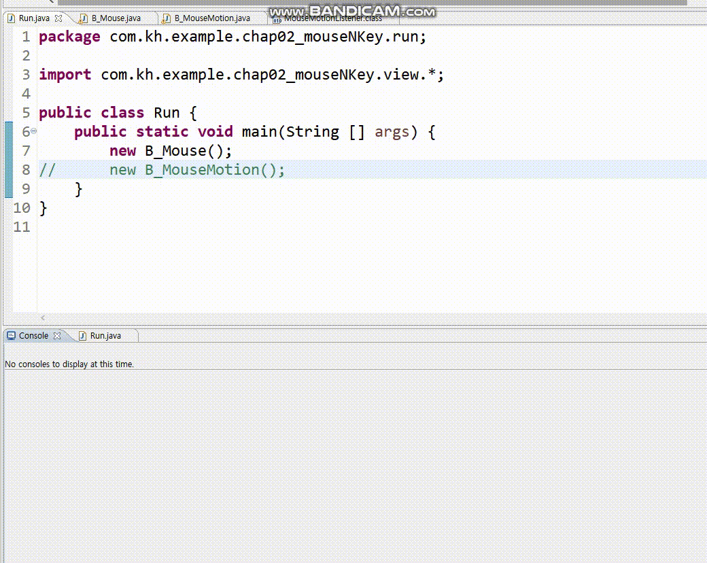
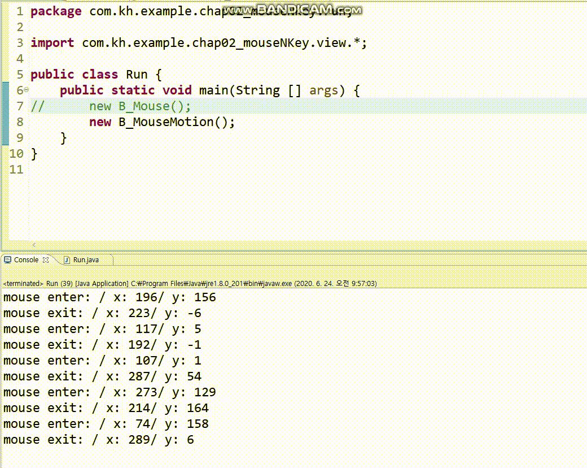

# 이벤트(Event)

- 이벤트 발생에 의해 프로그램 흐름을 결정
  - 마우스 클릭 / 마우스 오버/ 마우스 드래그
  - 키보드 누름
  - 센서 입력
  - 네트워크로부터 데이터 송신/수신


- 이벤트가 발생하면 이벤트를 처리하는 루틴(이벤트 리스너)가 실행됨

- EventObject : 이벤트 클래스 계층에서 최상위 클래스

- 이벤트에는 뭐가 들어갈 수 있냐?
  - 이벤트 종류
  - 이벤트 소스
  - 이벤트가 발생한 화면 좌표
  - 이벤트가 발생한 컴포넌트 내 좌표
  - 버튼이나 메뉴 아이템에 이벤트가 발생한 경우, 해당 아이템(컴포넌트)의 문자열
  - 클릭된 마우스 버튼 번호
  - 마우스 클릭 횟수
  - 누른 키의 코드값과 문자값
  - 체크박스/ 라디오버튼 등과 같은 컴포넌트에 이벤트 발생 시 체크 상태


- 액션이벤트와 마우스 리스너?
  - 컴포넌트가 어디서 발생하는지?

  - ActionEvent
    - JButton
    - JList
    - JTextField
    - JMenuItem

  - ItemEvent
    - JCheckBox
    - JCheckBoxMenuItem
    - JList

  - KeyEvent
    - Component

  - MouseEvent
    - Component


<hr>

> ## Event Listener

- 클래스로 작성된 이벤트를 처리하는 코드
  - 남자친구/여자친구 와 같이 특정 대상에게 이벤트를 함.
  - 이벤트를 발생시킬 주체가 아무나가 아님 (특정 대상임)

- 이벤트 처리를 위해 이벤트 발생을 시킬 컴포넌트에 이벤트 리스너를 연결
  - 5개의 추상메소드를 재정의해야함.
    - 나는 클릭만 오버라이딩하고 싶은데 5개 다해야됨.. 불편함.

<hr>

> # Adapter Class

- 효율적으로 메소드를 오버라이딩을 할 수 없을까?
  - 특정 메소드만 오버라이딩 하고 싶다.
  - 인터페이스에는 여러개의 추상메소드가 존재하더라, 그중에서 하나만 쓰고 싶은데
    모두다 오버라이딩 해야된다.
    - 내가 원하는 것 하나만 오버라이딩 할 수 없을까? ===><strong> Adapter 클래스를 이용!</strong>


- <strong>리스너의 인터페이스의 추상메소드를 모두 구현해야되는 부담을 줄일 수 있다.</strong>

- Adapter 사용 => D_CardLayout.java 에서 사용 => MouseAdapter


<hr>


> # Connecting Listener

```java
컴포넌트 레퍼런스.add이벤트명Listener(이벤트 핸들러);
```

- 별도의 클래스를 작성한다.
- 내부 클래스(Inner Class)로 작성한다.
- 무명(익명 Anonymous) 클래스로 작성
- 프레임 구성 클래스에 인터페이스를 상속하여 작성한다.


<hr>

> # 무명(익명) 클래스 - Anonymous class

- 이름이 없는 클래스
- 해당 이벤트에 대한 인터페이스를 상속받지 않음.

```java
컴포넌트레퍼런스.add이벤트Listener(new 이벤트인터페이스명(){
  @Override
  public 반환자료형 동작메소드이름 (이벤트클래스 레퍼런스){
      //해당 컴포넌트에 대한 동작 처리 구문 작성
      //단, 사용하지 않는 메소드에 대해서도 모두 재구현해야함.
  }
});

```

- 인터페이스는 객체 생성 불가능하고, 참조(reference)만 가능한데? 뭐지?
- 인터페이스를 구현하는 자식이 없으니까 -> 무명클래스이다.

```java

// 무명클래스 객체 생성과 동일.
interface A{ 추상메소드 }

public class B implements A{ A안에 있는 추상메소드를 오버라이드 };
new B(); // new 인터페이스명(){ ... }
```

- 무명클래스 코드 뜯어보기


<br>

- (example)
```java
button.addActionListener(new ActionListener() {

			@Override
			public void actionPerformed(ActionEvent e) {
				text.setText("버튼이 선택되었습니다");

			}
});
```


<br>


- 별도의 클래스로 작성
  - 해당 이벤트에 대한 이벤트 리스너 인터페이스 상속을 받아야함.

- 내부 클래스
  - 현재 클래스 안에 이벤트 핸들러 클래스 작성

- 프레임 구성 클래스에 인터페이스 상속
  - 해당 이벤트에 대한 인터페이스를 상속받지 않음.


<hr>


> # Anonymous Class

```java
package com.kh.example.chap01_use.view;

import java.awt.event.ActionEvent;
import java.awt.event.ActionListener;

import javax.swing.JButton;
import javax.swing.JFrame;
import javax.swing.JLabel;
import javax.swing.JPanel;

public class A_Anonymous {
	public void anonymousMethod() {
		//프레임생성
		JFrame frame =new JFrame("익명클래스");
		frame.setSize(250, 200); //프래임 크기

		//패널 생성
		JPanel panel= new JPanel();

		//컴포넌트 생성
		JButton button1= new JButton("버튼1");
		JButton button2= new JButton("버튼2");

		//컴포넌트를 패널안에 넣는다.
		panel.add(button1);
		panel.add(button2);

		String defaultMsg="아직 버튼이 눌리지 않았습니다.";
		JLabel text= new JLabel(defaultMsg);
		JPanel textPanel= new JPanel();

		//가운데 정렬
		text.setHorizontalAlignment(JLabel.CENTER);
		textPanel.add(text);


		//패널을 프레임안에 넣는다.
		frame.add(panel,"North");
		frame.add(textPanel,"Center");


		//버튼클릭 이벤트 리스너 - 익명 클래스를 사용
		button1.addActionListener(new ActionListener() {
			@Override
			public void actionPerformed(ActionEvent e) {
				text.setText("버튼1 클릭");
				System.out.println("button1 clicked=>"+e);
			}
		});

		button2.addActionListener(new ActionListener() {
			@Override
			public void actionPerformed(ActionEvent e) {
				text.setText("버튼2 클릭");
				System.out.println("button2 clicked=> "+e);
			}
		});

		frame.setVisible(true);
		frame.setDefaultCloseOperation(JFrame.EXIT_ON_CLOSE);
	}
}

```

<HR>

> # Other Class

```java
package com.kh.example.chap01_use.view;

import java.awt.event.ActionEvent;
import java.awt.event.ActionListener;

import javax.swing.JButton;
import javax.swing.JFrame;
import javax.swing.JLabel;
import javax.swing.JPanel;

public class B_Other extends JFrame{
	//버튼을 필드로 한다.
	private JButton button1, button2;
	private JLabel text;


	public B_Other() {
		setTitle("다른 클래스 만들기"); //타이틀
		setSize(250, 200); //프래임 크기

		//패널 생성
		JPanel panel= new JPanel();

		//컴포넌트 생성
		button1= new JButton("버튼1");
		button2= new JButton("버튼2");

		//컴포넌트를 패널안에 넣는다.
		panel.add(button1);
		panel.add(button2);

		String defaultMsg="아직 버튼이 눌리지 않았습니다.";
		text= new JLabel(defaultMsg);
		JPanel textPanel= new JPanel();

		//가운데 정렬
		text.setHorizontalAlignment(JLabel.CENTER);
		textPanel.add(text);


		//패널을 프레임안에 넣는다.
		add(panel,"North");
		add(textPanel,"Center");

		//버튼 이벤트 리스너 - 다른 클래스 이름으로 만든다.
		button1.addActionListener(new MyEvent(text, button1)); //내 라벨에 대한 정보를 넘긴다.
		button2.addActionListener(new MyEvent(text, button2));

		setVisible(true);
		setDefaultCloseOperation(JFrame.EXIT_ON_CLOSE);
	}

	public JButton getButton1() {
		return button1;
	}

	public void setButton1(JButton button1) {
		this.button1=button1;
	}

	public JButton getButton2() {
		return button2;
	}

	public void setButton2(JButton button2) {
		this.button2=button2;
	}
}


// 같이 있는 클래스는 public접근제한자를 갖지 않고, default 제한자로 한다.
class MyEvent implements ActionListener{
	private JLabel label;
	private JButton button;
	public MyEvent(JLabel label, JButton button) {
		this.label=label;
		this.button=button;
	}


	// 버튼이 눌렸을 때 라벨의 내용을 변경
	@Override
	public void actionPerformed(ActionEvent e) {
//		if(button.getText().equals("버튼1"))
//			label.setText("버튼1이 눌렸습니다.");
//		
//		else if(button.getText().equals("버튼2"))
//			label.setText("버튼2가 눌렸습니다.");
		label.setText(button.getText()+"이 눌렸습니다.");

	}

}
```

<hr>

> # Inner Class

```java
package com.kh.example.chap01_use.view;

import java.awt.event.ActionEvent;
import java.awt.event.ActionListener;

import javax.swing.JButton;
import javax.swing.JFrame;
import javax.swing.JLabel;
import javax.swing.JPanel;

public class C_Inner extends JFrame {
	// 버튼을 필드로 한다.
	private JButton button1, button2;
	private JLabel label;

	public C_Inner() {
		super("다른 클래스 만들기"); // 타이틀
		setSize(250, 200); // 프래임 크기

		// 패널 생성
		JPanel panel = new JPanel();

		// 컴포넌트 생성
		button1 = new JButton("버튼1");
		button2 = new JButton("버튼2");

		// 컴포넌트를 패널안에 넣는다.
		panel.add(button1);
		panel.add(button2);

		String defaultMsg = "아직 버튼이 눌리지 않았습니다.";
		label = new JLabel(defaultMsg);
		JPanel textPanel = new JPanel();

		// 가운데 정렬
		label.setHorizontalAlignment(JLabel.CENTER);
		textPanel.add(label);

		// 패널을 프레임안에 넣는다.
		add(panel, "North");
		add(textPanel, "Center");

		//버튼 이벤트 리스너 추가
		button1.addActionListener(new MyEvent());
		button2.addActionListener(new MyEvent());

		setVisible(true);
		setDefaultCloseOperation(JFrame.EXIT_ON_CLOSE);
	}

	private class MyEvent implements ActionListener{
		@Override
		public void actionPerformed(ActionEvent e) {
			if(e.getSource()==button1)
				label.setText("버튼1이 눌렸습니다.");

			else if(e.getSource()==button2)
				label.setText("버튼2이 눌렸습니다.");
		}
	}
}
```

<hr>

> # Method 이용

```java
package com.kh.example.chap01_use.view;

import java.awt.event.ActionEvent;
import java.awt.event.ActionListener;

import javax.swing.JButton;
import javax.swing.JFrame;
import javax.swing.JLabel;
import javax.swing.JPanel;

public class D_Method extends JFrame implements ActionListener {
	// 버튼을 필드로 한다.
	private JButton button1, button2;
	private JLabel label;

	public D_Method() {
		super("다른 클래스 만들기"); // 타이틀
		setSize(250, 200); // 프래임 크기

		// 패널 생성
		JPanel panel = new JPanel();

		// 컴포넌트 생성
		button1 = new JButton("버튼1");
		button2 = new JButton("버튼2");

		// 컴포넌트를 패널안에 넣는다.
		panel.add(button1);
		panel.add(button2);

		String defaultMsg = "아직 버튼이 눌리지 않았습니다.";
		label = new JLabel(defaultMsg);
		JPanel textPanel = new JPanel();

		// 가운데 정렬
		label.setHorizontalAlignment(JLabel.CENTER);
		textPanel.add(label);

		// 패널을 프레임안에 넣는다.
		add(panel, "North");
		add(textPanel, "Center");

		// 버튼 이벤트 리스너 추가
		button1.addActionListener(this);
		button2.addActionListener(this);

		setVisible(true);
		setDefaultCloseOperation(JFrame.EXIT_ON_CLOSE);
	}

	@Override
	public void actionPerformed(ActionEvent e) {
		if(e.getSource()==button1){
			label.setText("버튼1 클릭");
		}else {
			label.setText("버튼2 클릭");
		}
	}
}
```

<hr>

> # 키보드 리스너

```java
package com.kh.example.chap02_mouseKey;

import java.awt.event.KeyEvent;
import java.awt.event.KeyListener;

import javax.swing.JFrame;
import javax.swing.JTextField;

public class A_Key extends JFrame implements KeyListener {
	public A_Key() {
		setTitle("키 이벤트");
		setSize(300, 200);

		JTextField tf = new JTextField(20);
		add(tf);

		tf.addKeyListener(this);

		setVisible(true);
		setDefaultCloseOperation(JFrame.EXIT_ON_CLOSE);
	}

	@Override
	public void keyTyped(KeyEvent e) {
		display("Key Typed: ", e);

	}

	@Override
	public void keyPressed(KeyEvent e) {
		display("Key Pressed: ", e);

	}

	@Override
	public void keyReleased(KeyEvent e) {
		display("Key Released: ", e);
	}

	public void display(String s, KeyEvent e) {
		char c = e.getKeyChar();
		boolean isAlt = e.isAltDown();
		boolean isControl = e.isControlDown();
		boolean isShift = e.isShiftDown();

		String modifiers = isAlt + " " + isControl + " " + isShift;
		System.out.println(s + " " + c + " " + modifiers);
	}
}
```


```java
package com.kh.example.chap02_mouseKey.run;

import com.kh.example.chap02_mouseKey.A_Key;

public class Run {
	public static void main(String[] args) {
		new A_Key();
	}
}
```

<hr>

> # 마우스 이벤트 리스너

## B_Mouse.java
```java
package com.kh.example.chap02_mouseNKey.view;

import java.awt.event.MouseEvent;
import java.awt.event.MouseListener;

import javax.swing.JFrame;
import javax.swing.JPanel;

public class B_Mouse extends JFrame implements MouseListener{

	//기본생성자
	public B_Mouse() {
		setTitle("Mouse Event");
		setSize(300, 200);

		JPanel panel = new JPanel();
		panel.addMouseListener(this); //나- 마우스 리스너
		add(panel);

		setDefaultCloseOperation(EXIT_ON_CLOSE);
		setVisible(true);
	}


	@Override
	public void mouseClicked(MouseEvent e) {
		// 마우스 딸깍 클릭
		display("mouse click: (click count: "+e.getClickCount()+")" ,e);
	}

	@Override
	public void mousePressed(MouseEvent e) {
		// 마우스를 쭉 누른다.
		display("mouse press: " ,e);
	}

	@Override
	public void mouseReleased(MouseEvent e) {
		// 마우스를 놓을때
		display("mouse release: " ,e);
	}

	@Override
	public void mouseEntered(MouseEvent e) {
		// 영역에 마우스커서가 들어감(마우스 클릭을 떼어냈을때)
		display("mouse enter: " ,e);
	}

	@Override
	public void mouseExited(MouseEvent e) {
		//영역에 마우스 커서가 밖으로 나갈때
		display("mouse exit: " ,e);
	}

	public void display(String s, MouseEvent e) {
		System.out.println(s + "/ x: "+ e.getX() + "/ y: "+ e.getY());
	}
}
```



<br>

<hr>

## B_MouseMotion.java
```java
package com.kh.example.chap02_mouseNKey.view;

import java.awt.event.MouseEvent;
import java.awt.event.MouseListener;
import java.awt.event.MouseMotionListener;

import javax.swing.JFrame;
import javax.swing.JPanel;

//마우스 움직일때도 이벤트발생
public class B_MouseMotion extends JFrame implements MouseListener, MouseMotionListener{
		//기본생성자
		public B_MouseMotion() {
			setTitle("Mouse Event");
			setSize(300, 200);

			JPanel panel = new JPanel();
			panel.addMouseListener(this); //나- 마우스 리스너 -연결
			panel.addMouseMotionListener(this); //나 - 마우스 모션리스너 -연결
			add(panel);

			setDefaultCloseOperation(EXIT_ON_CLOSE);
			setVisible(true);
		}

		// MouseListener 추상메소드 오버라이드
		@Override
		public void mouseClicked(MouseEvent e) {
			// 마우스 딸깍 클릭
			display("mouse click: (click count: "+e.getClickCount()+")" ,e);
		}

		@Override
		public void mousePressed(MouseEvent e) {
			// 마우스를 쭉 누른다.
			display("mouse press: " ,e);
		}

		@Override
		public void mouseReleased(MouseEvent e) {
			// 마우스를 놓을때
			display("mouse release: " ,e);
		}

		@Override
		public void mouseEntered(MouseEvent e) {
			// 영역에 마우스커서가 들어감(마우스 클릭을 떼어냈을때)
			display("mouse enter: " ,e);
		}

		@Override
		public void mouseExited(MouseEvent e) {
			//영역에 마우스 커서가 밖으로 나갈때
			display("mouse exit: " ,e);
		}

		public void display(String s, MouseEvent e) {
			System.out.println(s + "/ x: "+ e.getX() + "/ y: "+ e.getY());
		}


		// MouseMotionListener - 추상메소드 정의
		@Override
		public void mouseDragged(MouseEvent e) {
			display("[MouseMotionListener] mouse Drag " ,e);
		}


		@Override
		public void mouseMoved(MouseEvent e) {
			display("[MouseMotionListener] mouse Move " ,e);
		}
}
```


