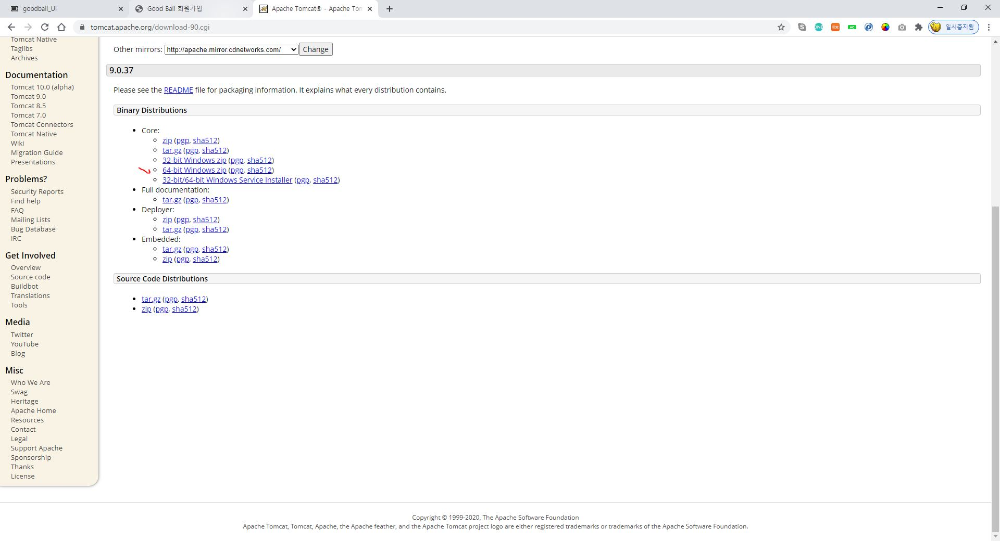

# Servlet

- Servlet Container
  - 서블릿의 생명 주기 관리
  - 정적 로딩 처리
  - 전송 방식에 따라 동적으로 페이지 구성하는 작업 진행

- POST방식: URL에 데이터가 보이지 않은 방식
- GET방식: URL에 보이는 방식

- JSP(Java Server Page)
  - JSP파일을 다시 java코드로 변경해줌.
  - 동적 로딩 처리
  - 자바를 가지고 서버에 페이지를 만든다.

- 웹서버: `정적 페이지`를 다룬다.
- WAS: `동적페이지`를 다룬다.

> # 배포서술자

- 애플리케이션에 대한 전체 설정 정보를 가지고 있는 파일.

- 웹컨테이너가 서블릿을 구동시킨다.
- `@`(annotation)

> ## sevlet 라이프 사이클

- 첫번째 요청: 객체를 생성하여 init()메소드를 호출
- service()메소드가 요청한 HTTP TYPE(GET/POST) 데이터 전달 방식에 따라 doGet(), doPost()

- 서블릿이 서비스 되지 않을 때는 destroy()

> # 아파치 톰캣 설치하기

> ## 1. 아파치 톰캣 설치

- http://www.tomcat.apache.org 에 접속해서 다운로드한다.
- 좌측 Download에서 `Tomcat 9`버젼 선택

> ## 2. 아파치 톰캣과 연결한 이클립스 프로젝트 만들기

- eclipse 프로젝트 생성하기: Dynamic Web Project

- 1단계

