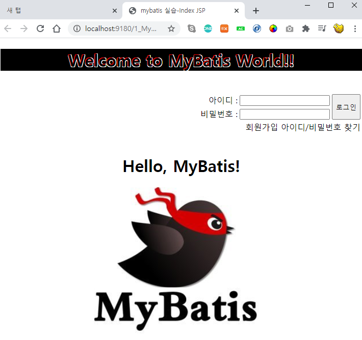
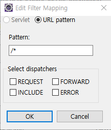
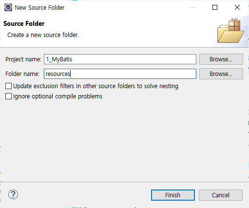
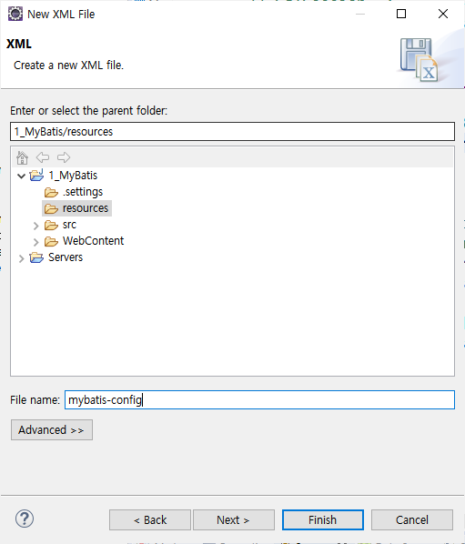

# 2020.10.05 실습

> ## index.jsp

```jsp
<%@ page language="java" contentType="text/html; charset=UTF-8"
    pageEncoding="UTF-8"%>
<!DOCTYPE html>
<html>
<head>
<meta charset="UTF-8">
<title>mybatis 실습-Index JSP</title>
</head>
<body>
	<%--표준 액션태그 --%>
	<%--기본위치: WebContent를 기준으로 위치함. --%>
	<jsp:include page="WEB-INF/views/common/menubar.jsp"/>
	<h1 align="center">Hello, MyBatis!</h1>
	<div align="center">

		<!--  
			contextPath: pageContext.servletContext.contextPath  
			이미지 경로: WebContent/resources/images/mybatis.png
		-->
		
	</div>
</body>
</html>
```

<br><BR>

> ## menubar.jsp

```jsp
<%@ page language="java" contentType="text/html; charset=UTF-8"
    pageEncoding="UTF-8"%>

<%--
	[jstl 라이브러리를 넣어야한다.]
	저장위치: WebContent/WEB-INF/lib

	taglibs-standard-compat-1.2.5.jar
	taglibs-standard-impl-1.2.5.jar
	taglibs-standard-jstlel-1.2.5.jar
	taglibs-standard-spec-1.2.5.jar
--%>
<%@ taglib prefix="c" uri="http://java.sun.com/jsp/jstl/core" %>
<!DOCTYPE html>
<html>
<head>
<meta charset="UTF-8">
<script src="https://code.jquery.com/jquery-3.5.1.min.js"></script>

<title>menubar.jsp</title>
<style>
	#welcome{background: black; text-shadow: -1px -1px 0 red, 1px -1px 0 white, -1px 1px 0 white, 1px 1px 0 white;}
	.login-area {height:100px;}
	.btn-login {height:50px;}
	.loginTable{text-align: right; float: right;}
	#logoutBtns>a{text-decoration: none; color: black;}
	#logoutBtns>a:hover{text-decoration: underline; font-weight: bold;}
</style>
</head>


<body>
	<%--
	 [변수형 태그 alias설정 ]

	 ${pageContextPath.servletContext.contextPath} 값을 contextPath로 별칭을 만들겠다.

	 이 contextPath를 사용할 수 있는 범위는 application(애플리케이션 전체)로 한다.
	--%>
	<c:set var="contextPath" value="${pageContext.servletContext.contextPath }" scope="application"/>
	<h1 id="welcome" align="center">Welcome to MyBatis World!!</h1>
		<br>


		<!-- ----------------------1. 회원 관련 서비스 -------------------------- -->
		<div class="login-area">	  
			<!-- 1_1. 로그인 관련 폼 만들기 -->
			<form action="${ contextPath }/login.me" method="post">
				<table class="loginTable">
					<tr>
						<td>아이디 : </td>
						<td>
							<input type="text" name="userId">
						</td>
						<td rowspan="2">
							<button id="login-btn" class="btn btn-login">로그인</button>
						</td>
					</tr>
					<tr>
						<td>비밀번호 : </td>
						<td>
							<input type="password" name="userPwd">
						</td>
					</tr>
					<tr>
						<td colspan="3" id="logoutBtns">
							<a href="${ contextPath }/memberInsertForm.me">회원가입</a>
							<a href="${ contextPath }/findMemberForm.me">아이디/비밀번호 찾기</a>
						</td>
					</tr>
				</table>
			</form>
		</div>

		<script>
			function home(){
				location.href="${ contextPath }";
			}
		</script>
</body>
</html>
```

<BR><BR>

> ## 실행결과



<BR><BR><BR>

# 로그인


> ## CommonFilter.java

- 모든 url에 적용한다.



<br>

- CommonFilter.java 코드

```java
package filter;

import java.io.IOException;
import javax.servlet.Filter;
import javax.servlet.FilterChain;
import javax.servlet.FilterConfig;
import javax.servlet.ServletException;
import javax.servlet.ServletRequest;
import javax.servlet.ServletResponse;
import javax.servlet.annotation.WebFilter;

/**
 * Servlet Filter implementation class CommonFilter
 */
@WebFilter("/*")
public class CommonFilter implements Filter {

    /**
     * Default constructor.
     */
    public CommonFilter() {
        // TODO Auto-generated constructor stub
    }

	/**
	 * @see Filter#destroy()
	 */
	public void destroy() {
		// TODO Auto-generated method stub
	}

	/**
	 * @see Filter#doFilter(ServletRequest, ServletResponse, FilterChain)
	 */
	public void doFilter(ServletRequest request, ServletResponse response, FilterChain chain) throws IOException, ServletException {
		request.setCharacterEncoding("UTF-8");
		response.setContentType("text/html; charset=UTF-8");
		chain.doFilter(request, response);
	}

	/**
	 * @see Filter#init(FilterConfig)
	 */
	public void init(FilterConfig fConfig) throws ServletException {
		// TODO Auto-generated method stub
	}

}
```

<br>

> ## Member.java

```java
package member.model.vo;

import java.sql.Date;

public class Member {
	private String userId;
	private String userPwd;
	private String userName;
	private String nickName;
	private String email;
	private Date birthday;
	private String gender;
	private String phone;
	private String address;
	private Date enrollDate;
	private Date updateDate;
	private String mStatus;

	public Member() {}

	public Member(String userId, String userPwd, String userName, String nickName, String email, Date birthday,
			String gender, String phone, String address) {
		super();
		this.userId = userId;
		this.userPwd = userPwd;
		this.userName = userName;
		this.nickName = nickName;
		this.email = email;
		this.birthday = birthday;
		this.gender = gender;
		this.phone = phone;
		this.address = address;
	}


	public Member(String userId, String userPwd, String userName, String nickName, String email, Date birthday,
			String gender, String phone, String address, Date enrollDate, Date updateDate, String mStatus) {
		super();
		this.userId = userId;
		this.userPwd = userPwd;
		this.userName = userName;
		this.nickName = nickName;
		this.email = email;
		this.birthday = birthday;
		this.gender = gender;
		this.phone = phone;
		this.address = address;
		this.enrollDate = enrollDate;
		this.updateDate = updateDate;
		this.mStatus = mStatus;
	}

	public String getUserId() {
		return userId;
	}

	public void setUserId(String userId) {
		this.userId = userId;
	}

	public String getUserPwd() {
		return userPwd;
	}

	public void setUserPwd(String userPwd) {
		this.userPwd = userPwd;
	}

	public String getUserName() {
		return userName;
	}

	public void setUserName(String userName) {
		this.userName = userName;
	}

	public String getNickName() {
		return nickName;
	}

	public void setNickName(String nickName) {
		this.nickName = nickName;
	}

	public String getEmail() {
		return email;
	}

	public void setEmail(String email) {
		this.email = email;
	}

	public Date getBirthday() {
		return birthday;
	}

	public void setBirthday(Date birthday) {
		this.birthday = birthday;
	}

	public String getGender() {
		return gender;
	}

	public void setGender(String gender) {
		this.gender = gender;
	}

	public String getPhone() {
		return phone;
	}

	public void setPhone(String phone) {
		this.phone = phone;
	}

	public String getAddress() {
		return address;
	}

	public void setAddress(String address) {
		this.address = address;
	}

	public Date getEnrollDate() {
		return enrollDate;
	}

	public void setEnrollDate(Date enrollDate) {
		this.enrollDate = enrollDate;
	}

	public Date getUpdateDate() {
		return updateDate;
	}

	public void setUpdateDate(Date updateDate) {
		this.updateDate = updateDate;
	}

	public String getmStatus() {
		return mStatus;
	}

	public void setmStatus(String mStatus) {
		this.mStatus = mStatus;
	}

	@Override
	public String toString() {
		return "Member [userId=" + userId + ", userPwd=" + userPwd + ", userName=" + userName + ", nickName=" + nickName
				+ ", email=" + email + ", birthday=" + birthday + ", gender=" + gender + ", phone=" + phone
				+ ", address=" + address + ", enrollDate=" + enrollDate + ", updateDate=" + updateDate + ", mStatus="
				+ mStatus + "]";
	}

}
```

<br><br>

> ## LoginServlet.java

- menubar.jsp에서 로그인 버튼클릭할 때 form태그의 action과 연결된 서블릿.

```java
package member.controller;

import java.io.IOException;

import javax.servlet.ServletException;
import javax.servlet.annotation.WebServlet;
import javax.servlet.http.HttpServlet;
import javax.servlet.http.HttpServletRequest;
import javax.servlet.http.HttpServletResponse;

import member.model.service.MemberService;
import member.model.vo.Member;

/**
 * Servlet implementation class LoginServlet
 */
@WebServlet("/login.me")
public class LoginServlet extends HttpServlet {
	private static final long serialVersionUID = 1L;

    /**
     * @see HttpServlet#HttpServlet()
     */
    public LoginServlet() {
        super();
        // TODO Auto-generated constructor stub
    }

	/**
	 * @see HttpServlet#doGet(HttpServletRequest request, HttpServletResponse response)
	 */
	protected void doGet(HttpServletRequest request, HttpServletResponse response) throws ServletException, IOException {
		//menubar.jsp에서 form태그에 입력된 아이디와 비밀번호를 받는다.
		String userId= request.getParameter("userId");
		String userPwd= request.getParameter("userPwd");

		Member m= new Member();
		m.setUserId(userId);
		m.setUserPwd(userPwd);

		Member member=new MemberService().selectMember(m);
	}

	/**
	 * @see HttpServlet#doPost(HttpServletRequest request, HttpServletResponse response)
	 */
	protected void doPost(HttpServletRequest request, HttpServletResponse response) throws ServletException, IOException {
		// TODO Auto-generated method stub
		doGet(request, response);
	}

}

```

<br>

> ## MemberService.java

- MVC패턴 model.service 단의 역할
  - Connection연결하여 DAO와 연결하여 넘기는 역할.
  - JDBC_Template 리턴값이 필요함.
  - 그런데 Mybatis에서는... Connection을 필요로하지 않고, **`sqlSession`** 을 반환하는 템플릿 클래스를 만들어서 연결.

```java

```

<br>

> ## Template.java

- getConnection()과 똑같은 역할.
- commit()/ rollback() / close()도 JDBC_Template.java에서 수행.

```java
package common;

import java.io.IOException;
import java.io.InputStream;

import org.apache.ibatis.io.Resources;
import org.apache.ibatis.session.SqlSession;
import org.apache.ibatis.session.SqlSessionFactory;
import org.apache.ibatis.session.SqlSessionFactoryBuilder;

public class Template {


	public static SqlSession getSqlSession() {
		// SqlSession  <--------- SqlSessionFactory <---------- SqlSessionFactoryBuilder
		// 				openSession()				build(InputStream)

		//리턴 대상 session
		SqlSession session =null;

		// 1. SqlSessionFactoryBuilder 객체 생성
		SqlSessionFactoryBuilder ssfb= new SqlSessionFactoryBuilder();


		try {
			// 2. SqlSessionFactory 객체생성
			// mybatis-config.xml: mybatis전체설정 정보를 갖고있다.
			InputStream inputStream = Resources.getResourceAsStream("/mybatis-config.xml");
			SqlSessionFactory ssf= ssfb.build(inputStream);

			// 3. SqlSession 객체 생성.
			session=ssf.openSession();
		} catch (IOException e) {
			e.printStackTrace();
		}

		return session;
	}
}

```

- 위의 코드의 문제점: getResourceAsStream() 인자의 `mybatis-config.xml`이 어디에있지?

> ### mybatis-config.xml 을 저장하자.

- (1) dynamic web 프로젝트 클릭
- (2) 오른쪽 마우스 클릭
- (3) New
- (4) Source Folder
- (5) 이름: resources



<br><br>

- (6) [mybatis-config.xml dtd파일 설정하기](./Mybatis_프로젝트세팅.md#116)

- (7) finish버튼 클릭
- (8) resources 패키지 클릭 -> 마우스 우클릭
- (9) New -> other클릭
- (10) xml -> next -> 이름: `mybatis-config`



- (11) mybatis-config.xml


<br>

<hr>

# 2020.10.06
