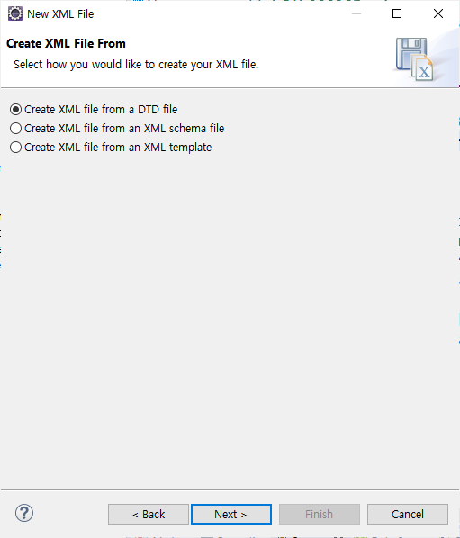
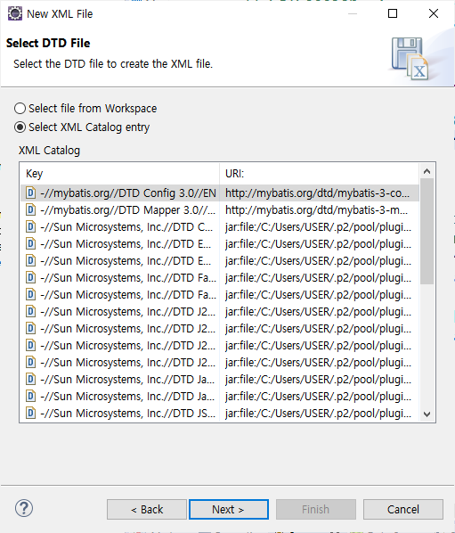
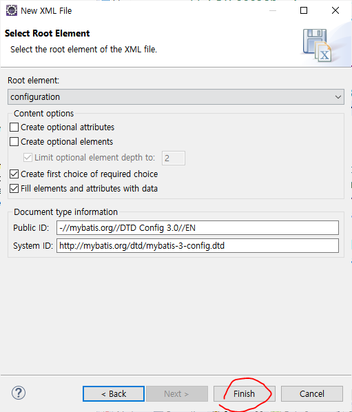

# 2020.10.05 실습

> ## index.jsp

```jsp
<%@ page language="java" contentType="text/html; charset=UTF-8"
    pageEncoding="UTF-8"%>
<!DOCTYPE html>
<html>
<head>
<meta charset="UTF-8">
<title>mybatis 실습-Index JSP</title>
</head>
<body>
	<%--표준 액션태그 --%>
	<%--기본위치: WebContent를 기준으로 위치함. --%>
	<jsp:include page="WEB-INF/views/common/menubar.jsp"/>
	<h1 align="center">Hello, MyBatis!</h1>
	<div align="center">

		<!--  
			contextPath: pageContext.servletContext.contextPath  
			이미지 경로: WebContent/resources/images/mybatis.png
		-->
		
	</div>
</body>
</html>
```

<br><BR>

> ## menubar.jsp

```jsp
<%@ page language="java" contentType="text/html; charset=UTF-8"
    pageEncoding="UTF-8"%>

<%--
	[jstl 라이브러리를 넣어야한다.]
	저장위치: WebContent/WEB-INF/lib

	taglibs-standard-compat-1.2.5.jar
	taglibs-standard-impl-1.2.5.jar
	taglibs-standard-jstlel-1.2.5.jar
	taglibs-standard-spec-1.2.5.jar
--%>
<%@ taglib prefix="c" uri="http://java.sun.com/jsp/jstl/core" %>
<!DOCTYPE html>
<html>
<head>
<meta charset="UTF-8">
<script src="https://code.jquery.com/jquery-3.5.1.min.js"></script>

<title>menubar.jsp</title>
<style>
	#welcome{background: black; text-shadow: -1px -1px 0 red, 1px -1px 0 white, -1px 1px 0 white, 1px 1px 0 white;}
	.login-area {height:100px;}
	.btn-login {height:50px;}
	.loginTable{text-align: right; float: right;}
	#logoutBtns>a{text-decoration: none; color: black;}
	#logoutBtns>a:hover{text-decoration: underline; font-weight: bold;}
</style>
</head>


<body>
	<%--
	 [변수형 태그 alias설정 ]

	 ${pageContextPath.servletContext.contextPath} 값을 contextPath로 별칭을 만들겠다.

	 이 contextPath를 사용할 수 있는 범위는 application(애플리케이션 전체)로 한다.
	--%>
	<c:set var="contextPath" value="${pageContext.servletContext.contextPath }" scope="application"/>
	<h1 id="welcome" align="center">Welcome to MyBatis World!!</h1>
		<br>


		<!-- ----------------------1. 회원 관련 서비스 -------------------------- -->
		<div class="login-area">	  
			<!-- 1_1. 로그인 관련 폼 만들기 -->
			<form action="${ contextPath }/login.me" method="post">
				<table class="loginTable">
					<tr>
						<td>아이디 : </td>
						<td>
							<input type="text" name="userId">
						</td>
						<td rowspan="2">
							<button id="login-btn" class="btn btn-login">로그인</button>
						</td>
					</tr>
					<tr>
						<td>비밀번호 : </td>
						<td>
							<input type="password" name="userPwd">
						</td>
					</tr>
					<tr>
						<td colspan="3" id="logoutBtns">
							<a href="${ contextPath }/memberInsertForm.me">회원가입</a>
							<a href="${ contextPath }/findMemberForm.me">아이디/비밀번호 찾기</a>
						</td>
					</tr>
				</table>
			</form>
		</div>

		<script>
			function home(){
				location.href="${ contextPath }";
			}
		</script>
</body>
</html>
```

<BR><BR>

> ## 실행결과


<BR><BR><BR>

# 로그인


> ## CommonFilter.java

- 모든 url에 적용한다.


<br>

- CommonFilter.java 코드

```java
package filter;

import java.io.IOException;
import javax.servlet.Filter;
import javax.servlet.FilterChain;
import javax.servlet.FilterConfig;
import javax.servlet.ServletException;
import javax.servlet.ServletRequest;
import javax.servlet.ServletResponse;
import javax.servlet.annotation.WebFilter;

/**
 * Servlet Filter implementation class CommonFilter
 */
@WebFilter("/*")
public class CommonFilter implements Filter {

    /**
     * Default constructor.
     */
    public CommonFilter() {
        // TODO Auto-generated constructor stub
    }

	/**
	 * @see Filter#destroy()
	 */
	public void destroy() {
		// TODO Auto-generated method stub
	}

	/**
	 * @see Filter#doFilter(ServletRequest, ServletResponse, FilterChain)
	 */
	public void doFilter(ServletRequest request, ServletResponse response, FilterChain chain) throws IOException, ServletException {
		request.setCharacterEncoding("UTF-8");
		response.setContentType("text/html; charset=UTF-8");
		chain.doFilter(request, response);
	}

	/**
	 * @see Filter#init(FilterConfig)
	 */
	public void init(FilterConfig fConfig) throws ServletException {
		// TODO Auto-generated method stub
	}

}
```

<br>

> ## Member.java

```java
package member.model.vo;

import java.sql.Date;

public class Member {
	private String userId;
	private String userPwd;
	private String userName;
	private String nickName;
	private String email;
	private Date birthday;
	private String gender;
	private String phone;
	private String address;
	private Date enrollDate;
	private Date updateDate;
	private String mStatus;

	public Member() {}

	public Member(String userId, String userPwd, String userName, String nickName, String email, Date birthday,
			String gender, String phone, String address) {
		super();
		this.userId = userId;
		this.userPwd = userPwd;
		this.userName = userName;
		this.nickName = nickName;
		this.email = email;
		this.birthday = birthday;
		this.gender = gender;
		this.phone = phone;
		this.address = address;
	}


	public Member(String userId, String userPwd, String userName, String nickName, String email, Date birthday,
			String gender, String phone, String address, Date enrollDate, Date updateDate, String mStatus) {
		super();
		this.userId = userId;
		this.userPwd = userPwd;
		this.userName = userName;
		this.nickName = nickName;
		this.email = email;
		this.birthday = birthday;
		this.gender = gender;
		this.phone = phone;
		this.address = address;
		this.enrollDate = enrollDate;
		this.updateDate = updateDate;
		this.mStatus = mStatus;
	}

	public String getUserId() {
		return userId;
	}

	public void setUserId(String userId) {
		this.userId = userId;
	}

	public String getUserPwd() {
		return userPwd;
	}

	public void setUserPwd(String userPwd) {
		this.userPwd = userPwd;
	}

	public String getUserName() {
		return userName;
	}

	public void setUserName(String userName) {
		this.userName = userName;
	}

	public String getNickName() {
		return nickName;
	}

	public void setNickName(String nickName) {
		this.nickName = nickName;
	}

	public String getEmail() {
		return email;
	}

	public void setEmail(String email) {
		this.email = email;
	}

	public Date getBirthday() {
		return birthday;
	}

	public void setBirthday(Date birthday) {
		this.birthday = birthday;
	}

	public String getGender() {
		return gender;
	}

	public void setGender(String gender) {
		this.gender = gender;
	}

	public String getPhone() {
		return phone;
	}

	public void setPhone(String phone) {
		this.phone = phone;
	}

	public String getAddress() {
		return address;
	}

	public void setAddress(String address) {
		this.address = address;
	}

	public Date getEnrollDate() {
		return enrollDate;
	}

	public void setEnrollDate(Date enrollDate) {
		this.enrollDate = enrollDate;
	}

	public Date getUpdateDate() {
		return updateDate;
	}

	public void setUpdateDate(Date updateDate) {
		this.updateDate = updateDate;
	}

	public String getmStatus() {
		return mStatus;
	}

	public void setmStatus(String mStatus) {
		this.mStatus = mStatus;
	}

	@Override
	public String toString() {
		return "Member [userId=" + userId + ", userPwd=" + userPwd + ", userName=" + userName + ", nickName=" + nickName
				+ ", email=" + email + ", birthday=" + birthday + ", gender=" + gender + ", phone=" + phone
				+ ", address=" + address + ", enrollDate=" + enrollDate + ", updateDate=" + updateDate + ", mStatus="
				+ mStatus + "]";
	}

}
```

<br><br>

> ## LoginServlet.java

- menubar.jsp에서 로그인 버튼클릭할 때 form태그의 action과 연결된 서블릿.

```java
package member.controller;

import java.io.IOException;

import javax.servlet.ServletException;
import javax.servlet.annotation.WebServlet;
import javax.servlet.http.HttpServlet;
import javax.servlet.http.HttpServletRequest;
import javax.servlet.http.HttpServletResponse;

import member.model.service.MemberService;
import member.model.vo.Member;

/**
 * Servlet implementation class LoginServlet
 */
@WebServlet("/login.me")
public class LoginServlet extends HttpServlet {
	private static final long serialVersionUID = 1L;

    /**
     * @see HttpServlet#HttpServlet()
     */
    public LoginServlet() {
        super();
        // TODO Auto-generated constructor stub
    }

	/**
	 * @see HttpServlet#doGet(HttpServletRequest request, HttpServletResponse response)
	 */
	protected void doGet(HttpServletRequest request, HttpServletResponse response) throws ServletException, IOException {
		//menubar.jsp에서 form태그에 입력된 아이디와 비밀번호를 받는다.
		String userId= request.getParameter("userId");
		String userPwd= request.getParameter("userPwd");

		Member m= new Member();
		m.setUserId(userId);
		m.setUserPwd(userPwd);

		Member member=new MemberService().selectMember(m);
	}

	/**
	 * @see HttpServlet#doPost(HttpServletRequest request, HttpServletResponse response)
	 */
	protected void doPost(HttpServletRequest request, HttpServletResponse response) throws ServletException, IOException {
		// TODO Auto-generated method stub
		doGet(request, response);
	}

}

```

<br>

> ## MemberService.java

- MVC패턴 model.service 단의 역할
  - Connection연결하여 DAO와 연결하여 넘기는 역할.
  - JDBC_Template 리턴값이 필요함.
  - 그런데 Mybatis에서는... Connection을 필요로하지 않고, **`sqlSession`** 을 반환하는 템플릿 클래스를 만들어서 연결.

```java
package member.model.service;

import static common.Template.getSqlSession;

import org.apache.ibatis.session.SqlSession;

import member.model.vo.Member;

public class MemberService {

	public Member selectMember(Member m) {
		SqlSession session = getSqlSession();
		System.out.println(session);

		Member member=null;
		return member;
	}

}
```

<br>

> ## 데이터베이스 연결

### 1. SQL Developer - 데이터베이스 계정 만들기

```sql
-- SYSTEM 계정에서 진행.

-- DB계정 생성하기 (계정이름: MyBatis/ 패스워드: MyBatis)
CREATE USER MyBatis IDENTIFIED BY MyBatis;

-- MyBatis 계정에 권한 부여하기
GRANT RESOURCE, CONNECT TO MyBatis;
```

### 2. [실습 관련 SQL 쿼리문]

- 계정을 `MyBatis`로 해야한다.

<br><BR>

> ## Template.java

- getConnection()과 똑같은 역할.
- commit()/ rollback() / close()도 JDBC_Template.java에서 수행.

```java
package common;

import java.io.IOException;
import java.io.InputStream;

import org.apache.ibatis.io.Resources;
import org.apache.ibatis.session.SqlSession;
import org.apache.ibatis.session.SqlSessionFactory;
import org.apache.ibatis.session.SqlSessionFactoryBuilder;

public class Template {


	public static SqlSession getSqlSession() {
		// SqlSession  <--------- SqlSessionFactory <---------- SqlSessionFactoryBuilder
		// 				openSession()				build(InputStream)

		//리턴 대상 session
		SqlSession session =null;

		// 1. SqlSessionFactoryBuilder 객체 생성
		SqlSessionFactoryBuilder ssfb= new SqlSessionFactoryBuilder();


		try {
			// 2. SqlSessionFactory 객체생성
			// mybatis-config.xml: mybatis전체설정 정보를 갖고있다.
			InputStream inputStream = Resources.getResourceAsStream("/mybatis-config.xml");
			SqlSessionFactory ssf= ssfb.build(inputStream);

			// 3. SqlSession 객체 생성.
			session=ssf.openSession();
		} catch (IOException e) {
			e.printStackTrace();
		}

		return session;
	}
}

```

- 위의 코드의 문제점: getResourceAsStream() 인자의 `mybatis-config.xml`이 어디에있지?

> ### mybatis-config.xml 을 저장하자.


- (1) dynamic web 프로젝트 클릭
- (2) 오른쪽 마우스 클릭
- (3) New
- (4) Source Folder
- (5) 이름: resources
- (6) Finish 버튼 클릭

<br><br>


- (8) `Java Resources`안에 있는 `resources` 패키지 클릭 -> 마우스 우클릭
- (9) New -> other클릭
- (10) xml -> next -> 이름: `mybatis-config` -> next

- (11) Create XML file from a DTD file 선택 후 next


<BR>

- (12) Select XML Catalog entry 클릭 후 Next선택 (key와 uri는 사진과, :point_down: 아래 참고.)
  - KEY: `-//mybatis.org//DTD Config 3.0//EN`
  - URI: `http://mybatis.org/dtd/mybatis-3-config.dtd`

<BR>



<BR>



<BR><BR>

> # mybatis-config.xml 파일

```xml
<?xml version="1.0" encoding="UTF-8"?>
<!DOCTYPE configuration PUBLIC "-//mybatis.org//DTD Config 3.0//EN" "http://mybatis.org/dtd/mybatis-3-config.dtd" >
<configuration>
	<!--DB에 연결할 설정 정보를 선언하는 부분  
		[environments -	default 옵션]
		- 여러개의 db에 연결할 수있다.
		- 기본적으로 어떤 db랑 연결할 건지를 설정한다.
		- default 옵션에는 기본적으로 연결할 db의 id를 넣으면 된다.

		- 연결 설정을 여러개 생성하여 아이디로 구분하고
		- 기본적으로 연결할 설정 정보를 설정하는 속성이다.
	-->
	<environments default="development">

		<!--

		[environments]
		- id를 통해서  db의 설정정보를 구분하고 연결할 수있다.
		-->
		<environment id="development">
			<transactionManager type="JDBC"></transactionManager>
			<dataSource type="POOLED">
				<property name="driver" value="oracle.jdbc.driver.OracleDriver"/>
				<property name="url" value="jdbc:oracle:thin:@localhost:1521:xe"/>
				<property name="username" value="MyBatis"/>
				<property name="password" value="MyBatis"/>
			</dataSource>
		</environment>
	</environments>
</configuration>
```

<br><br>

> ## mybatis-config.xml - db driver관련 정보를 프로퍼티에 저장 및 프로퍼티로부터 드라이버정보를 불러오는 방법


- ### 프로퍼티 파일 만들기 -  `driver.properties`
  - `Java Resources/resources` 마우스 우클릭 => `New` => `Other`=> `File`
  - 파일명: `driver.properties`

```
driver=oracle.jdbc.driver.OracleDriver
url=jdbc:oracle:thin:@localhost:1521:xe
userName=MyBatis
password=MyBatis

```

- ### `mybatis-config.xml` 코드

```xml
<?xml version="1.0" encoding="UTF-8"?>
<!DOCTYPE configuration PUBLIC "-//mybatis.org//DTD Config 3.0//EN" "http://mybatis.org/dtd/mybatis-3-config.dtd" >
<configuration>
	<!--DB에 연결할 설정 정보를 선언하는 부분  
		[environments -	default 옵션]
		- 여러개의 db에 연결할 수있다.
		- 기본적으로 어떤 db랑 연결할 건지를 설정한다.
		- default 옵션에는 기본적으로 연결할 db의 id를 넣으면 된다.

		- 연결 설정을 여러개 생성하여 아이디로 구분하고
		- 기본적으로 연결할 설정 정보를 설정하는 속성이다.
	-->
	<environments default="development">

		<!--

		[environments]
		- id를 통해서  db의 설정정보를 구분하고 연결할 수있다.
		-->
		<environment id="development">
			<transactionManager type="JDBC"></transactionManager>
			<dataSource type="POOLED">
				<!-- 직접입력하여 드라이버 정보를 불러오는 방식 -->
				<!--
				<property name="driver" value="oracle.jdbc.driver.OracleDriver"/>
				<property name="url" value="jdbc:oracle:thin:@localhost:1521:xe"/>
				<property name="username" value="MyBatis"/>
				<property name="password" value="MyBatis"/>
				-->

				<!-- 프로퍼티에 저장된 드라이버정보를 불러오는 방식  ${}는 EL이 아니다.-->
				<property name="driver" value="${driver}"/>
				<property name="url" value="${url}"/>
				<property name="username" value="${username}"/>
				<property name="password" value="${password}"/>
			</dataSource>
		</environment>
	</environments>


	<properties resource="/driver.properties"/>
</configuration>

```

<br>

- 바로 위에 있는 `mybatis-config.xml`에서 에러가 발생한다. 어디서부터 잘못된것일까?

- `mybatis-config.xml`은 mybatis에 관한 모든 설정정보를 갖고 있다.

- 그리고, 구성하는 여러 태그가 있는데, 태그들의 순서가 정해져있다.
  - **태그들의 순서를 반드시 지켜야한다.**
  - 따라서 `<properties>` 태그의 위치는 `<environments>`보다 위에 있어야한다.

- 태그들의 순서를 지키지 않을 때, 아래와 같은 에러메시지를 발생한다.


```
[error message]

The content of element type "configuration" must match

"(properties?,settings?,typeAliases?,typeHandlers?,objectFactory?,objectWrapperFactory?,reflectorFactory?,plugins?,environments?,databaseIdProvider?,mappers?)".
```

<br><BR>

```xml
<?xml version="1.0" encoding="UTF-8"?>
<!DOCTYPE configuration PUBLIC "-//mybatis.org//DTD Config 3.0//EN" "http://mybatis.org/dtd/mybatis-3-config.dtd" >
<configuration>
	<!--DB에 연결할 설정 정보를 선언하는 부분  
		[environments -	default 옵션]
		- 여러개의 db에 연결할 수있다.
		- 기본적으로 어떤 db랑 연결할 건지를 설정한다.
		- default 옵션에는 기본적으로 연결할 db의 id를 넣으면 된다.

		- 연결 설정을 여러개 생성하여 아이디로 구분하고
		- 기본적으로 연결할 설정 정보를 설정하는 속성이다.
	-->


	<properties resource="/driver.properties"/>


	<!-- settings: MyBatis와 관련된 기본 세팅을 선언한다. -->
	<settings>
		<!--
		jdbcTypeForNull을 설정하지 않으면
		데이터가 NULL로  전송하게 될 때, 빈칸(white space)로 표현한다.

		설정을 하면, 데이터값이 NULL일때  NULL로 표현하도록 한다.

		value옵션의 값은 반드시 대문자로 표현해야한다. Null, null은 널값으로 인지하지 못한다.
		-->
		<setting name="jdbcTypeForNull" value="NULL"/>
	</settings>

	<environments default="development">

		<!--

		[environments]
		- id를 통해서  db의 설정정보를 구분하고 연결할 수있다.
		-->
		<environment id="development">
			<transactionManager type="JDBC"></transactionManager>
			<dataSource type="POOLED">
				<!-- 직접입력하여 드라이버 정보를 불러오는 방식 -->
				<!--
				<property name="driver" value="oracle.jdbc.driver.OracleDriver"/>
				<property name="url" value="jdbc:oracle:thin:@localhost:1521:xe"/>
				<property name="username" value="MyBatis"/>
				<property name="password" value="MyBatis"/>
				-->

				<!-- 프로퍼티에 저장된 드라이버정보를 불러오는 방식  ${}는 EL이 아니다.-->
				<property name="driver" value="${driver}"/>
				<property name="url" value="${url}"/>
				<property name="username" value="${username}"/>
				<property name="password" value="${password}"/>


			</dataSource>
		</environment>
	</environments>


</configuration>

```

<BR>

> ## MemberService.java 코드 추가

```java
package member.model.service;

import static common.Template.getSqlSession;

import org.apache.ibatis.session.SqlSession;

import member.model.dao.MemberDAO;
import member.model.vo.Member;

public class MemberService {

	public Member selectMember(Member m) {
		SqlSession session = getSqlSession();
		System.out.println(session);

		Member member=new MemberDAO().selectMember(session, m);
		return member;
	}

}
```

<br><br>

- 로그인은 결과값이 최대 1개이다. (회원이다: 1,  회원이 아니다: 0)
- `sqlSession`객체의 `selectOne()` 메소드를 사용하여 db로부터 데이터를 불러온다.

<br>

- selectOne() 메소드는 인자개수에따라 메소드 오버로딩이 되어있다. 둘의 차이점은 무엇일까? 특히 인자 arg0과 arg1은 각각 무슨역할을 할까?
  - `session.selectOne(String arg0) : T-SqlSession`
  - `session.selectOne(String arg0, Object arg1) : T-SqlSession`

- ### 인자 `arg0`과 `arg1`의 역할?
  - #### `arg0` : 어느 쿼리를 가지고올지에 대한 id를 의미함.
    - **쿼리문 이름**
    - **쿼리문은 `mapper.xml`에서 작성한다.**
  - #### `arg1` :

- ### `mapper.xml` :  쿼리에 대한 정보를 갖고있다. 쿼리문을 작성할 수 있다.

<br>

> # mapper.xml 설정하기

- ### mapper.xml 파일 만들기
  - (1) 패키지 만들기
    - 패키지 이름: **mappers**
    - 패키지 저장위치: **`Java Resources`/`resources`**

  - (2) member-mapper.xml 파일 만들기
    - xml파일이름: **member-mapper**
    - 저장위치: **`Java Resources`/ `resource` / `mappers`**

<br>

- `member-mapper.xml`- 직접 입력하는 방법

```xml
<?xml version="1.0" encoding="UTF-8"?>
<!DOCTYPE mapper PUBLIC "-//mybatis.org//DTD Mapper 3.0 EN" "http://mybatis.org/dtd/mybatis-3-mapper.dtd">
```
<br>

- ### dtd파일을 만들어서 불러오는 방법
  - (1) DTD파일 만들기
    - `Window` > `Preferences` > `XML` > `XML Catalog`
    - `User Specified Entries`선택하고 `Add`버튼 클릭
    - **Location: `http://mybatis.org/dtd/mybatis-3-mapper.dtd`**
    - **Key: `-//mybatis.org//DTD Mapper 3.0//EN`**

  - (2) member-mapper.xml 파일 만들기
    - 저장위치: **`Java Resources`/ `resource` / `mappers`**
    - `New` > `Other` > `XML File` > Next버튼 클릭
    - xml파일이름: **member-mapper**
    - Next 버튼 클릭
    - `Create XML file from a DTD file` 선택 > Next버튼 클릭
    - `Select XML Catalog entry` 선택
      - Key가 `-//mybatis.org//DTD Mapper 3.0//EN` 인 카탈로그 선택 후, Next버튼 클릭

    - **Root element**가 `mapper`로 되어있고, 빨간색 밑줄이 없으면, Finish버튼 클릭


<br>


```xml
<?xml version="1.0" encoding="UTF-8"?>
<!DOCTYPE mapper PUBLIC "-//mybatis.org//DTD Mapper 3.0//EN" "http://mybatis.org/dtd/mybatis-3-mapper.dtd" >
<mapper>

	<select id="loginMember"></select>
</mapper>

```

<hr>

<br>

[GO TO TOP :point_up:](#)

<br><br>

# 2020.10.06

> ## MyBatis 정리

- 후에 Spring을 이용하여, MyBatis와 연결을 한다.

- JDBC에서는 Connection을 사용했지만, MyBatis에서는 SqlSession을 통해서 이용한다.

- `mybatis-config.xml`: mybatis에 대한 모든 설정을 갖고있다.
  - `<configuration>`내에서 사용되는 여러 개의 태그
    - **`<properties>`**: 외부에 있는 프로퍼티 파일들을 불러올 때 사용하는 태그이다.
    - **`<settings>`**: mybatis에 대한 기본 설정 정보을 갖고있는태그
    - **`<environments>`**: db에 연결할 설정정보를 갖고 있다.
      - **default** 인자: `<environment>`의 **`id`** 를 넣는다.
      - 기본적으로 연결할 db를 설정하는 것이며, 인자의 id의 값은, 해당 id에 대응되는 db정보를 기본으로 하겠다는 것이다.<br>
      - 예시: 아래코드 `<environments default="sample01">`은 id가 `sample01`인 `environment`를 기본으로 연결할 데이터베이스로 설정하겠다는 의미이다.<br>


      ```xml
      <environments default="sample01">
        <environment id="sample01">
          <transactionManager type="JDBC"></transactionManager>
          <dataSource type="POOLED">
            <property name="driver" value="oracle.jdbc.driver.OracleDriver"/>
      			<property name="url" value="jdbc:oracle:thin:@localhost:1521:xe"/>
      			<property name="username" value="MyBatis"/>
      			<property name="password" value="MyBatis"/>
          </dataSource>
        </environment>

        <environment id="sample02">
        </environment>

        <environment id="sample03">
        </environment>
      </environments>
      ```

      - **`<environment>`**
        - **`<transactionManager>`**
          - 트랜젝션에 대해서 어떻게 관리를 할 것인지.
          - 자동커밋(MANAGED)/수동커밋(JDBC) 에 대한 설정

        - **`<dataSource>`**: 실제연결할 DB정보를 가져온다.
          - **<property>** : 드라이버에 대한 정보
<br>

- `web.xml` : application에 대한 전체 설정정보.

<br>

> ## member-mapper.xml

```xml

```

<br>

- `parameterType`: DAO에서 mapper로 인자값을 보내려고할때, 인자의 타입을 설정하여 받아야한다.


<br>

> ##


<BR>

[GO TO TOP :point_up:](#)

<br><br>
