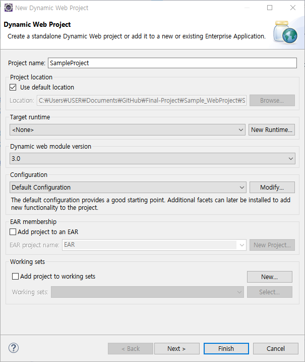
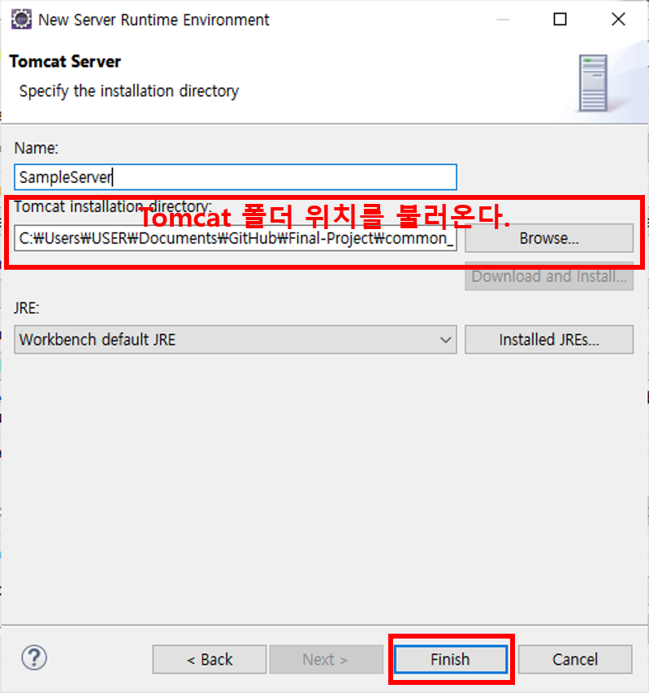
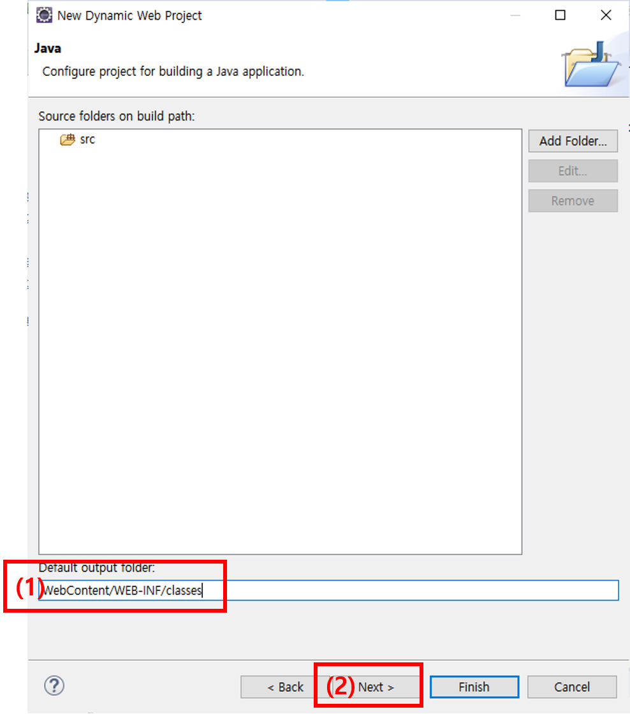
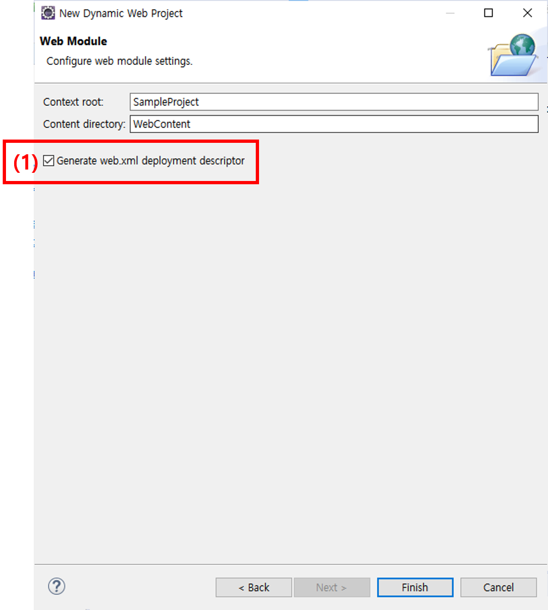
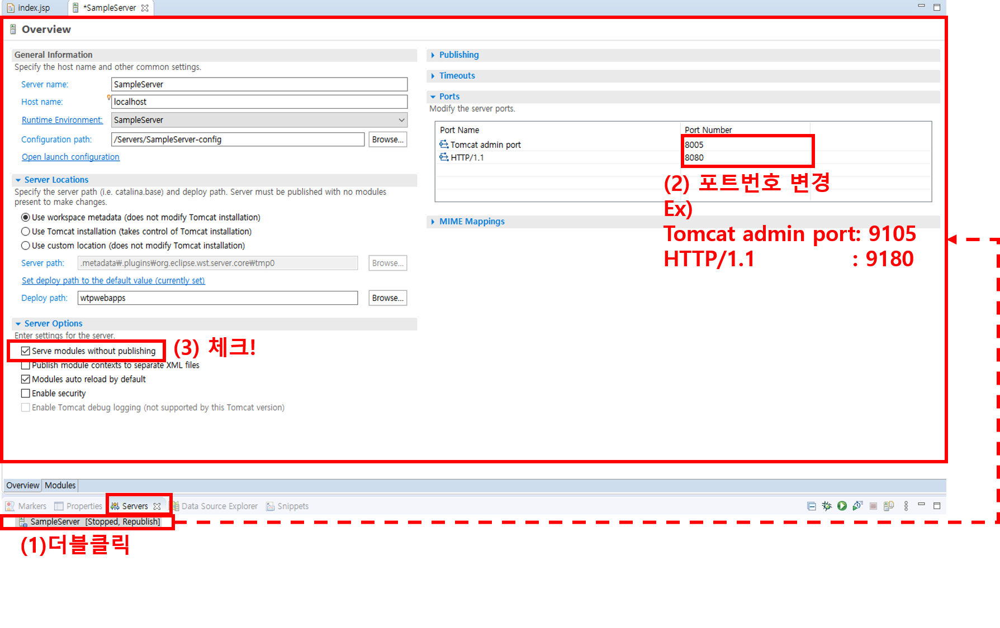

# :computer: Dynamic Web Project 만들기

요약

- 1. 프로젝트 만들기 [:baby_chick:](#1.-프로젝트-만들기)
- 2. 서버 연결하기 [:baby_chick:](#2.-서버-연결하기)
- 3. jar파일 연결 [:baby_chick:](#3.-jar파일-연결)

 

> ## 1. 프로젝트 만들기

- #### (1) 오른쪽 마우스 클릭
- #### (2) New
- #### (3) Dynamic Web Project

 

> #### (1) 프로젝트 이름 작성
> #### (2) Target Run Time 에서 `**New Run Time**` 클릭

> #### (3) 톰캣 서버 버젼 선택: **`Apache Tomcat v9.0`**
> #### (4) Next

 

> #### (2-3) 톰캣 서버 이름 작성
> #### (2-4) 톰캣 서버 위치 - `apache-tomcat-9.x 디렉토리 경로`를 찾으면 된다.
> #### (2-5) Finish 버튼 클릭

 

> #### (3) Next 버튼 클릭

 

> #### (1) Default output folder 경로 수정: **`WebContent/WEB-INF/classes`**
> #### (2) Next 버튼 클릭

 

> #### (1) Generate web.xml deployment descriptor 체크 박스 체크
> #### (2) Finish 버튼 클릭

  

> ## 2. 서버 연결하기

> #### (1) 하단 **`Servers`** 탭 클릭
> #### (2) 만일 서버가 존재하지 않는다면 **`No servers are available Click this link to create a new server`** 링크 클릭

> #### (3) 서버이름(Server name) 작성.
    - Server's host name: localhost로 일단 둔다.

> #### (4) Finish 버튼 클릭

 

> #### (5-1) 만든 서버 다시클릭
> #### (5-2) Port번호 변경 - 8080은 이미 사용되고 있음. 다른 포트번호와 충돌되지 않게 한다.
> #### (5-3) `Serve modules without publishing` 체크박스 체크표시!
> #### (5-4) 서버 저장하기( 단축키: `ctrl`+`s` )

 

> ## 3. jar파일 연결

- #### **`ojdbc6.jar`** 파일은 **`WebContent/WEB-INF/lib`** 에 넣는다.
- #### 그동안 사용한 jar 파일들
    - jdbc관련: `ojdbc6.jar`
    - cos 관련: `cos.jar`
    - json관련: `json-simple-1.1.1.jar`
    - gson관련: `gson-2.8.5.jar`
    - mybatis관련: `mybatis-3.5.5.jar`
    - jstl 관련
        - `taglibs-standard-compat-1.2.5.jar`
        - `taglibs-standard-impl-1.2.5.jar`
        - `taglibs-standard-jstlel-1.2.5.jar`
        - `taglibs-standard-spec-1.2.5.jar`

 

[:arrow_up:](#)