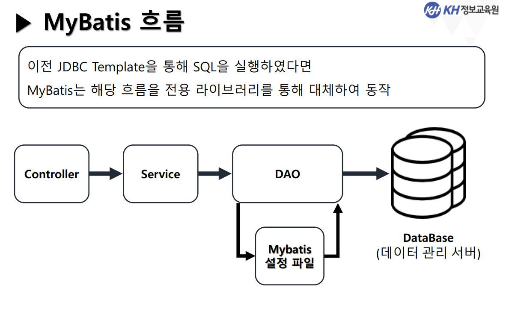
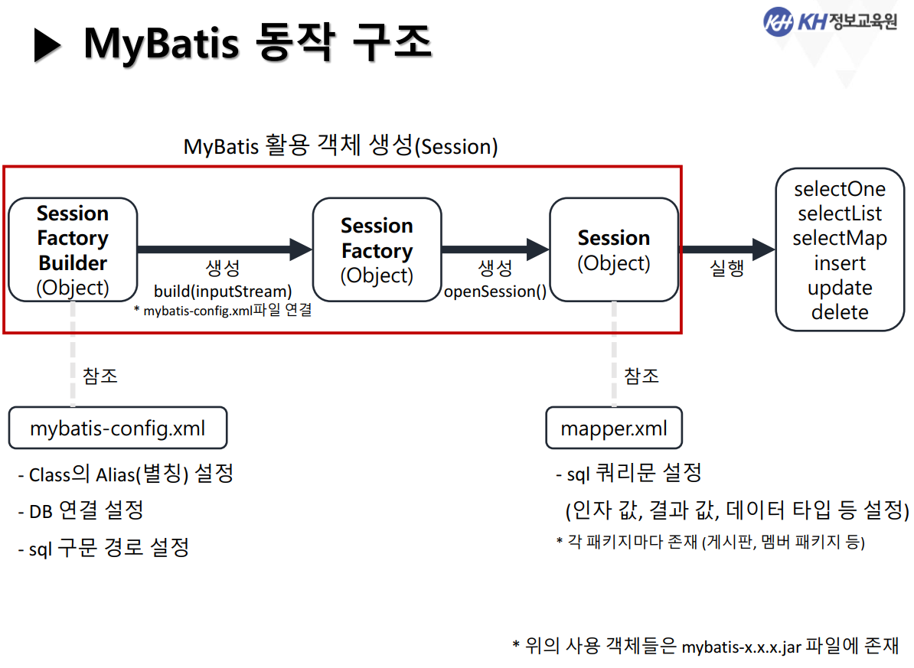

# Framework

- 프레임워크 프로그램 자체에 책임이 있다.

- 프레임워크 => 유지보수를 할 수 있다.
  - 개발 시간을 줄일 수 있음.
  - 틀이 잡혀있는 상태
    - 수정하기가 용이.

  

# 프레임워크 종류

|구분|종류|설명|
|:--:|:--:|:--:|
|**영속성**| **MyBatis** , Hibernate|데이터의 저장, 조회, 변경, 삭제를 다루는 클래스 및 설정 파일을 라이브러리화하여 구현|
|자바|Spring Framework|Java EE를 통한 Web Application개발에 초점을 맞춰 필요한 요소들을 모듈화하여 제공|
|화면구현|Bootstrap, Foundation, MDL| FE를 보다 쉽게 구현할 수 있는 틀 제공|
|기능지원|Log4j, JUnit5, ANT| 특정기능이나 업무 수행에 도움을 줄 수 있는 기능 제공|

  

# WEB.XML을 강조한 이유?

- `**web.xml**`은 `**웹어플리케이션 전체 설정정보**`대한 설정

- ### mybatis에서 나오는 xml
  - <h3>`mybatis-confit.xml`</h3> : **myBatis에 대한 전체 설정 정보**를 갖고 있다.

  - <H3>`mapper`</H3> : **쿼리에 대한 정보**를 갖고있다.
    - 이전에 query문을 저장하는 properties와 같은 역할.

  

# MyBatis

- Mapper설정파일을 통해 JDBC를 구현한 영속성 프레임워크
- MyBatis 흐름

 

- MyBatis동작구조

  - `sql Session Factory Builder(Object)` =( 객체 생성/  build(inputStream:myBatis-config.xml파일연결) )  =>`sql Session Factory(Object)` =( 생성/ openSession() )=>`sql Session(Object)`=( 실행 )=>`selectOne`/ `selectList`/ `selectMap` / `insert`/ `update`/ `delete`

  

- 필기

`<jsp:include>` : 표준 액션 태그

# myBatis- SqlSession

- 그동안 우리는 common패키지에 `JDBCTemplate.java`에서 commit, rollback처리 그리고 커넥션연결, close를 다 직접짰다.

- SqlSession은 commit, rollback, close(resultSet, PrepareStatement, Statement)에 대한 처리코드를 직접 작성하지 않아도 된다.
