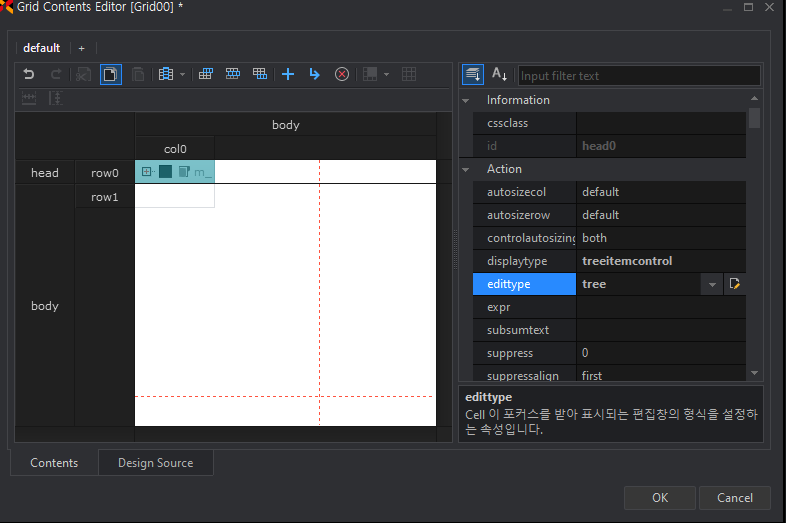
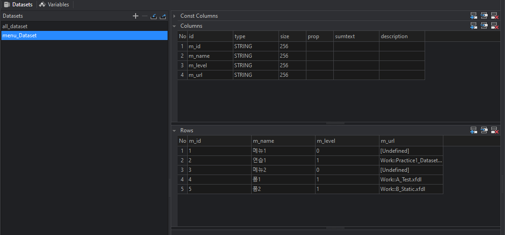
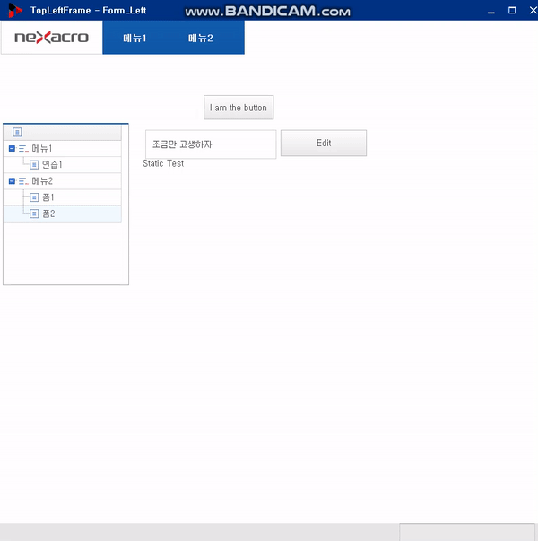

> # Frame 설정하기

## Frame을 이용한 화면 배치

- ### `MainFrame`: 최상위 프레임
- ### `ChildFrame`
  - `ChildFrame`에 화면(Form)을 배치한다.
  - **기본적으로 제공하는 하위프레임**
  - 하위로 **하나의 폼만 가질 수 있다.**

- 기본 제공되는 프레임은 `MainFrame`, `ChildFrame`으로 나뉜다.

- ### NodeFrame
  - ##### FrameSet
    - 특별한 형태없이 하위 프레임을 배치한다.
    - 2개 이상의 하위 프레임이 추가되면 계단식으로 배치하며 위치 속성값을 지정하면 해당 위치에 배치
    - 하위로 Node Frame 또는 ChildFrame을 가질 수 있다.

  - ##### VFrameSet
    - `세로` 형태로 하위 프레임을 배치
    - seperatesize속성으로 하위 프레임 배치 비율을 지정
    - 하위로 Node Frame 또는 ChildFrame을 가질 수 있다.

  - ##### HFrameSet
    - `가로` 형태로 하위 프레임을 배치
    - seperatesize속성으로 하위 프레임 배치 비율을 지정
    - 하위로 Node Frame 또는 ChildFrame을 가질 수 있다.

  - ##### TileFrameSet
    - 바둑판(표)형태로 하위 프레임을 배치
    - seperatetype, seperatecount 속성으로 가로, 세로 방향에 배치될 하위 프레임을 지정
    - 하위로 Node Frame 또는 ChildFrame을 가질 수 있다.


# FRAME: Multi Document Interface(MDI, 다중프레임)


- ### File > NEW > Application > Application ID: `App_MDI`

- ### MainFrame properties
  - width= height=800
- VFrame의 properties
  - 자식 프레임
  - seperatesize: 50, *

- `*.xadl`: Application
- `*.xfdl`: form
  - 컴포넌트 연결, 이벤트 연결...

- Form_Top, Form_Left, Form_Work
- 전역데이터셋: Application variable에서 만든다.

- ### Form_Left
  - row0

  
    - Actions 프로퍼티에서...
      - **displaytype**: `treeitemcontrol`
      - **edittype**: `tree`
      - **text**: `bind:m_name`
    - CellTreeItem 프로퍼티에서...
      - **treelevel**: `bind:m_level`
  - row1
    - Actions 프로퍼티에서..
      - **displaytype**: `treeitemcontrol`
      - **edittype** : `tree`
      - **text**: `bind:m_name`
    - CellTreeItem 프로퍼티에서..
      - **treelevel**: `bind:m_level`

- ### Grid클릭
  - CellTreeItem 프로퍼티에서...
    - `treeinitstatus`: expand,all (열어놓은 상태에서 본다.)
    - `treeusecheckbox`: false
- 두개를 한꺼번에 보고싶다면 => 퀵뷰가 아니라 Launch로 본다.
  - Generate > Launch > Run Screen: `screen00_1 App_MDI`


<BR><BR><BR>

> # 이벤트 연결하기

- 데이터셋




- ### Form_Left.xfdl
  - Grid의 event 프로퍼티에서..
    - oncellclick 더블클릭 => 이벤트 스크립트 함수 작성.

```js
var objApp=nexacro.getApplication();


this.Grid00_oncellclick = function(obj:nexacro.Grid,e:nexacro.GridClickEventInfo)
{
	// sid: dataset에 있는것을 가져온다.
	// getApplication(). 전역으로 가져온다.
	// 내가 들어온 이벤트에서 클릭한 row값과 m_id를 인자로한다.
	//var sid=nexacro.getApplication().menu_Dataset.getColumn(e.row, "m_id");
	//var surl=nexacro.getApplication().menu_Dataset.getColumn(e.row, "m_url");
	var sid=objApp.menu_Dataset.getColumn(e.row, "m_id");
	var surl=objApp.menu_Dataset.getColumn(e.row, "m_url");

	//콘솔 출력: nexacro.getApplication.trace(~);
	nexacro.getApplication().trace(sid);
	nexacro.getApplication().trace(surl);

	this.fn_open(sid,surl)
};

// 폼 내부의 함수
this.fn_open=function(sid, surl){
	//워크프레임에 접근해야한다.
	// 메인프레임안에 vFrame이 있고
	// vFrame안에 hFrame이 있고
	// hFrame안에 workFrame이 있다.
	var parentFrame=objApp.mainframe.VFrameSet00.HFrameSet00.WorkFrame;
	parentFrame.set_formurl(surl); //surl과 연결.
}
```



