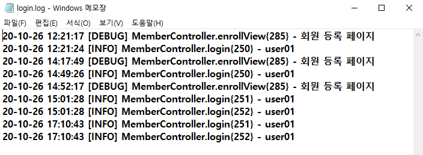
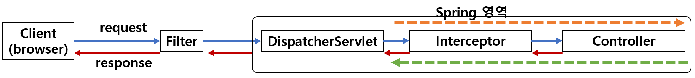
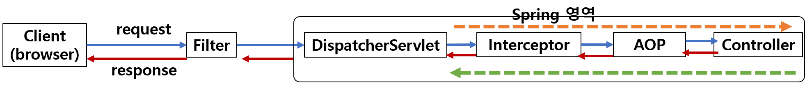

> # Logger와 Interceptor

> # Logger

<br>

Spring프로젝트를 시작하다보면 Console에 빨간색 글씨가 보일것이다. 수많은 로그들을 출력한다.

<br>

특히 HomeController.java 코드의 `logger.info("Welcome home! The client locale is {}.", locale);` 라는 메소드가 로그이다!

<br>

> ### HomeController.java

```java
package com.kh.spring;

import java.text.DateFormat;
import java.util.Date;
import java.util.Locale;

import org.slf4j.Logger;
import org.slf4j.LoggerFactory;
import org.springframework.stereotype.Controller;
import org.springframework.ui.Model;
import org.springframework.web.bind.annotation.RequestMapping;
import org.springframework.web.bind.annotation.RequestMethod;

/**
 * Handles requests for the application home page.
 */
@Controller
public class HomeController {

	//클래스에 대한 정보를 같이 보내줘야 로그출력이 가능하다.
	private static final Logger logger = LoggerFactory.getLogger(HomeController.class);

	@RequestMapping(value = "/home.do", method = RequestMethod.GET)
	public String home(Locale locale, Model model) {
		logger.info("Welcome home! The client locale is {}.", locale);

		return "home";
	}
}
```

<br>

로그를 관리하는 파일은 **`src/min/resources/log4j.xml`** 이다.

<br>

`log4j.xml` 파일에는 크게보면 `<appender>`와 `<logger>`, `<root>` 로 구성되어있다.

> ### log4j.xml

```xml
<?xml version="1.0" encoding="UTF-8"?>
<!DOCTYPE log4j:configuration PUBLIC "-//APACHE//DTD LOG4J 1.2//EN" "log4j.dtd">
<log4j:configuration xmlns:log4j="http://jakarta.apache.org/log4j/">

  <!--appender 태그 -->
  <appender name="console" class="org.apache.log4j.ConsoleAppender">
		<param name="Target" value="System.out" />

		<layout class="org.apache.log4j.PatternLayout">

			<param name="ConversionPattern" value="%-5p: %c 테스트입니다. - %m%n" />
		</layout>
	</appender>

  <!-- logger태그 -->
  <logger name="com.kh.spring">
		<level value="info" />
		<appender-ref ref="console"/>
	</logger>

  <!-- 3rdparty Loggers -->
  <logger name="org.springframework.core">
    <level value="info" />
  </logger>

  <logger name="org.springframework.beans">
    <level value="info" />
  </logger>

  <logger name="org.springframework.context">
    <level value="info" />
  </logger>

  <logger name="org.springframework.web">
    <level value="info" />
  </logger>


  <!-- Root Logger -->
  <root>
    <priority value="warn" />
    <appender-ref ref="console" />

  </root>
</log4j:configuration>

```

<br><br>

> ### <root> (root Logger) : 모든 자식 logger들의 출력은 root로거를 거쳐서 이뤄진다.

```xml
<root>
	<priority value="warn" />
	<appender-ref ref="console" />
</root>
```

<br>

여기서 보면, `appender-ref ref="console"`인 것을보아, 루트로거는 `name="console"`인 appender을 참조한다.

```xml
<appender name="console" class="org.apache.log4j.ConsoleAppender">
  <param name="Target" value="System.out" />

  <layout class="org.apache.log4j.PatternLayout">
    <param name="ConversionPattern" value="%-5p: %c - %m%n" />
  </layout>
</appender>
```

<br>

위의 이름이 console인 로그를 뜯어보자.

`<appender name="console" class="org.apache.log4j.ConsoleAppender">`

- 이름이 **console**이다.
- `<logger>`나 `<root>`에 `<appender-ref ref="console"/>`이라함은, **이름이 console인 appender을 참고한다**는 의미이다.

<br>

- 이름이 console인 appender은 org.apache.log4j 패키지에 위치한  **ConsoleAppender이라는 객체를 불러온다.**

<br>

<layout class="org.apache.log4j.PatternLayout">안에 있는 **`<param name="ConversionPattern" value="%-5p: %c - %m%n" />`** 은 우리가 프로젝트를 실행했을 때 (home.do url을 호출했을때) 나타내는 로그이다.

<br>

우리는 프로젝트를 실행할때마다, 페이지를 이동할때마다 아래와 같은 로그들을 봤다.

```
INFO : org.springframework.web.context.ContextLoader - Root WebApplicationContext initialized in 10280 ms

INFO : org.springframework.web.servlet.DispatcherServlet - Initializing Servlet 'boardServlet'
```

<br>

이렇게 출력할 수 있는것은 바로 **`<param name="ConversionPattern" value="%-5p: %c - %m%n" />`** 포맷터를 적용해서 콘솔에 출력했기 때문이다.

그러면 어디 코드에서 콘솔에 출력하라고 명시해놨을까?

<br>

그에 대한 답은 **`<param name="Target" value="System.out" />`** 의 value에 해당한다. 즉 value에 해당하는 부분은 `System.out.print()`는 자바를 시작한 우리에게 아주 익숙한 콘솔 출력문이다.

<br>

다시 name="console"인 appender을 정리해보자.

```xml
<appender name="console" class="org.apache.log4j.ConsoleAppender">
  <param name="Target" value="System.out" />
  <layout class="org.apache.log4j.PatternLayout">
    <param name="ConversionPattern" value="%-5p: %c - %m%n" />
  </layout>
</appender>
```

<br>

그러면 <appender>태그가 어떤역할을 하는지 모르고 우리는 한번 코드를 뜯어봤다. 그렇다면  <appender>태그는 어떤 역할을 하는 걸까?

> ## appender : 로그가 전달 됐을 때, **전달된 로그를 어디에 출력**할 지를 결정

<br>

> ## appender를 이용하여 **어디서** 로그를 출력하는지?

|종류|설명|
|:--:|:--:|
|ConsoleAppender|로그를 콘솔에 출력한다.|
|JDBCAppender|로그를 Database에 출력한다.|
|FileAppender|로그를 파일에 출력한다.|
|RollingFileAppender|파일에 로그 출력하는 FileAppender을 보완한다.<br>일정 조건후, 기존 파일을 백업파일로 바꾸 다시 처음부터 시작한다. (예: DailyRollingFileAppender)|
|DailyRollingFileAppender|이전에 기록된 로그를 백업으로 하고, 다시 처음부터 시작한다.|

<br><br>

> ## 로그 출력 포맷터에 대한 제어문자

|제어문자 종류|설명|
|:--:|:--:|
|%p|로그 레벨(debug< info< warn < error< fatal)을 출력|
|%m|로그 내용을 출력|
|%d|로깅 이벤트가 발생한 시간을 출력|
|%t|로그 이벤트가 발생한 스레드 이름을 출력|
|%%|%를 출력|
|%n|엔터=개행문자 를 출력|
|%c|package(카테고리)를 출력|
|%c{n}|n(숫자)만큼의 package를 가장 하단부턴 역으로 출력<br>패키지가 a.b.c로 되어있다면, %c{2}의 경우에는 b.c를 출력한다.|
|%C|호출자의 클래스명을 출력한다.<BR>클래스 구조가 a.b.c처럼 되어있다면, %C{2}의 경우에도 b.c로 출력한다.|
|%F|로깅이 발생한 프로그램 파일명을 출력한다.|
|%l|로깅이 발생한 caller의 정보를 출력한다.|
|%L|로깅이 발생한 caller의 라인수를 출력한다.|
|%M|로깅이 발생한 메소드이름을 출력한다.|
|%r|애플리케이션 시작 이후부터 로깅이 발생한 시점의 시간(단위: milliseconds, ms)를 출력한다.|

<br><br>

> ## logger (Application logger)

```xml
<logger name="com.kh.spring">
  <level value="info"/>
  <appender-ref ref="console"/>
</logger>
```

<br>

- ### `<level value="info"/>` : 로그를 출력할 수 있는 레벨을 의미한다.

- ### `<appender-ref ref="console">` : 이름이 console인 `<appender>`을 참고한다.

- ### `<logger name="com.kh.spring" additivity="false">` : 중복출력을 중지한다. `<root>`(루트로거)를 거치지 않음을 의미한다.

<br><br>

> ## 로그 레벨

- 로그 레벨에서 debug < info < warn < fatal 순으로 되어있다.
- 오른쪽위치(아래 표에서 아래로 갈 수록) 주의를 해야하는 레벨이다.
- 만약에 `<logger>`태그에서 설정한 레벨이 **info**라면
  - 이전인 debug레벨은 로그를 출력하지 않고
  - info이후의 레벨인, info, warn, fatal일때만 로그를 출력한다.

<br>

|로그 레벨|설명|
|:--:|:--:|
|trace|debug의 레벨이 광범위하기 때문에 자세한 이벤트를 나타낼때나 정보를 추적할 때 사용된다.|
|debug|개발시 디버그 용도로 사용되는 메시지이다.|
|info|상태변경을 나타내는 정보성 메시지이다.|
|warn|에러가 발생할 수 있다는 경고성 메시지이다.<br>프로그램 실행중에는 문제가 없지만, 나중에 에러의 원인이 될 수있다는 경고성 메시지이다.|
|error|심각한 에러는 아니지만, 어떤 요청을 처리할때 발생하는 에러를 나타내는 메시이다.|
|fatal|아주 심각한 에러일 때 발생하는 메시지이다.|

<br><br>

<hr>

> ## Logger 실습하기 1 - 콘솔에 로그를 출력하기.

```
DEBUG: MemberController.enrollView{300} - 회원등록페이지
라는 로그를 콘솔에 출력해보자.

- {300} 안의 300은 라인수를 나타낸다.
- 조건: 새로운 Appender를 추가하여 중복 로그를 출력하지 않도록한다.
```
<br>

> ## 풀이 과정

### 1. MemberController.java 에서 enrollView()메소드에서 로거를 호출

- (1-1) LoggerFactory객체를 호출하여 logger을 호출한다.

```java
private Logger logger= LoggerFactory.getLogger(MemberController.class);
```

<br>

- (1-2) enrollView() 메소드에서 로거를 호출한다.

```java
//회원가입  페이지로 이동
@RequestMapping("enrollView.me")
public String enrollView() {

  // 현재 logger가 debug레벨인지 확인한다.
  if(logger.isDebugEnabled()) {
    // debug레벨이라면, 해당 로그를 출력한다. (콘솔에!)
    logger.debug("회원 등록 페이지");
  }
  return "memberJoin";
}
```

<br>

- MemberController.java

```java
@SessionAttributes("loginUser")
@Controller
public class MemberController{
  @Autowired
  private MemberService mService;

  @Autowired
  private BcryptPasswordEncoder bcryptPasswordEncoder;

  // 1. LoggerFactory객체로부터 logger을 갖고온다.
  private Logger logger= LoggerFactory.getLogger(MemberController.class);

  //중략//

  @RequestMapping("enrollView.me")
  public String enrollView() {

  	// 디버그 레벨인지 확인한다.
  	if(logger.isDebugEnabled()) {
      //2. 디버그 레벨의 로그를 콘솔에 출력한다.
  		logger.debug("회원 등록 페이지");
  	}
  	return "memberJoin";
  }
}
```

<br><br>

### 2. log4j.xml 에서 `<appender>` 와 `<logger>`을 추가한다.

### (2-1) `<appender>`을 추가한다.

```xml
<appender name="myConsole" class="org.apache.log4j.ConsoleAppender">
		<param name="Target" value="System.out" />
		<layout class="org.apache.log4j.PatternLayout">
			<param name="ConversionPattern" value="%-5p: %c{1}.%M{%L} - %m%n" />
		</layout>
	</appender>
```

<br>

- #### **`<appender name="myConsole" class="org.apache.log4j.ConsoleAppender">`**
  - `name=myConsole` : appender이름을 myConsole로 한다.
  - `class="org.apache.log4j.ConsoleAppender"`
    - 콘솔에서 로그를 출력한다
    - ConsoleAppender은 org.apache.log4j 패키지에 존재한다.

- #### **`<param name="Target" value="System.out"/>`**
  - System.out.print 을 이용하여 콘솔에 출력한다.

- #### **`<param name="ConversationPattern" value="%-5p: %c{1}.%M{%L} - %m%n">`**
  - **`%-5p`** : 왼쪽정렬하여, 로그레벨(debug/ info/ warn / fatal)를 출력한다
    - 위에서 MemberController의 enrollView()메소드에서 logger.info()로 로거를 호출했으므로
    - **enrollView()메소드를 호출할 때마다, 로그레벨 info, warn, fatal에 대한 로그만 출력을 한다.**

  - **`%c{1}`**: 클래스 패키지(카테고리) 중 가장 오른쪽에 있는 것을 출력
    - `%c` : com.kh.spring.member.controller.MemberController
    - `%c{1}` : MemberController

  - **`%M`** : 로그가 발생한 메소드 이름을 출력
    - `%M` : enrollView

  - **`%L`** : caller의 라인수를 출력

  - **`%m`** : 로거에서 전송하려는 메시지를 출력
    - 위의 컨트롤러를 참고하면, `회원등록 페이지` 를 의미한다.

  - **`%n`** : 개행문자.

<br>

### (2-2) 위의 appender을 참고하는 `<logger>`을 추가한다.

```xml
<logger name="com.kh.spring.member.controller.MemberController" additivity="false">
  <level value="debug"/>
  <appender-ref ref="myConsole"/>
</logger>
```

<br><br>


> ### log4j.xml

```xml
<appender name="myConsole" class="org.apache.log4j.ConsoleAppender">

  <param name="Target" value="System.out">
  <layout class="org.apache.log4j.PatternLayout">
    <param name="ConversionPattern" value="%-5p: %c{1}.%M{%L} - %m%n"/>
  </layout>
</appender>

<logger name="com.kh.spring.member.controller.MemberController" additivity="false">
  <level value="debug"/>
  <appender-ref ref="myConsole"/>
</logger>

```

<br><br><br>

<hr>

> ## Logger 실습하기 2 - 파일에 로그를 저장하기

```
MemberController.java에서
로그인을 할때마다 로그파일을 만들어서
파일에 로그를 기록하도록 해보자.
```

- ### (1) MemberController.java의 로그인(login.me)할 때마다 로그를 불러옵니다.

```java
@SessionAttributes("loginUser")
@Controller
public class MemberController{
  @Autowired
  private MemberService mService;

  @Autowired
  private BcryptPasswordEncoder bcrytPasswordEncoder;

  //1. logger 추가하기
  private Logger logger= LoggerFactory.getLogger(MemberController.class);


  @RequestMapping(value="login.me", method=RequestMethod.POST)
  public String login(@ModelAttribute Member m, Model model) {
    Member loginUser= mService.memberLogin(m);
    boolean isPwdCorrect= bcryptPasswordEncoder.matches(m.getPwd(),  loginUser.getPwd());

    if(isPwdCorrect) {
      model.addAttribute("loginUser", loginUser);

      //2. 로그를 호출하여, info레벨부터 로그를 파일에 출력한다.
      // 이때 출력되는 로그는 로그인한 회원아이디이다.
      logger.info(loginUser.getId());

    }else {
      throw new MemberException("로그인에 실패하였습니다.");
    }

    System.out.println(m);
    return "redirect:home.do";
  }
}
```

<br>

- ### (2) `log4j.xml`파일에서  logger을 등록합니다.
```xml
<logger name="com.kh.spring.member.controller.MemberController" additivity="false">
		<level value="debug"/>

    <!--myConsole 이란 이름의 appender을 참조한다. -->
		<appender-ref ref="myConsole"/>

    <!--(logger등록) myDailyRollingFile 이란 이름의 appender을 참조한다. -->
		<appender-ref ref="myDailyRollingFile"/>
	</logger>
```

<BR>

- ### (3) (2)에서 등록한 logger을 참조하는 appender을 만듭니다!

```xml
<!-- DailyRollingFileAppender은 파일에 로그기록을 출력하도록 하는 객체입니다.-->
<appender name="myDailyRollingFile" class="org.apache.log4j.DailyRollingFileAppender">
		<!--로그 파일 위치를 정한다. -->
    <!--로그파일 login.log의 위치는: C드라이브의 logs/member에 있습니다.-->
		<param name="File" value="/logs/member/login.log"/>
		<param name="Append" value="true"/>

		<!--로그파일 인코딩 설정 -->
		<param name="encoding" value="UTF-8"/>
		<param name="DataPattern" value="'.'yyyyMMdd"/>

    <!--로그 출력 형식을 나타낸다.-->
		<layout class="org.apache.log4j.PatternLayout">
			<param name="ConversionPattern" value="%d{yy-MM-dd HH:mm:ss} [%p] %c{1}.%M{%L} - %m%n"/>
		</layout>
</appender>
```

<br><br>

- ### (2), (3) 전체 코드 - log4j.xml

```xml
<!--appender -->
<appender name="myDailyRollingFile" class="org.apache.log4j.DailyRollingFileAppender">
		<!--로그 파일 위치를 정한다. -->
		<param name="File" value="/logs/member/login.log"/>
		<param name="Append" value="true"/>

		<!--로그파일 인코딩 설정 -->
		<param name="encoding" value="UTF-8"/>
		<param name="DataPattern" value="'.'yyyyMMdd"/>

    <!--로그 출력 형식을 나타낸다.-->
		<layout class="org.apache.log4j.PatternLayout">
			<param name="ConversionPattern" value="%d{yy-MM-dd HH:mm:ss} [%p] %c{1}.%M{%L} - %m%n"/>
		</layout>
</appender>

<!-- logger -->
<logger name="com.kh.spring.member.controller.MemberController" additivity="false">
		<level value="debug"/>
		<appender-ref ref="myConsole"/>

    <!--myDailyRollingFile 이란 이름의 appender을 참조한다. -->
		<appender-ref ref="myDailyRollingFile"/>
</logger>
```

<br>

- ### login.log 파일



<br><br>

- ### Controller을 기준으로, Interceptor과 AOP 과정을 포함한 요청처리과정




<br>



<br><br>

- 컨트롤러(Controller)를 기준으로 보내는 값과 받는 값을 처리
- 컨트롤러에 관한 요청이나 응답에 대한 처리가 필요한 경우에는 Interceptor을 이용한다.
  - Interceptor은 DispatcherServlet에서 호출했느냐의 관점을 컨트롤러로 할 수 있다.

  - Interceptor을 구성하는 3개의 메소드가 있다.
    - 컨트롤러를 실행하기 전: **preHandler()**
    - 컨트롤러를 실행한 후: **postHandler()**
    - 모든 작업을 완료시킨 후: **afterCompletion()**

<BR>

<hr>

> ## Interceptor을 이용하여 로그를 출력하자.
