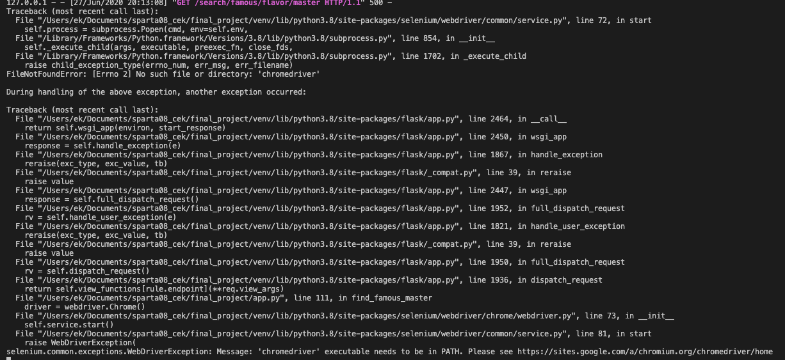

# Selenium을 이용한 web page scraping 문제점

> 어디서 문제가 발생했는가? 

```
"생활의 달인" 버튼을 클릭했다.

다른 맛집 방송과 다르게 생활의 달인의 데이터를 크롤링을 했을 때

Selenium으로 했다. selenium의 Chrome webdriver을 이용하여 웹페이지의 html코드 텍스트를 얻었다.

그 다음에 BeautifulSoup를 이용해서 크롤링했다.

웹서버 프레임워크는 Flask를 이용했다.

데이터는 수집했으나, 로컬웹서버를 실행했을 때 아래와 같은 에러메시지를 얻었다.
```



<hr>
