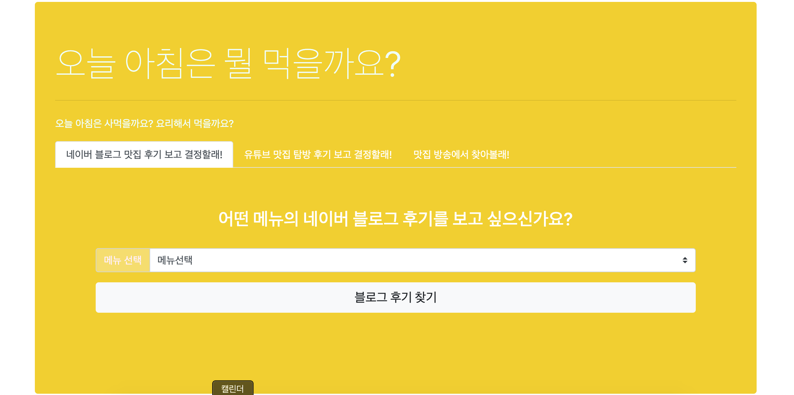
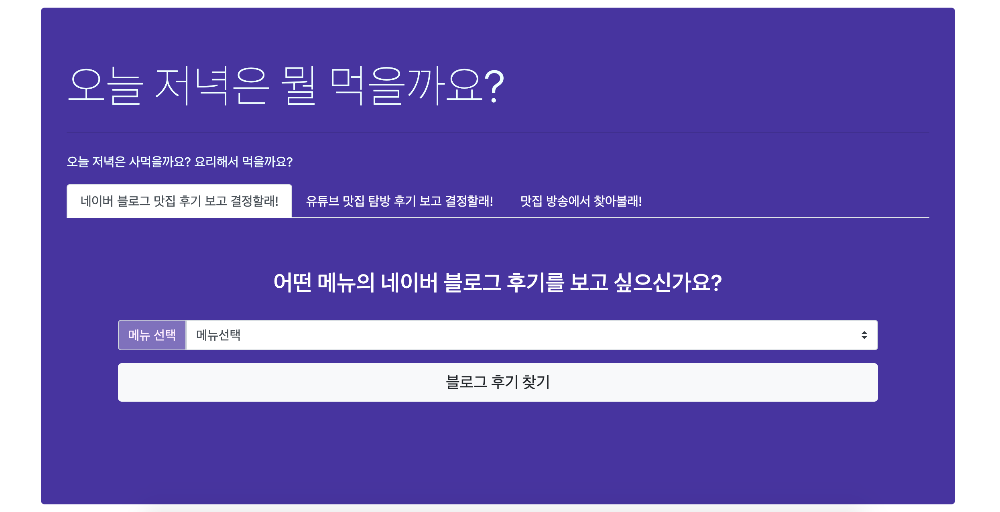
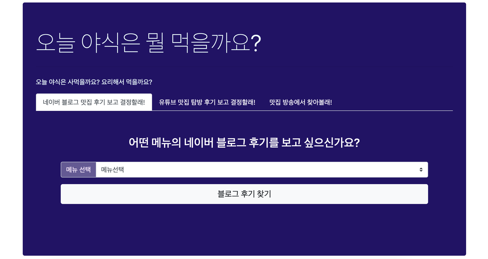

# 스파르타 8기 프로젝트

> [프로젝트 사이트 방문하기 - 오늘은 뭐먹을까?](http://ek12mv2.shop)

> 진행기간: 2020.06.14 ~ 2020.07.03

> 사용언어: python3, html, css, javascript(+ajax)

> 사용기술스택
- server
  - AWS EC2
  - Mongo db (NoSQL)
  - web crawling & scraping (BeautifulSoup, selenium)
  
- client page
  - bootstrap
  - API 및 웹서비스 사용
    - [네이버 블로그 검색 API](https://developers.naver.com/docs/search/blog/)
    - [카카오 맵 지도 검색결과 바로가기 URL (따로 API키 발급없이 이용가능)](https://apis.map.kakao.com/web/guide/#whatlibrary)
    - [구글 유튜브 스크래핑 API]()
        - [참고 URL](https://blog.naver.com/doublet7411/221511344483)

<br>

<hr>


## 오늘은 뭐먹을까?

> 기능 설명

### 1. 시간대별로 식사시간(아침/점심/저녁/야식)을 다르게 표현했고, 컴포넌트의 색상을 다르게 했습니다.

- DOM 안에 있는 모든 페이지의 랜더링이 완성됐을 때 실행하도록 했습니다.
- 먼저 현재 시각을 구하여, ajax를 이용하여 웹서버에게 `/now` 라는 url 에 해당하는 페이지를 요청합니다.
- POST방식이므로, 현재시각 데이터를 서버에게 전달합니다.
  - GET방식과 다르게, POST방식은 url에 전달한 데이터를 노출시키지 않습니다.
  - 서버는 현재시각 데이터에 따라 식사유형(아침/점심/저녁/야식)을 결정하고, 요청에 대한 응답데이터로 클라이언트에게 전달합니다.
  
- 페이지 요청이 성공하게되면 ajax의 success 영역에 해당하는 함수를 실행합니다.
- 따라서, 현재 시각의 시간(hour)에 따른 식사유형(아침/점심/저녁/야식) 결정과, 식사유형에 따른 컨테이너 컴포넌트의 색상을 결정했습니다.










<br>

- front end (jquery와 ajax를 이용했고, POST방식으로 웹서버에게 요청했습니다.)

```javascript
// 현재 시각을 구한다. //
// 현재시각을 구하여, 아침/점심/저녁/야식 으로 구분. => 시간대별로 색깔이 달라짐.
function getCurrentTime() {
    let currentDate = new Date();
    let hour = currentDate.getHours();

    //현재 시각에 따라서 나타낸다
    $.ajax({
        type: 'POST',
        url: '/now',
        data: { 'give_time': hour },
        success: function (response) {
            //페이지 요청이 성공하면, 이에대한 응답함수
            if (response['result'] == 'success') {
                let mealTime = response['meal_time'];
                let sayhi1 = $('#sayHi1');
                let sayhi2 = $('#sayHi2');
                let sayhi3 = $('#sayHi3');

                sayhi1.text(`오늘 ${mealTime}은 뭘 먹을까요?`);
                sayhi2.text(`오늘 ${mealTime}은 사먹을까요? 요리해서 먹을까요?`);
                sayhi3.text(`오늘 ${mealTime}은 이거 어때요?`);

                // mealTime : 아침/점심/저녁/야식 에 따라서 container 배경색깔이 달라짐
                let mainContainer = $('#main_container');
                let searchContainers = $('#search_result_container');
                let footer = $('#footer');
                let colorVal;


                //메인페이지 백그라운드 컬러가 시간대에 따라 달라진다.
                if (mealTime == '아침') {
                    colorVal = "#f2d00c";

                } else if (mealTime == '점심') {
                    colorVal = '#31d7f5';

                } else if (mealTime == '저녁') {
                    colorVal = '#472fa1';
                } else { //야식
                    colorVal = '#210e66';
                }
                mainContainer.css('background-color', colorVal, opacity = 0.5);
                searchContainers.css('background-color', colorVal, opacity = 0.5);
                footer.css('background-color', colorVal, opacity = 0.5);

            }
        }
    });
}

```

<br>

- back end
  - front end단에서 요청에 대한 서버의 응답코드를 구현했습니다.

```python
# 시간대별로 아침/점심/저녁/야식 로 나타낸다.
@app.route('/now', methods=['POST'])
def get_now():
    receive_time = int(request.form['give_time'])
    meal_time = None

    # 5시 ~ 11시 : 아침
    if(receive_time >= 5 and receive_time <= 11):
        meal_time = '아침'
    elif(receive_time >= 12 and receive_time <= 16):
        meal_time = '점심'
    elif(receive_time >= 17 and receive_time <= 21):
        meal_time = '저녁'
    elif((receive_time >= 22 and receive_time < 24) or (receive_time >= 0 and receive_time < 5)):
        meal_time = '야식'

    return jsonify({'result': 'success', 'meal_time': meal_time})

```


<br>

<br>

### 2. 네이버 블로그 맛집 후기보고 결정할래! 구현


- front end

```javascript
```


- back end

```python

```

### 3. 유튜브 맛집 탐방 후기를 보고 결정할래! 구현


<br>

<br>


### 4. 맛집 방송에서 찾아볼래! 구현

- 생생정보통, 생방송 투데이 : bs4(BeautifulSoup)를 이용하여 web-scraping
- 생활의 달인: 크롬브라우저 엔진을 이용하여 selenium과 bs4를 이용한 web-scraping


- front end

- back end


<br>

<hr>


