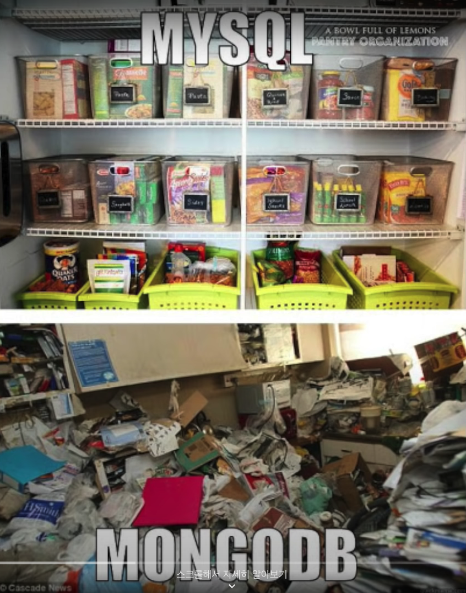
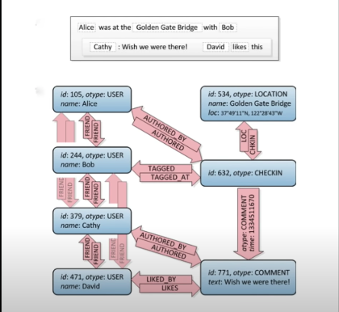

# 기술면접 대비 - 기본기 정리

<details>
  <summary>빠르게 보기</summary>

- [:pencil2:](#nosql-과-sql-차이점)
- [:pencil2:](#프로세스와-스레드)
- [:pencil2:](#멀티프로세스와-멀티스레드)
- [:pencil2:](#캐시cache)
- [:pencil2:](#docker의-정의)
- [:pencil2:](#쿠버네티스-정의)
- [:pencil2:](#jwt)
- [:pencil2:](#agile-방법론)
- [:pencil2:](#트랜잭선transaction-정의)
- [:pencil2:](#객체지향-프로그래밍-정의)
- [:pencil2:](#클래스--객체--인스턴스)
- [:pencil2:](#오버라이딩override와-오버로딩overloading)
- [:pencil2:](#운영체제operating-system)
- [:pencil2:](#restful-api)
- [:pencil2:](#라이브러리와-프레임워크의-차이점)
- [:pencil2:](#devops-란)
- [:pencil2:](#aws-gcp-클라우드)
- [:pencil2:](#http-프로토콜이란)
- [:pencil2:](#get과-post방식)
- [:pencil2:](#stack과-queue의-정의)
- [:pencil2:](#인덱스index)
- [:pencil2:](#)
- [:pencil2:](#)
- [:pencil2:](#)
- [:pencil2:](#)

</details>

<br><br>

> ## NoSQL 과 SQL 차이점?


### SQL (Structured Query Language)

- 관계형 데이터베이스
- 데이터의 형식이 구조화되어있다.
- 스키마에 따라 데이터베이스 테이블에 저장된다.
  - _스키마 (scheme)_
- 데이터 구조가 매우 엄격하다.
- 데이터의 일관성을 보증한다.
- 정규화에 따른 갱신비용을 최소화 한다.
- 시스템복잡도를 고려하여 구조화 해야한다.
- 행과 열로 구성되어있고, 엑셀시트처럼 2차원 배열 형태로 형식이 정해져있다.
- 데이터에서 어떤 데이터를 얻을지에 대한것은 편함. (**컬럼을 통해서 데이터를 쉽게 얻을 수 있다.**)

<br>

### No SQL (Not Only SQL)

No SQL은 세종류가 존재한다.

- 데이터간의 관계를 정의하지 않는다.
  - 반대로, sql은 데이터간의 관계를 정의한다.
- collection 이라는 형태로 데이터를 관리한다.
- 대용량 데이터를 저장할 수 있다.
- 분산형 구조
- 유연한 데이터 모델링
- 수평적 확장이 쉽다 (컬럼추가와 같은 것들)
- 컬렉션에 중복된 데이터가 저장이 될 수 있다.

<br><br>

- ### **Document DB**
  - **Mongo DB**가 대표적이다.
  - **데이터를 JSON 형태로 저장**한다.
  - 형태가 구조화되어있지 않아서 어떤 형태로든지 저장이 가능하다.



<br>

- ### **Key Value DB**

  - **Cassandra DB**와 **Dynamo DB**가 대표적이다.

  - #### **Cassandra DB**

    - column wide database
    - **읽기, 쓰기 가 겁나 빠르다.**
    - **많은 양의 데이터를 빠르게 저장하고 읽을 수 있다.**
    - 많은양의 데이터를 빨리 읽어야되는 *검색 엔진*에 많이 쓰인다.

  - #### **Dynamo DB**
    - 아마존에서 만든 데이터베이스
    - 서버리스(serverless) key value database
    - 매초에 2400000개를 읽는다.
    - 저장하기전에 db에 무엇을 얻을 것인지를 미리 생각해야됨.

- ### **Graph DB**
  - column과 document가 필요없을 때
  - 각각의 entity를 저장하고 이를 관계망으로 연결하는 것.
  - 각노드 간의 관계를 알 때 필요하다.
  - 페이스북이 graph db를 사용. (tao)
  - 유저 1이 좋아요를 누르면 => 유저1의 친구에게 공유할 수 있다.



<br>

- 참고
  - https://www.youtube.com/watch?v=Q_9cFgzZr8Q
  - https://www.youtube.com/watch?v=z9chRlD1tec
  - https://github.com/HyeminNoh/Tech-Stack/blob/master/docs/Database/RDBMS_and_NoSQL.md

[[🔝위로가기]](#)

<br>

> ## 프로세스와 스레드

> ### 프로세스 (process)

- 1. 정의
  - 어떤 작업을 위해 **실행할 수 있는 파일**
  - **프로그램을 메모리 상에서 실행중인 작업**
  - 메모리에 올라와 실행되고 있는 프로그램의 인스턴스
  - 운영체제로부터 시스템 자원을 할당받는 작업의 단위
    - 시스템 자원
      - CPU 시간
      - 주소 공간
      - 메모리 영역
  - 실행된 프로그램
- 2. 특징
  - 프로세스는 각각 독립된 메모리 영역(code, data, stack, heap)을 할당 받는다.
  - 프로세스 당 최소 1개의 스레드(main thread)를 갖는다.
  - 각 프로세스는 별도의 주소공간에서 실행된다.
  - 한 프로세스는 다른 프로세스의 변수나 자료구조에 접근할 수 없다.
  - 한 프로세스가 다른프로세스 자원에 접근하려면 프로세스간의 통신(IPC, Inter-Process Communication)을 사용해야한다.
    - 예) 파이프, 파일, 소켓 등을 이용한 통신 방법

<br>

> ### 스레드 (Thread)

- 1. 정의
  - 프로세스 안에서 실행되는 여러흐름 단위
  - 프로세스의 특정한 수행 경로
  - 프로세스가 할당받은 자원을 이용하는 실행의 단위
  - 스레드는 프로세스 내에서 각각 stack만 할당 받는다.
    - code, data, heap영역은 공유한다.
  - 프로세스 내의 주소 공간이나 자원들(힙공간)을 같은 프로세스 내에서 스레드끼리 공유하면서 실행된다.
  - 같은 프로세스 안에 있는 여러 스레드들은 같은 힙공간을 공유한다.
  - 프로세스는 다른 프로세스의 메모리에 직접 접근할 수 없다.
  - 각 스레드들은 별도의 레지스터와 스택을 갖는다.
  - 힙메모리는 서로 읽고 쓸 수 있다.
  - 한 스레드가 프로세스 자원을 변경하면, 다른 이웃 스레드도 그 변경 결과를 즉시 볼 수 있다.

<br>

- 참고 자료
  - https://gmlwjd9405.github.io/2018/09/14/process-vs-thread.html

[[🔝위로가기]](#)

<br>

> ## 멀티프로세스와 멀티스레드

> ### 1. 멀티 프로세스

- 멀티프로세싱(multi processing)

  - 정의

    - 하나의 응용프로그램을 여러개의 프로세스로 구성한다.
    - 각 프로세스가 하나의 작업(task)을 처리하도록 한다.

  - 장점
    - 여러개의 자식 프로세스 중 하나에 문제가 발생하면, 그 자식 프로세스만 죽고 다른 프로세스에게 영향을 주지 않는다.
  - 단점

    - 1. `context switching`에서의 오버헤드가 발생한다.
      - 캐시 메모리 초기화등 무거운 작업이 진행되고 많은 시간이 소모되는 오버헤드가 발생한다.
      - 프로세스는 각각의 독립된 메모리 영역을 할당받기 때문에 프로세스 사이에서 공유하는 메모리가 없다.
      - `context switching`이 발생하면 캐시에 있는 모든 데이터를 리셋하고 다시 캐시정보를 불러와야한다.
    - 2. 프로세스 사이의 어렵고 복잡한 통신기법

      - 프로세스는 각각의 독립된 메모리영역을 할당 받기 때문에, 하나의 프로개름에 속하는 프로세스들 사이의 변수를 공유할 수 없다.

    - (참고) _`Context Switching`_?
      - CPU에서 여러 프로세스를돌아가면서 작업을 처리한다.
      - 동작중인 프로세스가 대기를 하면서 해당 프로세스의 상태(context)를 보관하고, 대기하고 있던 다음 순서의 프로세스가 동작하면서 이전에 보관했던 프로세스의 상태를 복구하는 작업을 의미한다.

<br><br>

> ### 2. 멀티 스레드

- 멀티 스레딩(multi threading)

  - 정의

    - **하나의 응용프로그램을 여러개의 스레드**로 구성하고, 각 스레드로 하여금 하나의 작업을 처리하도록 하는 것이다.
    - 윈도우 리눅스 등 많은 운영체제들이 멀티프로세싱을 지원하고 있지만 멀티스레딩을 기본으로 하고있다.
    - 웹서버는 대표적인 멀티 스레드 응용프로그램이다.

  - 장점
    - 시스템 자원 소모 감소 (자원의 효율성 증대)
      - 프로세스를 생성하여 자원을 할당하는 시스템 콜이 줄어들어 자원을 효율적으로 관리할 수 있다.
    - 시스템 처리량 증가 (처리비용 감소)
      - 스레드 간 데이터를 주고받는 것이 간단하다
      - 시스템 자원 소모가 줄어든다.
    - 간단한 통신방법으로 인한 프로그램 응답 시간 단축
      - 스레드는 프로세스 내의 stack영역을 제외한 모든 메모리를 공유하기 때문에 통신부담이 적다.
  - 단점
    - 주의 깊은 설계가 필요하다.
    - 디버깅이 까다롭다.
    - 단일 프로세스 시스템의 경우 효과를 기대하기 어렵다.
    - 다른 프로세스에서 스레드를 제어할 수 없다.
      - 프로세스 밖에서 스레드 각각을 제어할 수 없다.
    - 멀티 스레드의 경우 자원 공유의 문제가 발생한다(동기화 문제)
      - 동기화
      - 스레드 간의 자원 공유는 전역변수(데이터 세그먼트)를 이용하므로 함께 상용할 때 충돌이 발생할 수 있다.
    - 하나의 스레드에 문제가 발생하면 전체 프로세스가 영향을 받는다.

<br><br>

> ### 멀티 프로세스 대신에 멀티스레드를 사용하는 이유는?

- #### 프로그램을 여러개 켜는 것보다, 하나의 프로그램 안에서 여러 작업을 해결한다.

- #### 자원의 효율성 증대

  - 멀티프로세스로 실행되는 작업을 멀티 스레드로 실행할 경우, **프로세스를 생성하여 자원을 할당하는 시스템 콜이 줄어**들기 때문에 자원을 효율적으로 관리할 수 있다.

  - 프로세스간의 context switching시 단순히 cpu레지스터 교체뿐만 아니라 RAM과 CPU 사이의 캐시 메모리에 대한 데이터까지 초기화되므로 오버헤드가 크기 때문이다.

  - 스레드는 프로세스 내의 메모리를 공유하기 때문에 독립적인 프로세스와 달리 스레드간 데이터를 주고받는 것이 간단해지고 시스템 자원 소모가 줄어들게 된다.

- #### 처리 비용 감소 및 응답 시간 단축

  - 프로세스 간의 통신(IPC)보다 스레드간의 통신의 비용이 적으므로 작업들 간의 통신의 부담이 줄어든다.
  - 스레드는 stack영역을 제외한 모든 메모리를 공유한다.
  - 프로세스 간의 전환 속도보다 스레드간의 전환 속도가 빠르다.
  - context switching시 스레드는 stack영역만을 처리한다.

- 참고자료
  - https://gmlwjd9405.github.io/2018/09/14/process-vs-thread.html

[[🔝위로가기]](#)

<br>

> ## 캐시(Cache)

<br>

> ## Docker의 정의

- Docker은 `environment disparity` 문제를 해결한다.

  - environment disparity란?
    - 개발한 것을 서버에 올렸는데, 서버에 올리니까 안됨.
    - OS에 따라 생성

- 참고자료
  - https://containerjournal.com/topics/container-ecosystems/kubernetes-vs-docker-a-primer/

[[🔝위로가기]](#)

<br>

> ## 쿠버네티스 정의

[[🔝위로가기]](#)

<br>

> ## JWT

[[🔝위로가기]](#)

<br>

> ## 쿠키(Cookie)와 세션(Session)

- 왜 쿠키(cookie)와 세션(session)을 사용하나?

  - http 프로토콜은 connectionless, stateless한 특성을 갖고있다.
  - 비연결성(connectionless) : 클라이언트가 서버에 요청을 한 후 응답을 받으면 **맺었던 연결을 끊는 특성**
  - 무상태성(stateless) : 서버와 클라이언트 사이의 통신이 끝나면 **상태를 유지하지 않는 특성**

- 상태를 모르면...아래와 같이 **클라이언트가 누군지 확인하기 위해서 인증을 반복**해야된다. 이는 HTTP 프로토콜 특성으로 인한 단점이라서 `쿠키`와 `세션`이 필요하다.

```
쇼핑몰에 접속
로그인
상품클릭 -> 상세화면 이동
로그인
주문
로그인
...
```

- ### 쿠키(Cookie)
  - **클라이언트의 상태정보를 로컬에 저장한 key-value형식의 데이터 파일**
  - 클라이언트 정보파일을 브라우저에 저장한다.
  - **클라이언트 로컬에 저장되는 키와 값**이 들어있는 작은 데이터 파일\*\*
  - 사용자 인증이 유효한 시간을 명시할 수 있다.
    - 유효시간이 정해지면 브라우저가 종료되어도 인증이 유지된다.
  - **클라이언트의 상태 정보를 로컬에 저장했다가 참조한다.**
  - Response Header에 Set-cookie 속성을 사용하면 클라이언트에 쿠키를 만들 수 있다.
  - 쿠키는 사용자가 따로 요청하지 않아도, 브라우저가 Request시 Request Header를 넣어서 자동으로 서버에 전송한다.
  - 쿠키의 구성요소
    - 이름(key): 쿠키를 구별하는데 사용하는 이름
    - 값(value): 쿠키의 이름과 관련된 값
    - 유효시간: 쿠키의 유지시간
    - 도메인 : 쿠키를 전송할 도메인
    - 경로: 쿠키를 전송할 요청경로

<br>

- ### 세션(Session)

  - 쿠키를 기반하고 있다.
  - 세션(Session)은 서버 측에서 관리하고 있다.
  - **클라이언트를 구분하기 위해 세션 id를 부여**한다.

    - session id : 클라이언트가 Request를 보내면 해당서버의 엔진이 클라이언트에게 유일한 id를 부여한다.

  - **웹브라우저가 서버에 접속해서 브라우저가 종료할 때까지 인증상태를 유지**한다.
  - 동시 접속자 수가 많은 경우에는 서버메모리에 여러사용자의 정보를 저장해야되므로 서버에 과부하가 발생하여 성능저하가 생길 수 있다.
  - 특징
    - 세션 ID로 클라이언트를 구분해서 클라이언트의 요구에 맞는 서비스를 제공한다.
    - 쿠키보다 보안면에서 우수하다.

<br>

> ### 쿠키와 세션은 어떤 차이점을 갖는가?

- 1. 서버의 자원을 사용하는가?

  - 쿠키는 서버의 자원을 전혀 사용하지 않는다.
  - 세션은 서버의 자원을 사용한다.

- 2. 보안

  - 세션은 쿠키보다 보안면에서 우수하다.
  - 쿠키는 세션보다 요청속도가 빠르다.
    - 세션은 서버의 처리가 필요하다.
  - 쿠키는 클라이언트 로컬에 저장되기때문에 변질되거나 request에서 sniffing을 당할 우려가 있어서 보안에 취약하다.
  - 반면, 세션은 쿠키를 이용해서 session id만 저장하고 id로 구분하여 서버에서 처리하기때문에 보안성이 좋다.

- 3. 만료시간
  - 쿠키는 파일로 저장되기때문에 브라우저를 종료해도 (유효시간이 지나지 않으면) 정보가 남아있다.
  - 세션은 만료시간을 정할 수있지만, 브라우저가 종료되면 만료시간 상관없이 삭제된다.
  - 세션의 정보는 서버에서 처리를 하기때문에 쿠키보다 속도가 느리다.

[[🔝위로가기]](#)

<br>

> ## 배열과 리스트(Linked List)는 어떤차이점을 갖는가?

[[🔝위로가기]](#)

<br>

> ## Agile 방법론

[[🔝위로가기]](#)

<br>

> ## 트랜잭션(Transaction) 정의

[[🔝위로가기]](#)

<br>

> ## 객체지향 프로그래밍 정의

[[🔝위로가기]](#)

<br>

> ## 클래스 / 객체 / 인스턴스

> ### 클래스(class)

- 객체를 만들어 내기위한 설계도(틀)
- 연관되어있는 변수와 메소드의 집합

<br>

> ### 객체(Object)

- 소프트웨어 세계에 구현할 대상
- 클래스에 선언된 모양 그대로 생성된 실체

- 클래스의 인스턴스라고 불린다.
- 객체는 모든 인스턴스를 대표하는 포괄적인 의미를 갖는다.

<br>

> ### 인스턴스(Instance)

- 설계도를 바탕으로 소프트웨어 세계에 구현된 구체적인 실체

  - 객체를 소프트웨어에 실체화한 것.
  - 실체화된 인스턴스는 **메모리에 할당**된다.

- 인스턴스는 객체에 포함되어있다.

[[🔝위로가기]](#)

<br>

> ## 오버라이딩(Override)와 오버로딩(Overloading)

[[🔝위로가기]](#)

<br>

> ## 운영체제(Operating System)

[[🔝위로가기]](#)

<br>

> ## Restful API

[[🔝위로가기]](#)

<br>

> ## 라이브러리와 프레임워크의 차이점?

[[🔝위로가기]](#)

<br>

> ## DevOps 란?

[[🔝위로가기]](#)

<br>

> ## AWS, GCP 클라우드

[[🔝위로가기]](#)

<br>

> ## HTTP 프로토콜이란?

- ### HTTP (HyperText Transfer Protocol)

  - **인터넷 상에서 클라이언트와 서버가 자원을 주고 받을 때 쓰는 통신 규약**
  - Hyper Text의 전송을 목적으로 설계된 Application 레벨의 프로토콜
  - 텍스트 교환
  - **Hyper Text** : 클라이언트의 선택에 따라서 이동이 가능한 조직화된 정보
    - 이동이 가능한 텍스트를 의미한다.
  - Serverless 프로토콜
    - 서버는 클라이언트의 상태정보를 유지하지 않는다.
    - 클라이언트가 다시 요청을 해도 이 클라이언트가 조금전에 한차례 요청을 했던 클라이언트임을 인식하지 못한다.

- ### HTTPS(HypterText Transfer Protocol Secure) 는 보완기능까지 추가되어있다.
  - 중간에 가로채는 경우를 막기위해서.
  - 텍스트를 암호화 시킨다.
  - `주의 요함` , `안전하지 않은 사이트` 와 같은 알림으로 주의를 받는다.

[[🔝위로가기]](#)

<br>

> ## GET과 POST방식

[[🔝위로가기]](#)

<br>

> ## Stack과 Queue 정의

- ### Stack

  - **후입선출 (Last In First Out)**
  - 먼저 들어간 요소가 맨 나중에 나오는 구조로 되어있다.
  - 맨나중에 들어간 요소가 맨처음으로 나올 수있도록 함.

- ### Queue
  - **선입선출 (First In Last Out)**
  - 먼저 들어간 요소가 먼저 나오는 구조로 되어있다.

[[🔝위로가기]](#)

<br>

> ## 인덱스(INDEX)

- 인덱스는 데이터레코드를 빠르게 접근하기 위해 `<key값, 포인터>` 쌍으로 구성되는 데이터 구조이다.
- 데이터가 저장된 물리적 구조와 밀접한 관계가 있다.
- 인덱스는 레코드가 저장된 물리적 구조에 접근하는 방법을 제공한다.

[[🔝위로가기]](#)
