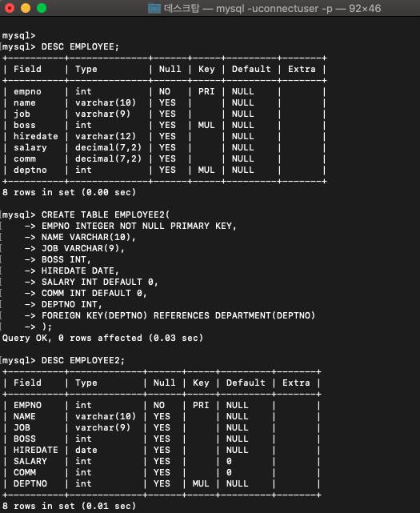
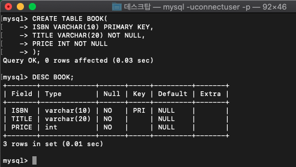
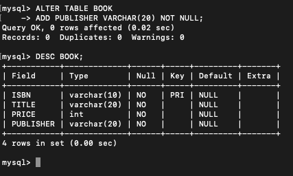
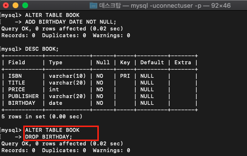
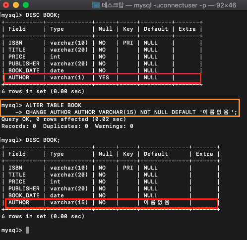
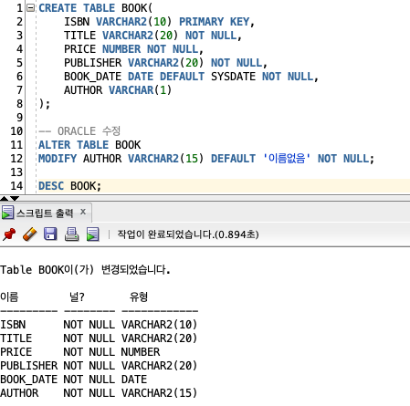
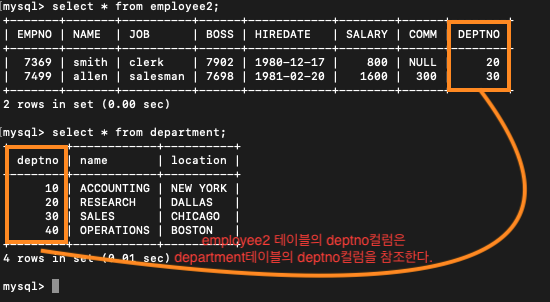
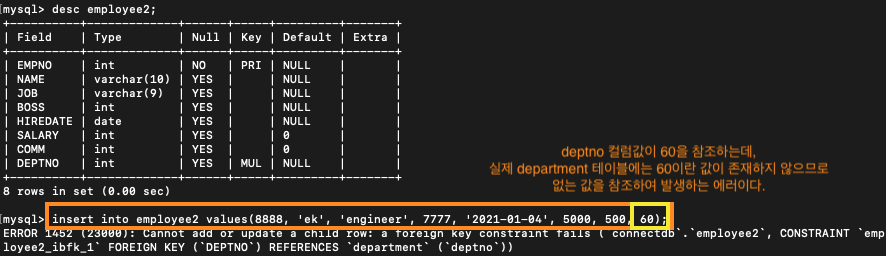

> # DDL

- DDL (Data Definition Language) : 데이터 정의어

- 테이블 정의, 수정, 삭제

- MySQL에서 사용하는 데이터 타입


|타입|설명|
|:--:|:--:|
|TINYINT(M)|1바이트 정수|
|SMALLINT(M)|2바이트 정수|
|MEDIUMINT(M)|3바이트 정수|
|INT(M), INTEGER(M)|4바이트 정수|
|BIGINT(M)|8바이트 정수|
|FLOAT(M,D)|부동소수점을 나타냄. 4바이트|
|DOUBLE(M,D)|부동소수점을 나타냄. 8바이트|
|DATE|0000-00-00 형식으로 날짜를 표현 3바이트|
|DATETIME|날짜와 시간을 같이 나타냄 8바이트|
|TIMESTAMP|1970-01-01 00:00:00 형식으로 나타냄. 4바이트|
|TIME|시간|
|YEAR|년도|
|CHAR(M)|고정길이 문자열을 저장|
|VARCHAR(M)|가변길이 문자열을 저장|
|TINYBLOB, TINYTEXT|255개 문자를 저장|
|BLOB, TEXT|63535개의 문자를 저장|
|MEDIUMBLOB, MEDIUMTEXT|16777215개 문자를 저장|
|LONGBLOB, MEDIUMTEXT|4기가 개의 문자를 저장|

<br>

> # 테이블 생성 - CREATE

```sql
CREATE TABLE 테이블명(
  필드명1 타입 [NULL|NOT NULL],
  필드명2 타입 [NULL|NOT NULL],
  ...
);
```

- **예시1**: employee테이블의 구성컬럼이 완전 똑같은 테이블을 만들어보자.

- ORACLE에서는 정수 타입이 `NUMBER`이고, mySQL에서는 `INTEGER` 이다.

<br>

```sql
CREATE TABLE EMPLOYEE2(
  EMPNO INTEGER NOT NULL PRIMARY KEY,
  NAME VARCHAR(10),
  JOB VARCHAR(9),
  BOSS INT,
  HIREDATE DATE,
  SALARY INT DEFAULT 0,
  COMM INT DEFAULT 0,
  DEPTNO INT
);
```



<br>

- **예시2** : BOOK 테이블을 만들어보자

```sql
CREATE TABLE BOOK(
  ISBN VARCHAR(10) PRIMARY KEY,
  TITLE VARCHAR(20) NOT NULL,
  PRICE INT NOT NULL
);
```



<br>

> # 테이블 변경 - ALTER

## 컬럼 추가

```sql
ALTER TABLE 테이블이름
ADD 컬럼명 타입 [NOT NULL|NULL] [DEFAULT] [AUTO_INCREMENT];
```

<br>

- 예시: 출판사 컬럼 추가하기

```sql
ALTER TABLE BOOK
ADD PUBLISHER VARCHAR(20) NOT NULL;
```



<br>

## 컬럼 삭제

```SQL
ALTER TABLE 테이블이름
DROP 컬럼명;
```

- 임시로 불필요한 컬럼 `birthday`를 만들어봤다. 불필요한 컬럼 `birthday`를 지워보자.

```sql
ALTER TABLE BOOK
DROP BIRTHDAY;
```



<br>

## 컬럼 수정

- BOOK 테이블 `AUTHOR` 컬럼을 수정해보자.
  - 1BYTE => 15BYTE 로 수정
  - `NOT NULL` 로 수정
  - default는 `'이름없음'` 으로 수정

- mySQL

```SQL
ALTER TABLE BOOK
CHANGE AUTHOR AUTHOR VARCHAR(15) NOT NULL DEFAULT '이름없음';
```



<br>

- Oracle

```sql
ALTER TABLE BOOK
MODIFY AUTHOR VARCHAR2(15) DEFAULT '이름없음' NOT NULL;
```



<br>

## 컬럼 이름 변경

- `BOOK_DATE` 를 `PUBLISH_DATE` 로 변경한다.

```sql
ALTER TABLE BOOK
RENAME COLUMN BOOK_DATE TO PUBLISH_DATE;
```

<br>

## 테이블 이름 변경

- 테이블이름을 `BOOKS` 로 한다.

```sql
ALTER TABLE BOOK RENAME BOOKS;
```

<br>

> # 테이블 삭제 - DROP

- 테이블 삭제

```sql
DROP TABLE 테이블명;
```

<BR>

EMPLOYEE2(EMPLOYEE) 테이블의 `deptno` 컬럼은

DEPARTMENT 테이블의 primary key인 `deptno` 컬럼과 연결되어있다.

그러므로 EMPLOYEE2(EMPLOYEE)테이블의 `deptno`컬럼은 외래키이다.

DEPARTMENT 테이블의 데이터 중 deptno 컬럼에 없는 값을 외래키에서 조회하려고하면 에러메시지가 뜬다.

<br>



<br>



<br>

삭제에서도 다른테이블과 연결되어있는 데이터가 있다면

그 데이터때문에 삭제가 수행되지 못하는 경우가 있다.

이때 사용하는 예약어가 `CASCADE` 이다.

<br>

- 제약조건이 포함된 데이터를 포함한 테이블 삭제

- MySQL

```sql
DROP TABLE 테이블이름 CASCADE;
```

- ORACLE

```SQL
DROP TABLE 테이블이름 CASCADE CONSTRAINTS;
```


<HR>

> # ORACLE - DDL 자료

- [DDL - CREATE & 제약조건 & ALTER](https://github.com/loveAlakazam/TIL/blob/master/2020/KH_Git_Repository/notes/ORACLE_DATABASE/02_DDL/0710.md)
- [DDL - ALTER](https://github.com/loveAlakazam/TIL/blob/master/2020/KH_Git_Repository/notes/ORACLE_DATABASE/02_DDL/0713_DDL_2.md)
