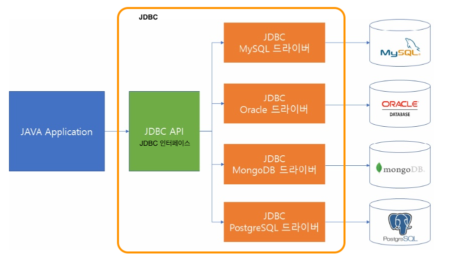

# JDBC

## 정의

- **JDBC** (Java Database Connectivity)

- 자바프로그램에서 데이터베이스에 접근할 수 있게 해주는 API이다.

- `java.sql`: DBMS 연동에 필요한 메소드를 담은 자바패키지이다.




<br>

## JDBC 동작

(1) **JDBC 드라이버 로드**

- 사용하는 데이터베이스가 oracle 11g 를 사용할 경우에는 `ojdbc6.jar` 를 설치.
  - 드라이버파일(ojdbc6.jar)을 `WEB-INF` 폴더 내의 `lib` 폴더안에 저장.
  - JDBC 클래스 로드하기

```java
Class.forName("oracle.jdbc.driver.OracleDriver");
```

<br>

(2) **데이터베이스 연결**

- Connection객체를 얻는다.

```java
Connection conn= DriverManager.getConnection(url, uid, pwd);
```

- `url` : JDBC 형식 url
- `uid` : 사용자 아이디
- `pwd` : 사용자 아이디의 비밀번호

<br>

(3) **데이터베이스 작업**

- **Statement** 객체 : 데이터베이스 연결 후 실제 SQL문을 수행하기 위한 객체이다.
- **Connection** 객체의 `createStatement()`메소드를 통해서 **Statement**객체를 얻을 수 있다.

```java
Statement stmt= conn.createStatement();
```

- 쿼리문 실행 메소드
  - **`executeQuery`**
    - **`select`** 문과 같은 여러개 레코드 결과를 구할 때 사용.
    - 결과값은 **`ResultSet`** 객체이다.
    - **`ResultSet`** 객체는 여러개의 행을 결과값으로 받을 수 있어서, 결과값을 받을 때 iterator을 사용해야한다. (1개의 결과값인 경우에는 단일if문으로 사용해도 된다.)

  - **`executeUpdate`**
    - **`insert`**, **`update`**, **`delete`** 문 수행할 때 사용.
    - 반환결과 값이 **행의 개수(0이상의 정수)**로 나타낸다.

<br>

(4) **데이터베이스 연결 해제**

<br>

## JDBC 클래스의 생성 단계


### DriverManager

- JDBC 드라이버를 통해 커넥션을 만드는 역할을 한다.
- `Class.forName()` 메소드를 통해 생성되며, 반드시 예외처리를 해야한다.
- 직접 객체 생성이 불가능해서, `getConnection()`메소드를 사용하여 객체를 생성한다.

<br>

### Connection

- 데이터베이스와 연결된 커넥션을 의미한다.
- SQL 문장을 수행하기 전에 필요로하는 객체이다.
- `createStatement()`메소드를 호출하여 Statement객체를 생성한다.

<br>

### Statement

- SQL문을 수행할 때 필요로하는 객체이다.
- 이때, 수행할 SQL문은 완전한 SQL문이이어야한다.
- 주로 전체컬럼에 대한 쿼리결과를 조회(select)할 때 많이 사용된다.
- `select`문을 수행할 때는 `executeQuery()` 메소드를 사용한다.


<br>

### PreparedStatement

- 각 위치에 대한 플레이스홀더(?)가 존재하는 불완전한 쿼리문을 수행할 때 사용된다.
  - 플레이스홀더 위치의 시작값은 `1`이다.
- 매개값을 플레이스홀더(?)에 넣어서 세팅해야 완전한 쿼리문이 된다.
- 그러므로 쿼리문을 수행하기전에 타입에 맞춰서 홀더에 값을 세팅한다.
  - 컬럼 타입이 문자열일 경우에는 `setString()`
  - 컬럼 타입이 정수일 경우에는 `setInt()` 메소드를 사용한다.

<br>

## JDBC Connection Pool

### Pooling

미리 데이터베이스 Connection을 여러개 만들어서 특정 공간에 저장해놓고 

필요할 때마다 하나씩 꺼내서 사용하고 다시 집어넣는 방식이다.
