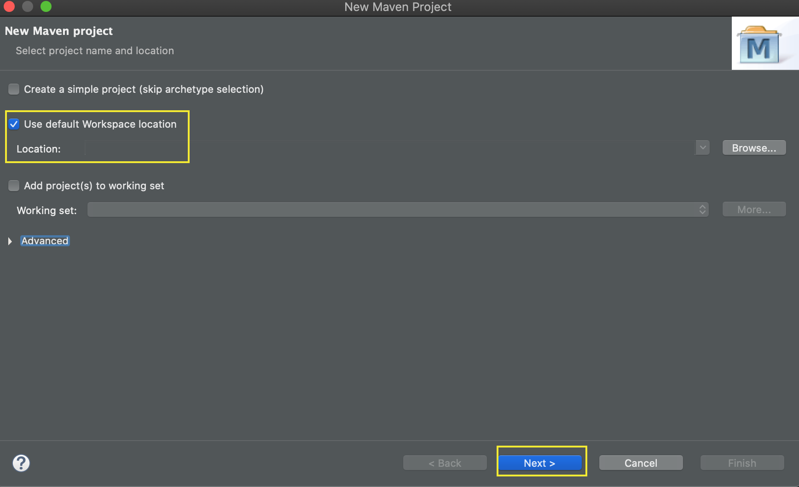
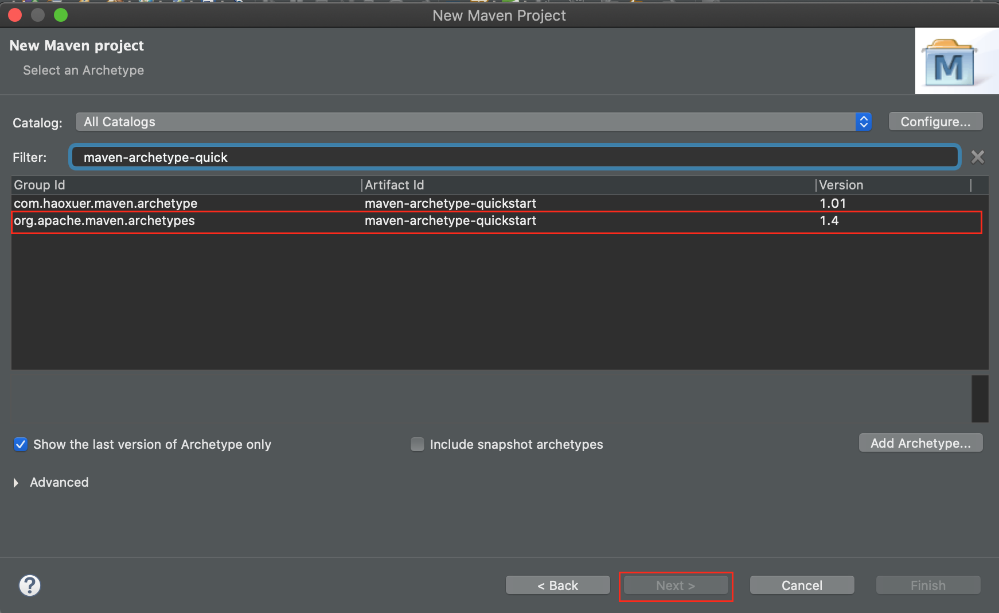
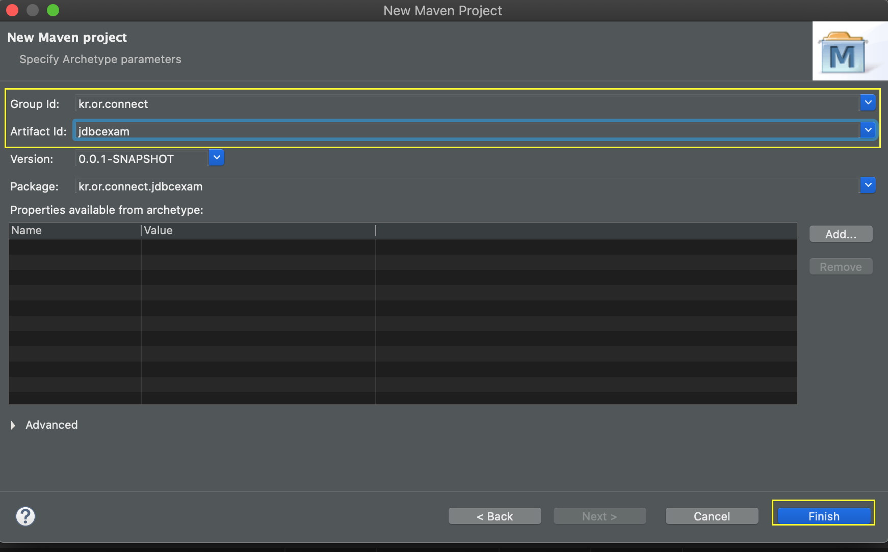
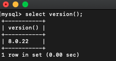
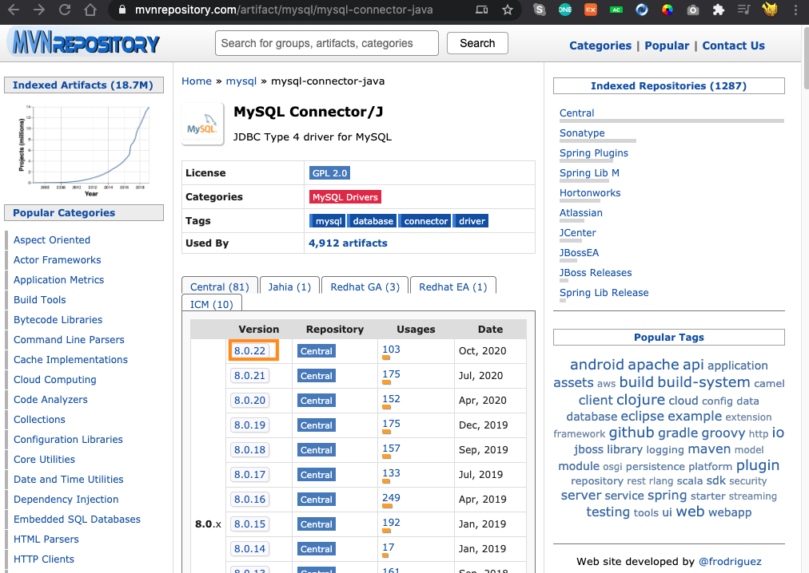
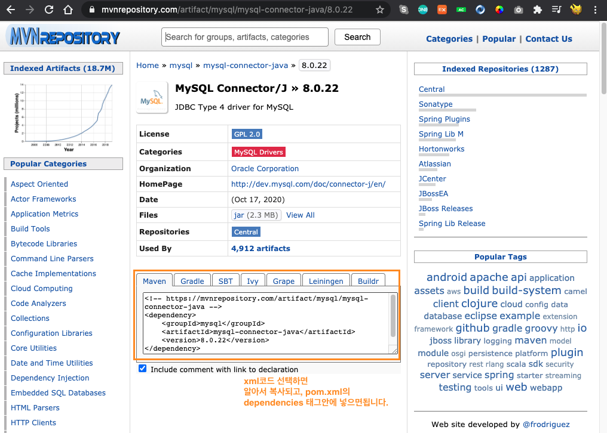
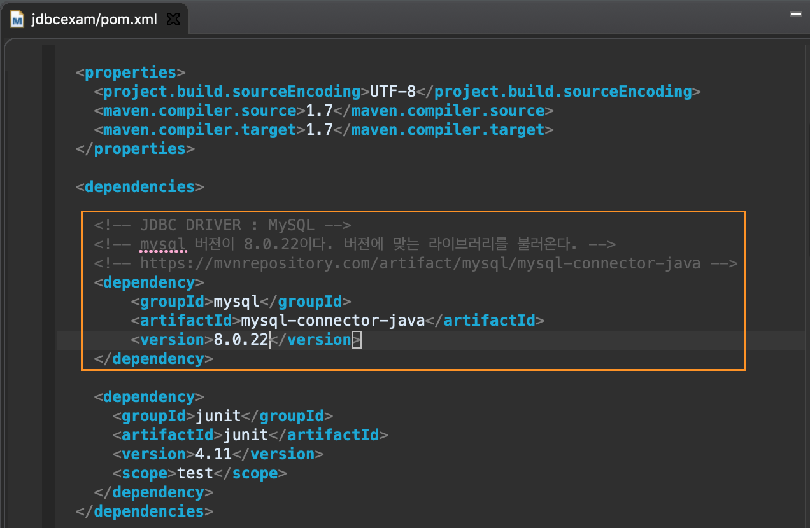
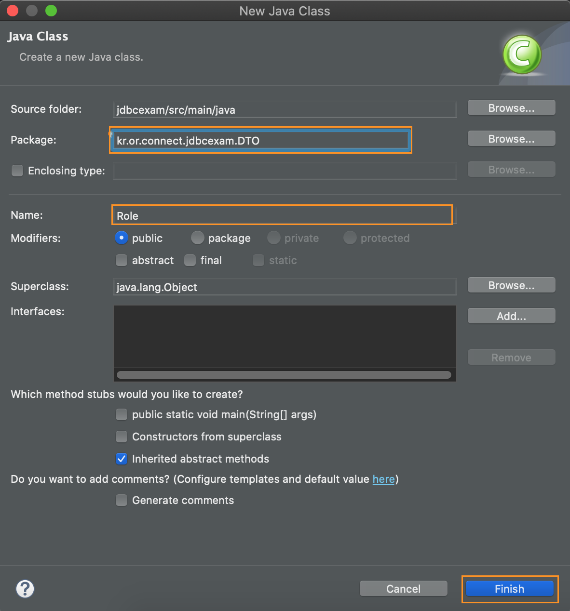
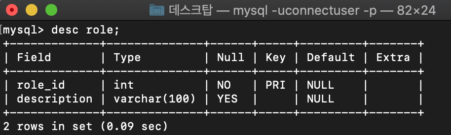
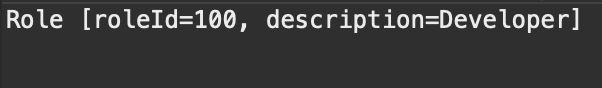

# JDBC 실습

## 이클립스에서, 메이븐 프로젝트를 연다.

- `New` > `Create a Maven Project` 선택


## Maven 프로젝트 만들기








## pom.xml 에서 mysql connector 추가하기

- mysql 버젼을 먼저 확인



- mysql connector 를 찾는다.
  - [https://mvnrepository.com/artifact/mysql/mysql-connector-java](https://mvnrepository.com/artifact/mysql/mysql-connector-java)
  - 저는 8.0.22 버젼이므로, `8.0.22` 를 선택했습니다.









## 데이터를 저장하는 객체 만들기

- connectdb 데이터베이스의 ROLE 테이블와 연결하여 데이터를 저장하는 객체 Role을 만든다.



- ROLE 테이블이 갖는 컬럼 정보를 확인



<br>

- Role.java

```java
package kr.or.connect.jdbcexam.model.vo;

public class Role {
	private int roleId;
	private String description;


	// 생성자
	public Role() {}


	public Role(int roleId, String description) {
		super();
		this.roleId = roleId;
		this.description = description;
	}

	// getter & setter
	public int getRoleId() {
		return roleId;
	}
	public void setRoleId(int roleId) {
		this.roleId = roleId;
	}
	public String getDescription() {
		return description;
	}
	public void setDescription(String description) {
		this.description = description;
	}


	@Override
	public String toString() {
		return "Role [roleId=" + roleId + ", description=" + description + "]";
	}
}
```

<br>

- RoleDAO.java
  - 데이터베이스에서 ROLE 테이블과 관련된 sql쿼리문 결과를  Role클래스 타입으로 받는 과정.

  - mysql 8.0 버젼 이상일 때는 드라이버불러오는 표기법이 다르다!
    - [참고자료 - mysql 문서](https://dev.mysql.com/doc/connector-j/8.0/en/connector-j-usagenotes-connect-drivermanager.html)

  - mysql 8.0버젼 이상일 때는 `serverTimezone=UTC` 를 추가해야한다.

<br>

```java
package kr.or.connect.jdbcexam.model.dao;

import java.sql.Connection;
import java.sql.DriverManager;
import java.sql.PreparedStatement;
import java.sql.ResultSet;
import java.sql.SQLException;

import kr.or.connect.jdbcexam.model.vo.Role;

public class RoleDAO {
	//driver 정보
	//호스트정보: 로컬호스트=localhost= 127.0.0.1
	//포트번호: 3306
	//사용데이터베이스: connectdb
	//mysql version 8.0.x 에서는 ?serverTimezone=UTC 를 추가해야한다.
	private String url="jdbc:mysql://localhost:3306/connectdb?serverTimezone=UTC";
	private String user="connectuser"; //계정 id
	private String password="connect123!@#"; //계정 비밀번호

	public Role selectRole(Integer roleId) {
		Role role=null;
		Connection conn=null; // 드라이버 연결
		PreparedStatement pstmt= null; //sql실행 관련 객체
		ResultSet rset= null; //sql 실행결과를 담는 객체

		try {
			//드라이버 로드
			//Class.forName("com.mysql.jdbc.Driver"); //mysql 5.x version
			Class.forName("com.mysql.cj.jdbc.Driver"); //mysql 8.0.x version

			//접속할 데이터베이스의 정보를 불러온다.
			conn=DriverManager.getConnection(url,user, password);

			//쿼리문
			String sql="SELECT * FROM ROLE WHERE ROLE_ID=?";

			//쿼리문 수행
			//pstmt는 ?(플레이스홀더)가 포함된 미완성된 쿼리문을 수행한다.
			pstmt=conn.prepareStatement(sql);

			//? 에 해당하는 값을 세팅시킨다.
			pstmt.setInt(1, roleId); //1번째 플레이스홀더에 매개변수roleId(primary key)값을 대입.

			//쿼리문 수행결과를 객체로 가져온다.
			rset= pstmt.executeQuery();

			//여러개가 아닌, 1개 아니면 0개이다.
			//쿼리문 결과값이 끝날때까지 각컬럼에 대응되는 값들을 모두 객체에 세팅한다.
			if(rset.next()) {
				role=new Role();
				role.setRoleId(rset.getInt("ROLE_ID"));
				role.setDescription(rset.getString("DESCRIPTION"));
			}

		}catch(ClassNotFoundException e) {
			e.printStackTrace();
		}catch(SQLException e){
			e.printStackTrace();
		}finally {
			//수행후에 객체들을 닫는다.
			try {
				if(rset!=null)
					rset.close();

				if(pstmt!=null)
					pstmt.close();

				if(conn!=null)
					conn.close();
			} catch (SQLException e) {
				e.printStackTrace();
			}
		}
		return role;
	}
}
```

<br>

- 테스트 해보기(JDBCExam.java)

```java
package kr.or.connect.jdbcexam.view;

import kr.or.connect.jdbcexam.model.dao.RoleDAO;
import kr.or.connect.jdbcexam.model.vo.Role;

public class JDBCExam {

	public static void main(String[] args) {
		RoleDAO dao= new RoleDAO();
		Role role=dao.selectRole(100);
		System.out.println(role);
	}

}
```




<br>

## 실습 전체코드 - RoldDAO.java

```java
package kr.or.connect.jdbcexam.model.dao;

import java.sql.Connection;
import java.sql.DriverManager;
import java.sql.PreparedStatement;
import java.sql.ResultSet;
import java.sql.SQLException;
import java.sql.Statement;
import java.util.ArrayList;

import kr.or.connect.jdbcexam.model.vo.Role;

public class RoleDAO {
	//driver 정보
	//호스트정보: 로컬호스트=localhost= 127.0.0.1
	//포트번호: 3306
	//사용데이터베이스: connectdb
	//mysql version 8.0.x 에서는 ?serverTimezone=UTC 를 추가해야한다.
	private String url="jdbc:mysql://localhost:3306/connectdb?serverTimezone=UTC";
	private String user="connectuser"; //계정 id
	private String password="connect123!@#"; //계정 비밀번호

	//모든정보 조회(select all)
	public ArrayList<Role> selectAllRole(){
		ArrayList<Role> rList= new ArrayList<Role>();
		ResultSet rset=null;
		try {
			// 드라이버 로드
			Class.forName("com.mysql.cj.jdbc.Driver");

			// 커넥션 생성
			Connection conn= DriverManager.getConnection(url, user, password);
			String sql="SELECT * FROM ROLE";

			// statement객체 생성
			Statement stmt= conn.createStatement();

			//쿼리문 수행
			rset=stmt.executeQuery(sql);
			while(rset.next()) {
				Role role= new Role();
				role.setRoleId(rset.getInt("ROLE_ID"));
				role.setDescription(rset.getString("DESCRIPTION"));
				rList.add(role);
			}

		} catch (ClassNotFoundException e) {
			e.printStackTrace();
		} catch (SQLException e) {
			// TODO Auto-generated catch block
			e.printStackTrace();
		}

		return rList;
	}


	//추가(insert)
	public int addRole(Role role) {
		int result=0;

		Connection conn= null;
		PreparedStatement pstmt=null;


		try {
			Class.forName("com.mysql.cj.jdbc.Driver");
			conn=DriverManager.getConnection(url, user, password);

			String sql= "INSERT INTO ROLE(ROLE_ID, DESCRIPTION) VALUES (?, ?)";

			pstmt=conn.prepareStatement(sql);
			pstmt.setInt(1, role.getRoleId()); //위치홀더 값세팅(숫자=role_id 컬럼)
			pstmt.setString( 2,role.getDescription());//위치홀더 값세팅(문자열=description 컬럼)

			result=pstmt.executeUpdate(); //sql문 수행
		} catch (SQLException e) {
			e.printStackTrace();
		} catch (ClassNotFoundException e) {
			// TODO Auto-generated catch block
			e.printStackTrace();
		}

		return result;
	}

	//조회(select)
	public Role selectRole(Integer roleId) {
		Role role=null;
		Connection conn=null; // 드라이버 연결
		PreparedStatement pstmt= null; //sql실행 관련 객체
		ResultSet rset= null; //sql 실행결과를 담는 객체

		try {
			//드라이버 로드
			//Class.forName("com.mysql.jdbc.Driver"); //mysql 5.x version
			Class.forName("com.mysql.cj.jdbc.Driver"); //mysql 8.0.x version

			//접속할 데이터베이스의 정보를 불러온다.
			conn=DriverManager.getConnection(url,user, password);

			//쿼리문
			String sql="SELECT * FROM ROLE WHERE ROLE_ID=?";

			//쿼리문 수행
			//pstmt는 ?(플레이스홀더)가 포함된 미완성된 쿼리문을 수행한다.
			pstmt=conn.prepareStatement(sql);

			//? 에 해당하는 값을 세팅시킨다.
			pstmt.setInt(1, roleId); //1번째 플레이스홀더에 매개변수roleId(primary key)값을 대입.

			//쿼리문 수행결과를 객체로 가져온다.
			rset= pstmt.executeQuery();

			//여러개가 아닌, 1개 아니면 0개이다.
			//쿼리문 결과값이 끝날때까지 각컬럼에 대응되는 값들을 모두 객체에 세팅한다.
			if(rset.next()) {
				role=new Role();
				role.setRoleId(rset.getInt("ROLE_ID"));
				role.setDescription(rset.getString("DESCRIPTION"));
			}

		}catch(ClassNotFoundException e) {
			e.printStackTrace();
		}catch(SQLException e){
			e.printStackTrace();
		}finally {
			//수행후에 객체들을 닫는다.
			try {
				if(rset!=null)
					rset.close();

				if(pstmt!=null)
					pstmt.close();

				if(conn!=null)
					conn.close();
			} catch (SQLException e) {
				e.printStackTrace();
			}
		}
		return role;
	}
}

```
