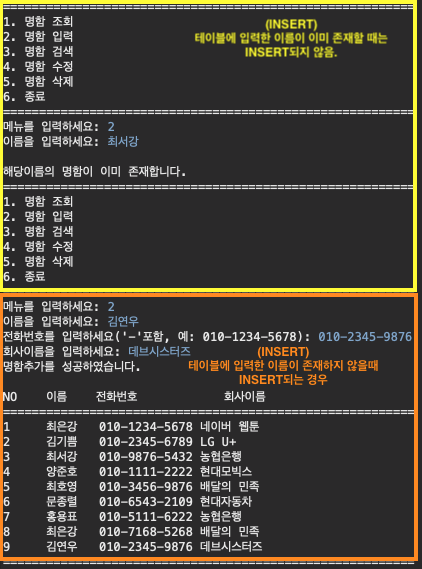
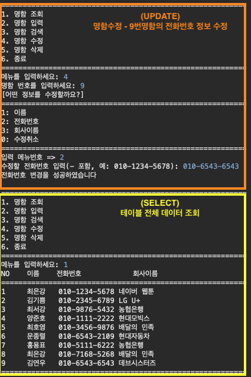
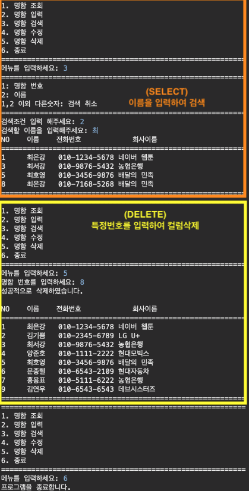
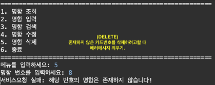

> # 명함관리 프로그램

### [프로젝트 전체코드 보러가기](./projectA)

## 1. pom.xml 환경설정

```xml
<?xml version="1.0" encoding="UTF-8"?>

<project xmlns="http://maven.apache.org/POM/4.0.0" xmlns:xsi="http://www.w3.org/2001/XMLSchema-instance"
  xsi:schemaLocation="http://maven.apache.org/POM/4.0.0 http://maven.apache.org/xsd/maven-4.0.0.xsd">
  <modelVersion>4.0.0</modelVersion>

  <groupId>kr.com.ek.practice.course.boost</groupId>
  <artifactId>projectA</artifactId>
  <version>0.0.1-SNAPSHOT</version>

  <name>projectA</name>
  <!-- FIXME change it to the project's website -->
  <url>http://www.example.com</url>

  <properties>
    <project.build.sourceEncoding>UTF-8</project.build.sourceEncoding>
    <maven.compiler.source>1.7</maven.compiler.source>
    <maven.compiler.target>1.7</maven.compiler.target>
  </properties>

  <dependencies>
  	<!--mysql  -->
  	<dependency>
	    <groupId>mysql</groupId>
	    <artifactId>mysql-connector-java</artifactId>
	    <version>8.0.22</version>
	</dependency>


    <dependency>
      <groupId>junit</groupId>
      <artifactId>junit</artifactId>
      <version>4.11</version>
      <scope>test</scope>
    </dependency>
  </dependencies>

  <build>
    <pluginManagement><!-- lock down plugins versions to avoid using Maven defaults (may be moved to parent pom) -->
      <plugins>
        <!-- clean lifecycle, see https://maven.apache.org/ref/current/maven-core/lifecycles.html#clean_Lifecycle -->
        <plugin>
          <artifactId>maven-clean-plugin</artifactId>
          <version>3.1.0</version>
        </plugin>
        <!-- default lifecycle, jar packaging: see https://maven.apache.org/ref/current/maven-core/default-bindings.html#Plugin_bindings_for_jar_packaging -->
        <plugin>
          <artifactId>maven-resources-plugin</artifactId>
          <version>3.0.2</version>
        </plugin>
        <plugin>
          <artifactId>maven-compiler-plugin</artifactId>
          <version>3.8.0</version>
        </plugin>
        <plugin>
          <artifactId>maven-surefire-plugin</artifactId>
          <version>2.22.1</version>
        </plugin>
        <plugin>
          <artifactId>maven-jar-plugin</artifactId>
          <version>3.0.2</version>
        </plugin>
        <plugin>
          <artifactId>maven-install-plugin</artifactId>
          <version>2.5.2</version>
        </plugin>
        <plugin>
          <artifactId>maven-deploy-plugin</artifactId>
          <version>2.8.2</version>
        </plugin>
        <!-- site lifecycle, see https://maven.apache.org/ref/current/maven-core/lifecycles.html#site_Lifecycle -->
        <plugin>
          <artifactId>maven-site-plugin</artifactId>
          <version>3.7.1</version>
        </plugin>
        <plugin>
          <artifactId>maven-project-info-reports-plugin</artifactId>
          <version>3.0.0</version>
        </plugin>
      </plugins>
    </pluginManagement>
  </build>
</project>

```

<hr>

## 2. 테이블 생성 및 샘플 데이터 넣기


### (1) 테이블 만들기

```sql
CREATE TABLE CARD(
  CARD_NO INT NOT NULL AUTO_INCREMENT,
  NAME VARCHAR(10) NOT NULL,
  TEL VARCHAR(20) NOT NULL,
  COMPANY_NAME VARCHAR(100) DEFAULT '회사없음',
  PRIMARY KEY(CARD_NO)
)
```

<br>

### (2) 샘플데이터 넣기

```sql
INSERT INTO CARD (NAME, TEL, COMPANY_NAME)
VALUES('최은강', '010-1234-5678', '네이버 웹툰');

INSERT INTO CARD(NAME, TEL, COMPANY_NAME)
VALUES('김기쁨', '010-2345-6789', 'LG U+');

INSERT INTO CARD(NAME, TEL, COMPANY_NAME)
VALUES('최서강', '010-9876-5432', '농협은행');

INSERT INTO CARD(NAME, TEL, COMPANY_NAME)
VALUES('양준호', '010-1111-2222', '현대모빅스');

INSERT INTO CARD(NAME, TEL, COMPANY_NAME)
VALUES('최호영', '010-3456-9876', '배달의 민족');

INSERT INTO CARD(NAME, TEL, COMPANY_NAME)
VALUES('문종렬','010-6543-2109', '현대자동차');
```

<br>

### (3) Card.java 클래스 만들기

```java
package kr.com.ek.practice.course.boost.projectA.card.model.vo;

public class Card {
	private int cardNo;
	private String name;
	private String tel;
	private String compayName;

	public Card() {}

	public Card(String name, String tel, String compayName) {
		super();
		this.name = name;
		this.tel = tel;
		this.compayName = compayName;
	}

	public Card(int cardNo, String name, String tel, String compayName) {
		super();
		this.cardNo=cardNo;
		this.name = name;
		this.tel = tel;
		this.compayName = compayName;
	}

	public int getCardNo() {
		return cardNo;
	}

	public void setCardNo(int cardNo) {
		this.cardNo = cardNo;
	}

	public String getName() {
		return name;
	}

	public void setName(String name) {
		this.name = name;
	}

	public String getTel() {
		return tel;
	}

	public void setTel(String tel) {
		this.tel = tel;
	}

	public String getCompayName() {
		return compayName;
	}

	public void setCompayName(String compayName) {
		this.compayName = compayName;
	}

	@Override
	public String toString() {
		return "Card [cardNo=" + cardNo + ", name=" + name + ", tel=" + tel + ", compayName=" + compayName + "]";
	}
}

```

<hr>

## 3. 구성

### (1) Run.java - 실행

```java
package kr.com.ek.practice.course.boost.projectA.run;

import kr.com.ek.practice.course.boost.projectA.view.View;

public class Run {
	public static void main(String[] args) {
		new View().mainMenu();
	}
}

```

<br>

### (2) View.java - 화면을 보여주고, 사용자로부터 입력

```java
package kr.com.ek.practice.course.boost.projectA.view;

import java.util.ArrayList;
import java.util.Scanner;

import kr.com.ek.practice.course.boost.projectA.card.controller.CardController;
import kr.com.ek.practice.course.boost.projectA.card.model.vo.Card;

public class View {
	Scanner sc= new Scanner(System.in);
	private static Card card=null;
	private static CardController cc=null;

	public void mainMenu(){

		int select=0;
		cc=new CardController();
		do {
			System.out.println("=========================================================");
			System.out.println("1. 명함 조회");
			System.out.println("2. 명함 입력");
			System.out.println("3. 명함 검색");
			System.out.println("4. 명함 수정");
			System.out.println("5. 명함 삭제");
			System.out.println("6. 종료");

			System.out.println("=========================================================");
			System.out.print("메뉴를 입력하세요: ");
			select= Integer.parseInt(sc.nextLine());

			switch(select){
				case 1:cc.selectAll();break;
				case 2:cc.insertOneCard();break;
				case 3:cc.selectOneCard();break;
				case 4:cc.updateOneCard();break;
				case 5:cc.deleteOneCard();break;
				case 6:System.out.println("프로그램을 종료합니다.");break;
				default: System.out.println("1~6 숫자를 입력해주세요!");
			}
		}while(select!=6);

	}


	//성공메시지
	public void displaySuccess(String msg) {
		System.out.println(msg+"\n");
	}

	//에러메시지
	public void displayError(String msg) {
		System.out.println("서비스요청 실패: "+ msg+"\n");
	}


	//1.명함 조회
	//검색결과 출력
	public void selectAll(ArrayList<Card> cList) {
		System.out.printf("%-5s %-5s %-15s %-20s\n", "NO", "이름", "전화번호", "회사이름");
		System.out.println("=========================================================");
		for(Card c : cList) {
			System.out.printf("%-5s %-5s %-10s %-20s\n", c.getCardNo() , c.getName(), c.getTel(), c.getCompayName());
		}
		System.out.println("=========================================================");
	}


	//2. 명함 추가
	public Card insertOneCard() {
		Card card= null;
		String name;
		String tel;
		String companyName;

		boolean isAvailable=false;
		do {
			System.out.print("이름을 입력하세요: ");
			name= sc.nextLine();

		}while(name.length()<=0 || name.length()>3 );


		//이미 존재하는 이름인지 확인
		if(cc.searchName(name)==0) {
			isAvailable=true;

			do {
				System.out.print("전화번호를 입력하세요('-'포함, 예: 010-1234-5678): ");
				tel=sc.nextLine();
			}while(tel.length()<=0);

			do {
				System.out.print("회사이름을 입력하세요: ");
				companyName= sc.nextLine();
			}while(companyName.length()<=0);

			if(isAvailable) {
				card=new Card(name, tel, companyName);
			}
		}else {
			System.out.println("\n해당이름의 명함이 이미 존재합니다.");
		}

		return card;
	}

	// 3. 카드 검색
	public int selectOneCard() {
		System.out.println("=========================================================");
		System.out.println("1: 명함 번호");
		System.out.println("2: 이름");
		System.out.println("1,2 이외 다른숫자: 검색 취소");

		System.out.println("=========================================================");
		System.out.print("검색조건 입력 해주세요: ");
		int searchNo= Integer.parseInt(sc.nextLine());

		return searchNo;
	}


	//3-1. 명함번호 입력
	public int searchCardNo() {
		int cardNo;
		System.out.print("검색할 카드번호(숫자)를 입력해주세요: ");
		cardNo=Integer.parseInt(sc.nextLine());

		return cardNo;
	}


	//3-2. 이름 입력
	public String searchName() {
		String name;
		do {
			System.out.print("검색할 이름을 입력해주세요: ");
			name=sc.nextLine();
		}while(name.length()<=0);
		return name;
	}


	//4. 명함 수정
	//명함 번호 입력
	public int insertCardNo() {
		int cardNo;
		do {
			System.out.print("명함 번호를 입력하세요: ");
			cardNo=Integer.parseInt(sc.nextLine());
		}while(cardNo<=0);
		return cardNo;
	}

	public int selectMenu() {
		int menuNo=0;
		do {
			System.out.println("[어떤 정보를 수정할까요?]");
			System.out.println("=========================================================");
			System.out.println("1: 이름");
			System.out.println("2: 전화번호");
			System.out.println("3: 회사이름");
			System.out.println("0: 수정취소");

			System.out.println("=========================================================");
			System.out.print("입력 메뉴번호 => ");
			menuNo=Integer.parseInt(sc.nextLine());
		}while(menuNo<0 || menuNo>3);
		return menuNo;
	}


	public String getChangeName() {
		String name;
		do {
			System.out.print("수정할 이름 입력: ");
			name=sc.nextLine();
		}while(name.length()<=0);
		return name;
	}


	public String getChangeTel() {
		String tel;
		do {
			System.out.print("수정할 전화번호 입력(- 포함, 예: 010-1234-5678): ");
			tel=sc.nextLine();
		}while(tel.length()<=0);
		return tel;
	}


	public String getChangeCompanyName() {
		String companyName;
		do {
			System.out.print("수정할 회사 이름 입력: ");
			companyName=sc.nextLine();
		}while(companyName.length()<=0);
		return companyName;
	}
}

```

<br>

### (3) CardController.java - 뷰와 서비스단과 연결

```java
package kr.com.ek.practice.course.boost.projectA.card.controller;

import java.util.ArrayList;

import kr.com.ek.practice.course.boost.projectA.card.model.service.CardService;
import kr.com.ek.practice.course.boost.projectA.card.model.vo.Card;
import kr.com.ek.practice.course.boost.projectA.view.View;

public class CardController {

	private View view=new View();
	private CardService cService= new CardService();


	//1. 카드 조회
	public void selectAll() {
		ArrayList<Card> cList=  cService.selectAll();
		if(!cList.isEmpty()) {
			view.selectAll(cList);
		}else {
			view.displayError("명함이 존재하지 않습니다!");
		}
	}


	//2. 카드 추가
	public void insertOneCard() {
		Card card= view.insertOneCard();
		int result=0;
		if(card!=null) {
			result=cService.insertOneCard(card);

			if(result>0) {
				view.displaySuccess("명함추가를 성공하였습니다.");
				selectAll();
			}else {
				view.displayError("명함추가에 실패하였습니다.");
			}
		}
	}

	//이름중복확인
	public int searchName(String name) {
		//입력한 이름이 이미 존재하고 있는지 확인하기.
		//이미 존재하면 result값이 1
		//존재하지 않으면 result값이 0
		int result=cService.isDuplicatedName(name);
		return result;
	}


	//3. 카드 검색
	public void selectOneCard() {
		int searchNo= view.selectOneCard();

		//검색조건 선택하기
		switch(searchNo) {
			case 1:searchCardNo();break;//명함번호
			case 2:searchName();break;//이름
			default:System.out.println("검색을 취소합니다.");//검색취소
		}

	}

	//명함번호 검색
	public void searchCardNo() {
		//명함번호 입력
		int cardNo= view.searchCardNo();
		ArrayList<Card> cList=cService.searchCardNo(cardNo);
		if(!cList.isEmpty()) {
			view.selectAll(cList);
		}else {
			view.displayError("검색실패: "+cardNo+"번 카드는 존재하지 않습니다.");
		}
	}

	//이름검색
	public void searchName() {
		//이름번호 입력
		String name= view.searchName();
		ArrayList<Card> cList=cService.searchName(name);
		if(!cList.isEmpty()) {
			view.selectAll(cList);
		}else {
			view.displayError("검색실패: '"+name+"' 이름의 명함이 존재하지 않습니다!");
		}


	}


	//4. 명함 수정
	public void updateOneCard() {
		// 명함번호 입력
		int cardNo= view.insertCardNo();

		// 입력한 명함번호에 해당하는 명함이 있는지 확인
		ArrayList<Card> cardNoList= cService.searchCardNo(cardNo);
		if(!cardNoList.isEmpty()) {
			//이미 존재
			Card card= cardNoList.get(0);
			int menuNo=view.selectMenu();
			switch(menuNo) {
			case 1:updateName(card);break;
			case 2:updateTel(card);break;
			case 3:updateCompanyName(card);break;
			default: view.displaySuccess("명함수정을 취소합니다");
			}
		}else {
			view.displayError("수정실패: 카드번호가 "+cardNo+"번 명함은 존재하지 않습니다.");
		}
	}


	public void updateName(Card card) {
		//이름 수정
		//이름 중복확인
		String name;
		int result=0;
		do {
			name=view.getChangeName();
			result=searchName(name);
			if(result>0) {
				view.displayError("해당 이름은 이미 존재합니다. 다시 입력해주세요.");
			}

		}while(result>0);

		card.setName(name); //이름 변경.
		int result2=cService.updateName(card);
		if(result2>0) {
			view.displaySuccess("이름변경을 성공하였습니다.");
		}else {
			view.displayError("이름변경을 실패하였습니다.");
		}

	}

	public void updateTel(Card card) {
		String tel=view.getChangeTel();
		card.setTel(tel);
		int result=cService.updateTel(card);
		if(result>0) {
			view.displaySuccess("전화번호 변경을 성공하였습니다");
		}else {
			view.displayError("전화번호 변경을 실패하였습니다");
		}

	}

	public void updateCompanyName(Card card) {
		String companyName= view.getChangeCompanyName();
		card.setCompayName(companyName);
		int result=cService.updateCompanyName(card);
		if(result>0) {
			view.displaySuccess("회사이름 변경을 성공하였습니다.");
		}else {
			view.displayError("회사이름 변경을 실패하였습니다.");
		}

	}


	//5. 명함 삭제
	public void deleteOneCard() {
		int cardNo= view.insertCardNo();
		ArrayList<Card> cList= cService.searchCardNo(cardNo);
		if(!cList.isEmpty()) {
			int result=cService.deleteCard(cardNo);
			if(result>0) {
				view.displaySuccess("성공적으로 삭제하였습니다.");
				selectAll();
			}else {
				view.displayError("명함 삭제에 실패하였습니다.");
			}
		}else {
			view.displayError("해당 번호의 명함은 존재하지 않습니다!");
		}

	}
}

```

<br>

### (4) CardService.java - 커넥션 객체를 불러오고 DAO와 연결

```java

package kr.com.ek.practice.course.boost.projectA.card.model.service;


import static kr.com.ek.practice.course.boost.projectA.common.JDBCTemplate.getConnection;
import static kr.com.ek.practice.course.boost.projectA.common.JDBCTemplate.commit;
import static kr.com.ek.practice.course.boost.projectA.common.JDBCTemplate.rollback;


import java.sql.Connection;
import java.util.ArrayList;

import kr.com.ek.practice.course.boost.projectA.card.model.dao.CardDAO;
import kr.com.ek.practice.course.boost.projectA.card.model.vo.Card;

public class CardService {

	public ArrayList<Card> selectAll() {
		Connection conn=getConnection();
		CardDAO cDAO= new CardDAO();
		ArrayList<Card> cList= cDAO.selectAll(conn);
		return cList;
	}

	public int isDuplicatedName(String name) {
		Connection conn=getConnection();
		CardDAO cDAO=new CardDAO();
		int result=cDAO.isDuplicatedName(conn, name);
		return result;
	}

	public int insertOneCard(Card card) {
		Connection conn=getConnection();
		CardDAO cDAO= new CardDAO();
		int result=cDAO.insertOneCard(conn, card);
		if(result>0) {
			commit(conn);
		}else {
			rollback(conn);
		}
		return result;
	}

	public ArrayList<Card> searchCardNo(int cardNo) {
		Connection conn=getConnection();
		CardDAO cDAO= new CardDAO();
		ArrayList <Card> cList= cDAO.selectCardNo(conn,cardNo);
		return cList;
	}

	public ArrayList<Card> searchName(String name) {
		Connection conn= getConnection();
		CardDAO cDAO=new CardDAO();
		ArrayList<Card> cList=cDAO.selectName(conn, name);
		return cList;
	}

	//이름 변경
	public int updateName(Card card) {
		Connection conn= getConnection();
		CardDAO cDAO= new CardDAO();
		int result= cDAO.updateName(conn, card);
		if(result>0) {
			commit(conn);
		}else {
			rollback(conn);
		}
		return result;
	}

	public int updateTel(Card card) {
		Connection conn=getConnection();
		CardDAO cDAO=new CardDAO();
		int result= cDAO.updateTel(conn, card);
		if(result>0) {
			commit(conn);
		}else {
			rollback(conn);
		}
		return result;
	}

	public int updateCompanyName(Card card) {
		CardDAO cDAO= new CardDAO();
		Connection conn= getConnection();
		int result=cDAO.updateCompanyName(conn, card);
		if(result>0) {
			commit(conn);
		}else {
			rollback(conn);
		}
		return result;
	}

	public int deleteCard(int cardNo) {
		CardDAO cDAO= new CardDAO();
		Connection conn= getConnection();
		int result=cDAO.deleteOneCard(conn, cardNo);
		if(result>0) {
			commit(conn);
		}else {
			rollback(conn);
		}
		return result;
	}
}

```

<br>

### (5) CardDAO.java - 데이터베이스와 연결하여 쿼리문 수행하고, 이후 쿼리결과를 전달받음.

```java
package kr.com.ek.practice.course.boost.projectA.card.model.dao;

import java.io.FileNotFoundException;
import java.io.FileReader;
import java.io.IOException;
import java.sql.Connection;
import java.sql.PreparedStatement;
import java.sql.ResultSet;
import java.sql.SQLException;
import java.sql.Statement;
import java.util.ArrayList;
import java.util.Properties;

import kr.com.ek.practice.course.boost.projectA.card.model.vo.Card;
import static kr.com.ek.practice.course.boost.projectA.common.JDBCTemplate.close;

public class CardDAO {

	private Properties prop=null;
	public CardDAO() {
		prop=new Properties();
		try {
			prop.load(new FileReader("query.properties"));
		} catch (FileNotFoundException e) {
			e.printStackTrace();
		} catch (IOException e) {
			e.printStackTrace();
		}
	}

	public ArrayList<Card> selectAll(Connection conn) {
		Statement stmt=null;
		ResultSet rset=null;

		ArrayList<Card> cList=null;
		String query=prop.getProperty("selectAll");

		try {
			//statement객체생성
			stmt=conn.createStatement();

			//select쿼리문 수행.
			rset=stmt.executeQuery(query);

			cList=new ArrayList<Card>();
			while(rset.next()) {
				Card card= new Card(rset.getInt("CARD_NO"),
						rset.getString("NAME"),
						rset.getString("TEL"),
						rset.getString("COMPANY_NAME")
				);

				cList.add(card);
			}

		} catch (SQLException e) {
			e.printStackTrace();
		} finally {
			//닫는다.
			close(rset);
			close(stmt);
		}

		return cList;
	}

	public int insertOneCard(Connection conn, Card card) {
		int result=0;
		String query=prop.getProperty("insertOneCard");
		PreparedStatement pstmt= null;

		try {
			pstmt=conn.prepareStatement(query);
			pstmt.setString(1, card.getName());
			pstmt.setString(2, card.getTel());
			pstmt.setString(3, card.getCompayName());

			result=pstmt.executeUpdate();

		} catch (SQLException e) {
			e.printStackTrace();
		}finally {
			close(pstmt);
		}
		return result;
	}

	public int isDuplicatedName(Connection conn, String name) {
		int result=0;
		String query=prop.getProperty("isDuplicatedName");
		PreparedStatement pstmt=null;
		ResultSet rset=null;
		try {
			pstmt=conn.prepareStatement(query);
			pstmt.setString(1, name);
			rset=pstmt.executeQuery();
			if(rset.next()) {
				result=rset.getInt(1);
			}
		} catch (SQLException e) {
			e.printStackTrace();
		}finally {
			close(pstmt);
			close(rset);
		}

		return result;
	}

	public ArrayList<Card> selectCardNo(Connection conn, int cardNo) {
		PreparedStatement pstmt=null;
		ResultSet rset= null;
		String query= prop.getProperty("selectCardNo");
		ArrayList<Card> cList= new ArrayList<Card>();
		try {
			pstmt=conn.prepareStatement(query);
			pstmt.setInt(1, cardNo);
			rset=pstmt.executeQuery();
			while(rset.next()) {
				Card card= new Card(rset.getInt("CARD_NO"),
						rset.getString("NAME"),
						rset.getString("TEL"),
						rset.getString("COMPANY_NAME"));

				cList.add(card);
			}
		} catch (SQLException e) {
			e.printStackTrace();
		}finally {
			close(rset);
			close(pstmt);
		}

		return cList;
	}

	public ArrayList<Card> selectName(Connection conn, String name) {
		ArrayList<Card> cList= new ArrayList<Card>();
		PreparedStatement pstmt=null;
		ResultSet rset=null;
		String query= prop.getProperty("selectName");

		try {
			pstmt=conn.prepareStatement(query);
			pstmt.setString(1, "%"+name+"%");
			rset=pstmt.executeQuery();
			while(rset.next()) {
				Card card=new Card(rset.getInt("CARD_NO"),
							rset.getString("NAME"),
							rset.getString("TEL"),
							rset.getString("COMPANY_NAME")
				);
				cList.add(card);
			}
		} catch (SQLException e) {
			e.printStackTrace();
		} finally {
			close(rset);
			close(pstmt);
		}
		return cList;
	}

	public int updateName(Connection conn, Card card) {
		int result=0;
		PreparedStatement pstmt=null;
		String query =prop.getProperty("updateName");

		try {
			pstmt=conn.prepareStatement(query);
			pstmt.setString(1, card.getName());
			pstmt.setInt(2, card.getCardNo());
			result=pstmt.executeUpdate();

		} catch (SQLException e) {
			e.printStackTrace();
		}finally {
			close(pstmt);
		}
		return result;
	}

	public int updateTel(Connection conn, Card card) {
		int result=0;
		PreparedStatement pstmt=null;
		String query= prop.getProperty("updateTel");
		try {
			pstmt=conn.prepareStatement(query);
			pstmt.setString(1, card.getTel());
			pstmt.setInt(2, card.getCardNo());
			result=pstmt.executeUpdate();
		} catch (SQLException e) {
			e.printStackTrace();
		}finally {
			close(pstmt);
		}

		return result;
	}

	public int updateCompanyName(Connection conn, Card card) {
		int result=0;
		PreparedStatement pstmt=null;
		String query= prop.getProperty("updateCompanyName");

		try {
			pstmt=conn.prepareStatement(query);
			pstmt.setString(1, card.getCompayName());
			pstmt.setInt(2, card.getCardNo());
			result=pstmt.executeUpdate();
		} catch (SQLException e) {
			e.printStackTrace();
		}finally {
			close(pstmt);
		}

		return result;
	}

	public int deleteOneCard(Connection conn, int cardNo) {
		int result=0;
		PreparedStatement pstmt=null;
		String query =prop.getProperty("deleteOneCard");

		try {
			pstmt=conn.prepareStatement(query);
			pstmt.setInt(1, cardNo);
			result=pstmt.executeUpdate();
		} catch (SQLException e) {
			e.printStackTrace();
		}finally {
			close(pstmt);
		}

		return result;
	}
}

```

<br>

### (6) SQL 쿼리문 - query.properties

```sql
selectAll=SELECT * FROM CARD ORDER BY CARD_NO
insertOneCard=INSERT INTO CARD (NAME, TEL, COMPANY_NAME) VALUES(?, ?, ?)
isDuplicatedName=SELECT COUNT(*) FROM CARD WHERE NAME =?
selectCardNo= SELECT * FROM CARD WHERE CARD_NO=?
selectName=SELECT * FROM CARD WHERE NAME LIKE ?

updateName=UPDATE CARD SET NAME=? WHERE CARD_NO=?
updateTel=UPDATE CARD SET TEL=? WHERE CARD_NO=?
updateCompanyName=UPDATE CARD SET COMPANY_NAME=? WHERE CARD_NO=?

deleteOneCard=DELETE FROM CARD WHERE CARD_NO=?
```

<hr>

## 4. 실행결과


- INSERT



<br>

- UPDATE



<br>

- SELECT(전체 데이터 조회) & SELECT(명함번호 검색)


<br>

- SELECT(이름 검색) & DELETE



<br>


