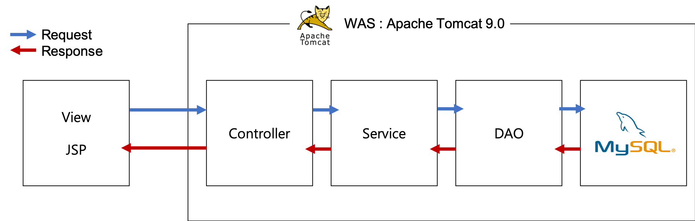
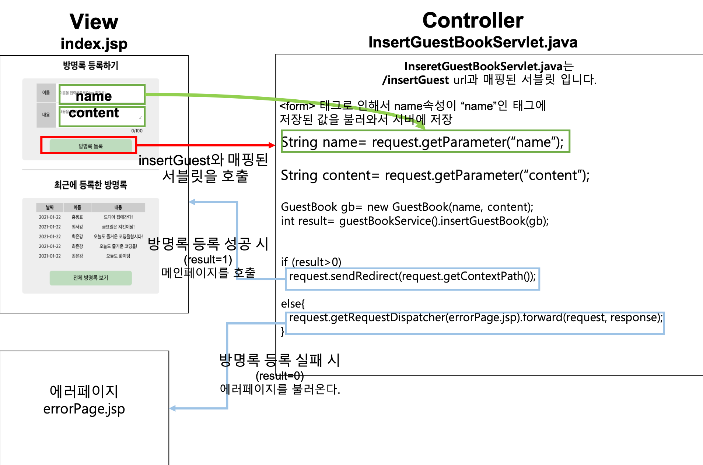
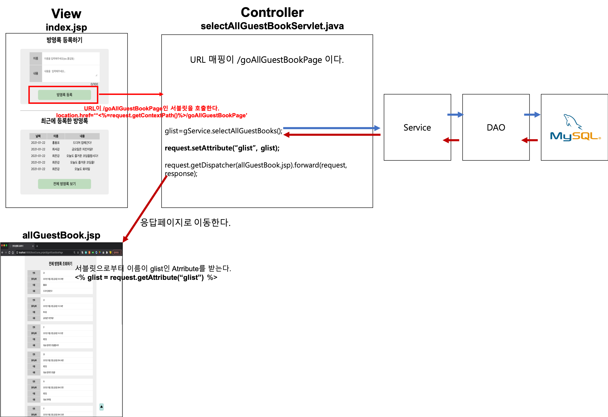
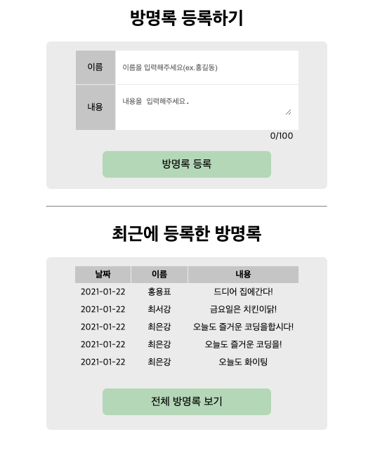
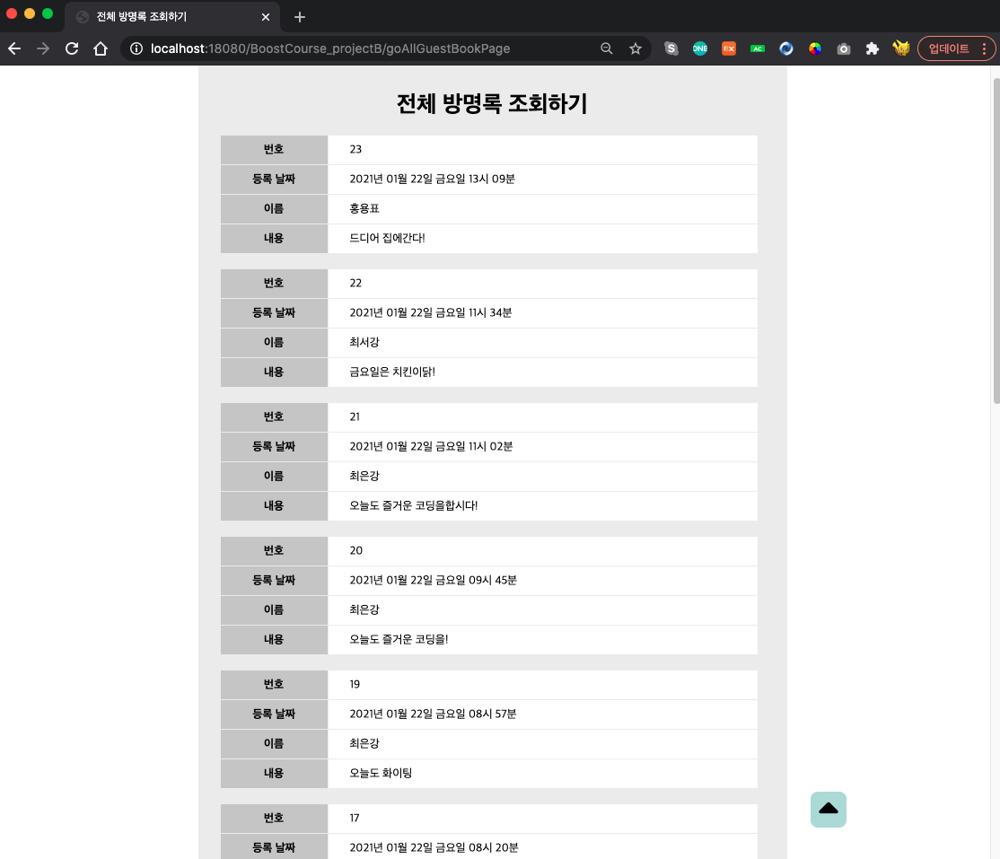

# 방명록 프로젝트

## 1. 사용 기술 스택

|기술스택|상세정보|
|:--:|:--:|
|Language|- Java <br>- JSP & Servlet<br>- HTML, CSS, JS(jQuery), Ajax |
|Server| Apache Tomcat 9.0|
|Design Pattern| MVC Pattern|
|Database|Mysql 8.0.23|

<br>



<hr>

## 2. 프로젝트 개요

> ## 공통

- JDBC의 pooling방식으로 MySQL 데이터베이스에 접근한다.
  - 싱글톤 패턴을 이용하여, 드라이버 객체를 생성없이 공동으로 드라이버를 사용하여 데이터베이스에 접근하도록 한다.

<br>

- 서버의 url은 로컬호스트(127.0.0.1) 이다.

<br><br>

> ## 메인 페이지

- 방명록은 POST방식을 이용하여 등록하고, 비동기방식인 Ajax를 활용한다.

- JSTL & EL을 사용하여 방명록을 데이터를 화면에 랜더링 시킨다.

  - 데이터베이스에 저장된 방명록이 존재하지 않을때는 존재하지 않는다는 메시지와 함께 화면에 랜더링한다.

  - 메인 페이지에 보여주는 방명록은 최신순 5개를 보여준다.


- 목록버튼을 클릭하면 전체 방명록을 볼 수있다.
  - 그러나 저장된 방명록이 없을때는 목록버튼을 볼 수 없다.

<br>

> ## 방명록 목록 리스트 페이지

- 테이블 형태로 방명록을 나타낸다.

  - 방명록 테이블을 나타내는 모든 컬럼에 해당하는 데이터를 보여준다.

- 방명록을 등록한 날짜와 시각(시, 분)을 나타낸다.

- 메인페이지로 돌아가는 버튼이 있다.

- jQuery를 활용하여 맨위로 이동하는 고정 버튼이 있다.

<br>

> ## 최근 방명록 5개 조회 - 응답 & 요청 과정 도식화


<br>

> ## 방명록 등록 - 응답 & 요쳥 과정 도식화



- AJax 와 GSON을 사용하여 비동기식으로 최근에 등록한 방명록 5개를 랜더링하여 동적페이지를 구현하였다.

- jQuery를 사용하여 **이름** 과 **내용** 글자수를 제한시켰다.

- **전체 방명록 보기** 버튼 을 만들었다.
  - 방명록이 존재할 때만 전체방명록 보기 버튼이 있다.
  - `location.href` 을 이용하였다.
    - `location.href` 는 히스토리에 기록하여 페이지를 이동한다.
      - 즉, 뒤로가기 가 가능하다.
    - 반면, `location.replace` 는 히스토리에 기록하지 않고 페이지를 이동한다.
      - 즉, 뒤로가기가 불가능하고 이전 페이지 기록을 남기고 싶지 않은 경우에 사용된다.


`<form action="<%=request.getContextPath()%>/insertGuest" method="POST">` 는 `insertGuest` 라는 URL에 매핑된 서블릿을 호출한다.

`insertGuest` url에 매핑된 서블릿은 **`request.getParameter()`** 로 인해서 index.jsp에서 입력받은 입력값(이름, 내용)을 저장한다.

`request.getParameter("name")` : name속성값이 "name"인 요소에 저장된 텍스트값을 읽어온다.

<br>

> ## 전체 방명록 조회 - 응답 & 요청 과정 도식화




<br>

> ## 방명록 테이블

```sql
CREATE TABLE GUESTBOOK(

GID INT NOT NULL AUTO_INCREMENT,
NAME VARCHAR(20) NOT NULL,
CONTENT VARCHAR(350) NOT NULL,
GDATE DATETIME NOT NULL DEFAULT (NOW()),
PRIMARY KEY(GID)
);
```

<br>

> ## 방명록 객체(GuestBook.java)

JDBC를 통해서 방명록 테이블에 저장된 데이터를 서버에게 전송하려면 방명록 클래스 객체가 필요하다.

```java
package guestBook.model.vo;

import java.sql.Date;

public class GuestBook {
	private int gid;
	private String name;
	private String content;
	private Date date;

	public GuestBook() {}

	public GuestBook(int gid, String name, String content, Date date) {
		super();
		this.gid = gid;
		this.name = name;
		this.content = content;
		this.date = date;
	}

	public int getGid() {
		return gid;
	}

	public void setGid(int gid) {
		this.gid = gid;
	}

	public String getName() {
		return name;
	}

	public void setName(String name) {
		this.name = name;
	}

	public String getContent() {
		return content;
	}

	public void setContent(String content) {
		this.content = content;
	}

	public Date getDate() {
		return date;
	}

	public void setDate(Date date) {
		this.date = date;
	}

	@Override
	public String toString() {
		return "GuestBook [gid=" + gid + ", name=" + name + ", content=" + content + ", date=" + date + "]";
	}

}

```

<hr>

## 3. 뷰 화면

> ### 메인 화면



<br>

> ### 전체 방명록 페이지



<br>

## 4. [전체 코드 보러가기](./projectB)
