> # 아파치 톰캣 설치하기 (macOS)

- Tomcat 9.0버젼으로 설치
  - [아파치 톰캣 사이트](https://tomcat.apache.org)
  - [아파치 톰캣 설치하기 참고자료](https://hyunah030.tistory.com/2)

<br>

- Apache Tomcat 저장경로
  - 현재 작업 자바프로젝트 저장장소( `Document/review_java_backend`)에

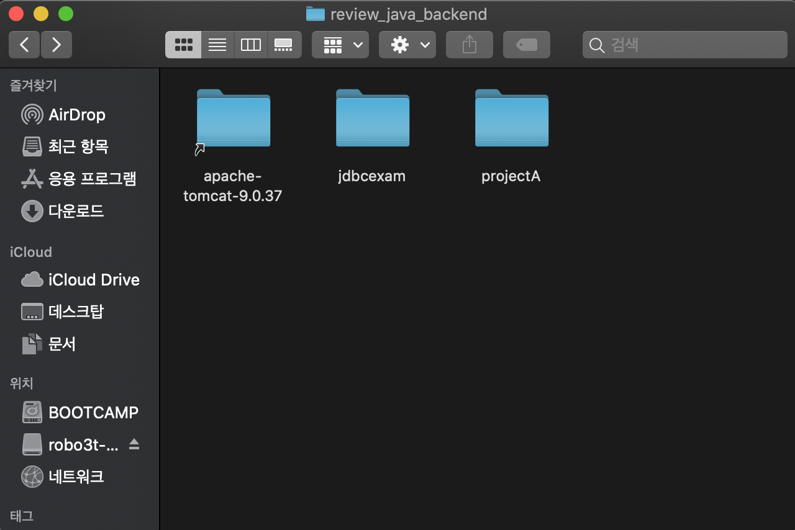

<br>

> # Java Web Application 만들기 (with Tomcat Server)

- Dynamic Web Project 만들기

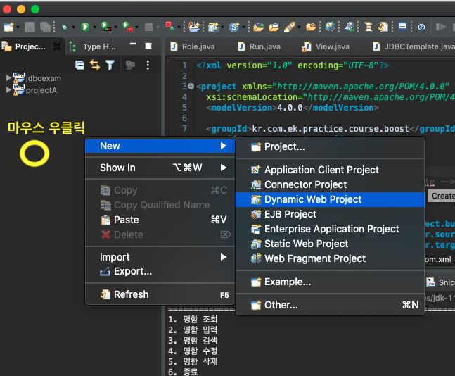

<br>

- 서버 만들기 및 서버 설정

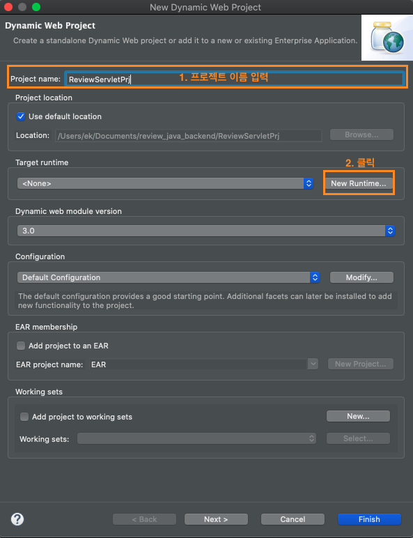

<br>

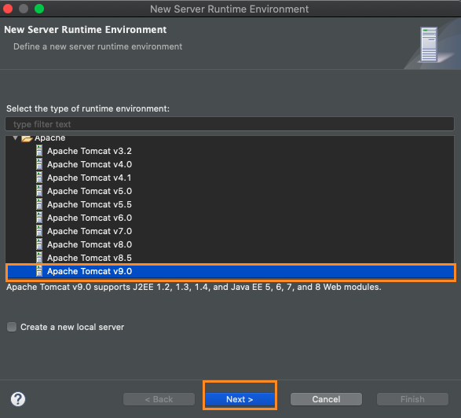

<br>

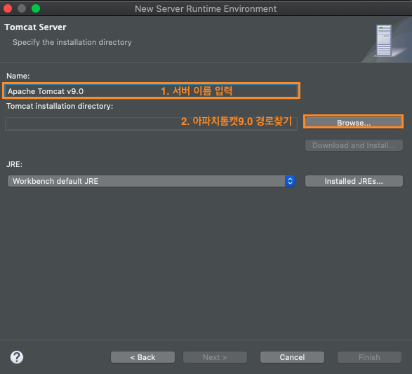

<br>

- 톰캣 설치 경로는, 프로젝트에 저장한 톰캣 폴더를 선택하면된다.

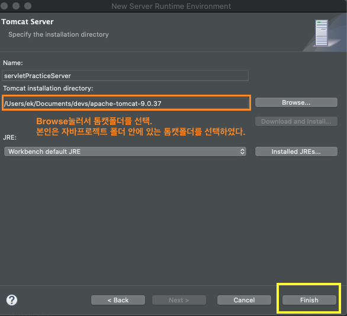

<br>

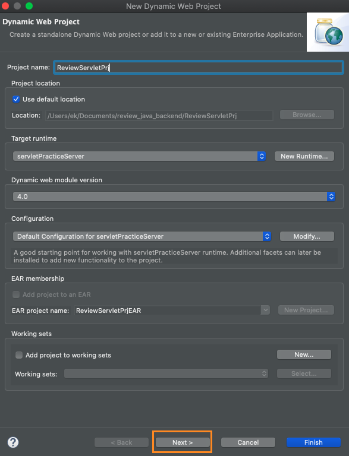

<br>

- **`WebContent/WEB-INF/classes`** 로 변경한다.

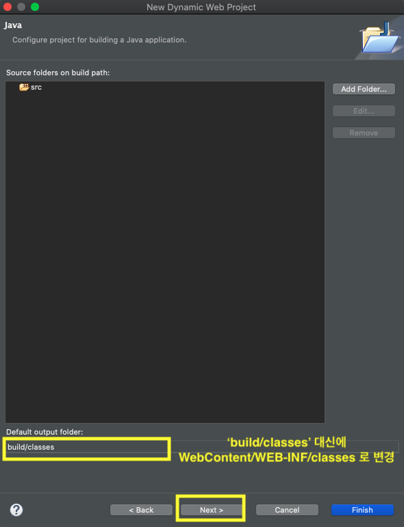

<br>

- **Generate web.xml deployment descriptor** 체크박스 체크하기.

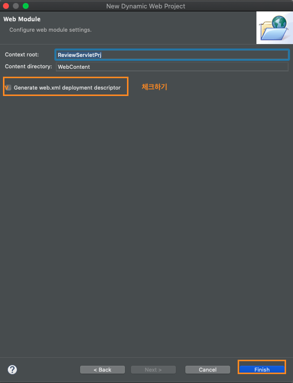

<br>

- 서버 설정하기

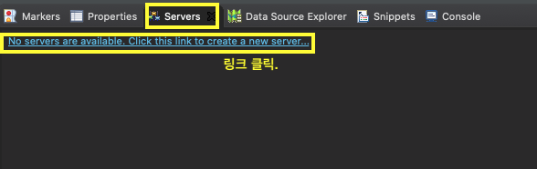

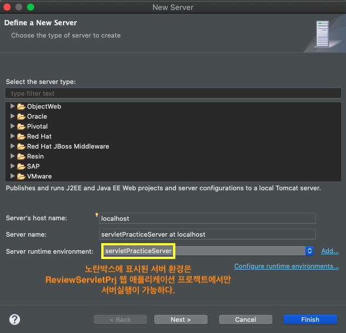

<br>

- 서버 포트 변경하기

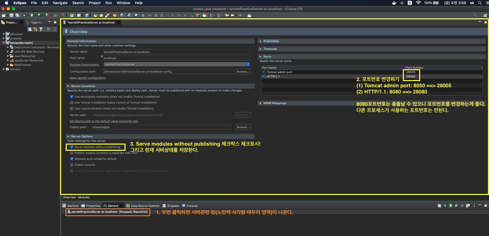

<br>

<hr>

> # (추가) jar파일들 추가 설치

## 1. ojdbc6.jar

> ### ojdbc (Open Database Connectivity)

데이터베이스에 접근하기 위한 표준 개방형 API

접속하려는 DBMS에 맞는 드라이버가 필요하다.

`*.jar` 파일로 설치해서 프로젝트에 직접 추가를 해야한다.

**ojdbc6.jar** 설치 페이지 링크

https://www.oracle.com/database/technologies/jdbc-upc-downloads.html

<br>

그러나 Maven과 Gradle 프로젝트에서는 데이터베이스와 접근 및 연결할 때

ojdb에 관한 라이브러리를 추가해야한다.

<br>

## 2. cos.jar

> ### cos 라이브러리의 쓰임

- cos.jar 라이브러리는 파일을 업로드/다운로드 할 때 사용한다.
- 그래서 `<form>` 태그에 `enctype=multipart/form-data` 형식을 갖는다.

단, 스프링 프로젝트에서는 필요없다. 서블릿을 직접 만들어야되는 프로젝트에서는 필요하다.

<br>

> ### cos.jar 다운로드 방법

http://servlets.com/cos/ 에 접속하여 `zip` 파일을 다운로드한다.

<br>

## 3. gson.jar


서버에 있는 클래스 타입의 객체를

JSON 형태로 클라이언트(뷰)에게 전달한다.


> ### XML (eXtensible Markup Language)

웹브라우저 간 HTML 문법이 호환이 가능하며

정보 손실없이 효율적으로 주고받을 수 있는 다목적 마크업 언어이다.


유니코드 기반으로 다국어를 지원할 수 있다.


사용자가 직접 문서의 태그를 정의할 수 있으며 다른사람이 정의한 태그를 사용이 가능하다.


텍스트, 이미지, 오디오, 비디오 와 같은 멀티미디어 자료를 자동적으로 전송하고 저장할 수 있도록 지원한다.

<br>

**마크업 언어** : 다른문서의 처리를 위해 문서의 논리구조나 체계를 정의하는 언어이다.


<BR>

> ### JSON

키(key)와 값(value) 형태의 데이터를 표현하는 객체이다.

인터넷상에서 데이터를 주고받을 때, 자료를 표현하는 방법이다.


```json
{
  "nickname" : "loveAlakazam",
  "url": "https://github.com/loveAlazam",
  "memberCode": 1
}
```

<BR>

> ### GSON

객체를 컨트롤러에서 뷰로전달 할때, 사용되는 라이브러리이다.

Json 라이브러리보다 더 편하게 데이터를 주고 받을 수 있도록 만든 라이브러리이다.

클래스를 JSON 형태로 전달한다.  

<br>

- ### *.jar 설치방법

https://github.com/google/gson 에 접속하여 라이브러리를 다운로드한다.


## 4. 프로젝트에 추가하는 방법

- `cos.jar`, `ojdbc.jar`, `gson.jar` 등 관련 라이브러리를 추가하는 방법입니다.


- ### 다이나믹 웹프로젝트에서 jar파일 추가하기

`웹프로젝트` > `WebContent` > `WEB-INF` > `lib` 에 위치한 **lib** 폴더에 저장한다.

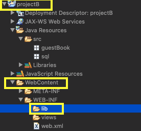

<br>

> ### Spring Maven 프로젝트에서 jar파일 추가하기  

**`pom.xml`** 의 `<dependencies>` 태그안에 넣는다.

`<dependecy>` 태그는 라이브러리를 불러오는 태그이다.

메이븐 프로젝트에 라이브러리를 제공하는 사이트가 있다.

https://mvnrepository.com/


```xml
<dependencies>
  <!-- ojdbc6 추가 -->
  <dependency>
    <groupId>com.oracle.database.jdbc</groupId>
    <artifactId>ojdbc6</artifactId>
    <version>11.2.0.4</version>
  </dependency>

  <!--json 라이브러리 추가-->
  <!-- https://mvnrepository.com/artifact/com.googlecode.json-simple/json-simple -->
  <dependency>
      <groupId>com.googlecode.json-simple</groupId>
      <artifactId>json-simple</artifactId>
      <version>1.1.1</version>
  </dependency>


  <!-- gson 라이브러리 추가-->
  <!-- https://mvnrepository.com/artifact/com.google.code.gson/gson -->
  <dependency>
      <groupId>com.google.code.gson</groupId>
      <artifactId>gson</artifactId>
      <version>2.8.6</version>
  </dependency>

</dependencies>

```
