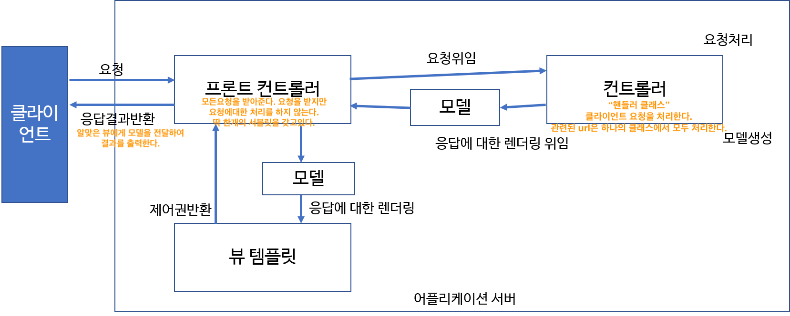

# MVC  (Model View Controller)

**Model**
- 뷰가 랜더링하는데 필요한 데이터.
- 사용자가 요청한 상품목록, 주문내역 등이 해당.

**View**
- 웹 애플리케이션에서 뷰는 실제로 보여주는 부분.
- 모델을 사용하여 랜더링을 한다.

**Controller**
- 사용자의 액션에 응답하는 컴포넌트
- 모델을 업데이트하고 다른 액션을 수행한다.

 

# MVC 모델 - Web Module - Spring MVC

 

# Spring MVC 기본 동작 흐름

- Spring MVC를 이해한다는 것은 DispatcherServlet이 어떻게 요청하는지를 이해해야한다.

 

- 파란색: (DB 제외) 스프링프레임워크가 만들어야 하는 것/ 보라색: 개발자가 만들어야 하는것/ 초록색: 스프링 또는 개발자

- DispatcherServlet
  - 클라이언트로부터 요청을 받는다.
  - 요청을 처리할 메소드와 서블릿이 무엇인지 Handler Mapping한테서 찾는다.

- Handler Mapping
  - 요청을 처리할 메소드와 서블릿을 찾는다.

- Handler Adapter
  - 요청 처리할 메소드와 서블릿을 컨트롤러에서 실행할 수 있도록 한다.
  - 요청 처리후 응답뷰 이름을 리턴받는다.

- DispatcherServlet은 응답뷰 이름으로 어떤 응답화면을 보여줄지를 ViewResolver을 통해서 찾아서 해당 뷰를 클라이언트에게 응답한다.

 

# DispatcherServlet 내부동작 흐름
