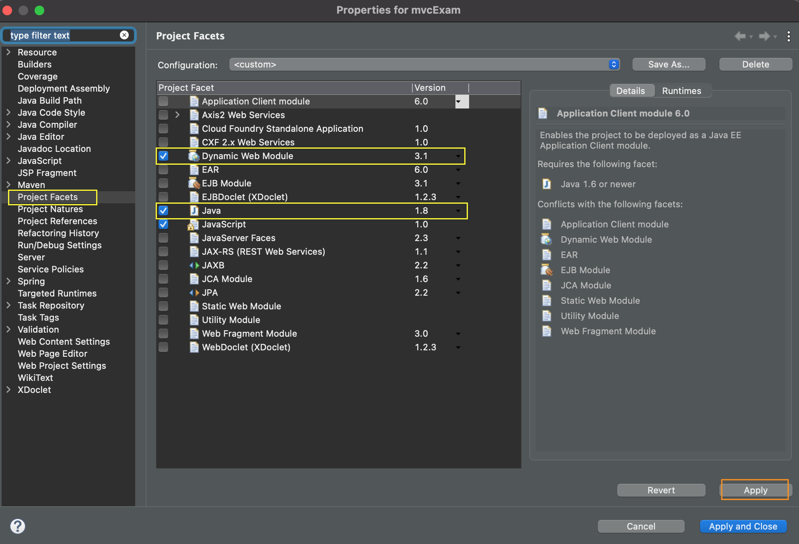

> # Spring MVC 실습 - 프로젝트 세팅

- 프로젝트 세팅
  - Maven 프로젝트
    - GroupId : **org.apache.maven.archetypes**
    - ArtifactId: **maven-archetype-webapp**

<br>

### pom.xml 파일에 라이브러리 추가

```xml
<?xml version="1.0" encoding="UTF-8"?>

<project xmlns="http://maven.apache.org/POM/4.0.0" xmlns:xsi="http://www.w3.org/2001/XMLSchema-instance"
  xsi:schemaLocation="http://maven.apache.org/POM/4.0.0 http://maven.apache.org/xsd/maven-4.0.0.xsd">
  <modelVersion>4.0.0</modelVersion>

  <groupId>com.exam.boostcourse</groupId>
  <artifactId>mvcExam</artifactId>
  <version>0.0.1-SNAPSHOT</version>
  <packaging>war</packaging>

  <name>mvcExam Maven Webapp</name>
  <!-- FIXME change it to the project's website -->
  <url>http://www.example.com</url>

  <properties>
    <project.build.sourceEncoding>UTF-8</project.build.sourceEncoding>
    <maven.compiler.source>1.7</maven.compiler.source>
    <maven.compiler.target>1.7</maven.compiler.target>
    <spring.version>5.2.12.RELEASE</spring.version>
  </properties>

  <dependencies>
    <dependency>
      <groupId>junit</groupId>
      <artifactId>junit</artifactId>
      <version>4.11</version>
      <scope>test</scope>
    </dependency>

    <!--(spring context) spring-context -->
    <!-- https://mvnrepository.com/artifact/org.springframework/spring-context -->
	<dependency>
	    <groupId>org.springframework</groupId>
	    <artifactId>spring-context</artifactId>
	    <version>${spring.version}</version>
	</dependency>

    <!--(spring web mvc) spring-webmvc  -->
    <dependency>
	    <groupId>org.springframework</groupId>
	    <artifactId>spring-webmvc</artifactId>
	    <version>${spring.version}</version>
	</dependency>

    <!-- JSTL : jstl-->
    <!-- https://mvnrepository.com/artifact/javax.servlet/jstl -->
	<dependency>
	    <groupId>jstl</groupId>
	    <artifactId>jstl</artifactId>
	    <version>1.2</version>
	</dependency>

    <!-- JSP : javax.servlet.jsp-api -->
    <!-- https://mvnrepository.com/artifact/javax.servlet.jsp/javax.servlet.jsp-api -->
	<dependency>
	    <groupId>javax.servlet.jsp</groupId>
	    <artifactId>javax.servlet.jsp-api</artifactId>
	    <version>2.3.3</version>
	    <scope>provided</scope>
	</dependency>


    <!--  Servlet : javax.servlet-api -->
    <!-- https://mvnrepository.com/artifact/javax.servlet/javax.servlet-api -->
	<dependency>
	    <groupId>javax.servlet</groupId>
	    <artifactId>javax.servlet-api</artifactId>
	    <version>3.1.0</version>
	    <scope>provided</scope>
	</dependency>


  </dependencies>

  <build>
    <finalName>mvcExam</finalName>
    <pluginManagement><!-- lock down plugins versions to avoid using Maven defaults (may be moved to parent pom) -->
      <plugins>
        <plugin>
          <artifactId>maven-clean-plugin</artifactId>
          <version>3.1.0</version>
        </plugin>
        <!-- see http://maven.apache.org/ref/current/maven-core/default-bindings.html#Plugin_bindings_for_war_packaging -->
        <plugin>
          <artifactId>maven-resources-plugin</artifactId>
          <version>3.0.2</version>
        </plugin>


        <!-- maven-compiler-plugin 라이브러리 -->
        <plugin>
          <artifactId>maven-compiler-plugin</artifactId>
          <version>3.8.0</version>
          <configuration>
          	<source>1.8</source>
          	<target>1.8</target>
          </configuration>
        </plugin>


        <plugin>
          <artifactId>maven-surefire-plugin</artifactId>
          <version>2.22.1</version>
        </plugin>
        <plugin>
          <artifactId>maven-war-plugin</artifactId>
          <version>3.2.2</version>
        </plugin>
        <plugin>
          <artifactId>maven-install-plugin</artifactId>
          <version>2.5.2</version>
        </plugin>
        <plugin>
          <artifactId>maven-deploy-plugin</artifactId>
          <version>2.8.2</version>
        </plugin>
      </plugins>
    </pluginManagement>
  </build>
</project>

```


<br>

### Dynamic Web Module 3.1버젼으로 설정하기

- Navigator > .settings > **org.eclipse.wst.common.project.facet.core.xml** 수정
  - `facet="jst.web"`의 `version`을 **3.1**로 변경한다.

```xml
<?xml version="1.0" encoding="UTF-8"?>
<faceted-project>
  <fixed facet="wst.jsdt.web"/>
  <installed facet="jst.web" version="3.1"/>
  <installed facet="wst.jsdt.web" version="1.0"/>
  <installed facet="java" version="1.8"/>
</faceted-project>

```


- 프로젝트 마우스 오른쪽 클릭 > Properties > Project Facets 에서..
  - **Dynamic Web Module**의 version을 **3.1**로 설정한다.
  - Java 버젼이 **1.8**인지 확인한다.



<br>
