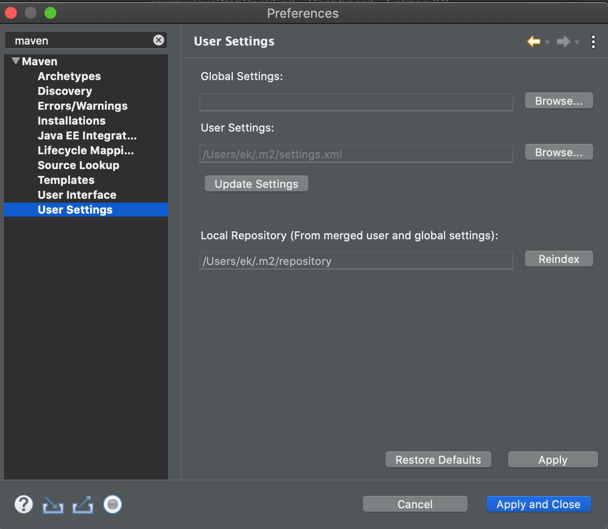
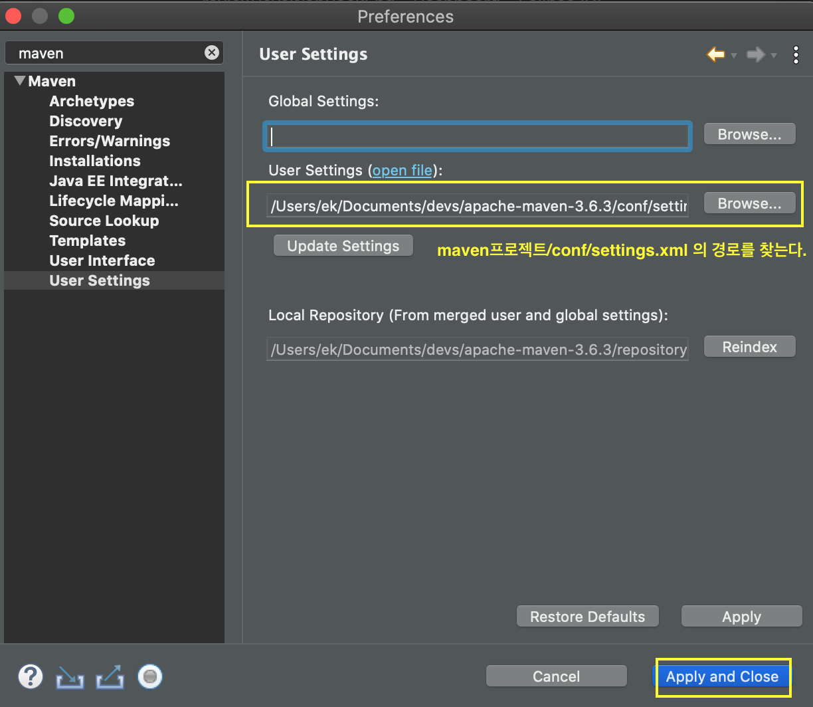

# Maven 빌드툴 설치하기

> # apache-maven-3.6.3  다운로드

<br>

> # apache-maven-3.6.3 > conf > settings.xml 파일 세팅하기

- ### `<settings>` 밑에 `<localRepository>`를 추가한다.

- ### settings.xml 파일

```xml
<!-- 위 생략 -->

<settings xmlns="http://maven.apache.org/SETTINGS/1.0.0"
          xmlns:xsi="http://www.w3.org/2001/XMLSchema-instance"
          xsi:schemaLocation="http://maven.apache.org/SETTINGS/1.0.0 http://maven.apache.org/xsd/settings-1.0.0.xsd">
  <!-- localRepository
   | The path to the local repository maven will use to store artifacts.
   |
   | Default: ${user.home}/.m2/repository
  <localRepository>/path/to/local/repo</localRepository>
  -->

<!-- apache-maven-3.6.3/repository 경로를 넣으면 된다 -->
<localRepository>/Users/ek/Documents/devs/apache-maven-3.6.3/repository</localRepository>

<!-- 아래 생략-->
```

<br>

> # 이클립스 IDE와 연동하기

- **Help > Eclipse Marketplace** 로 들어간다.
- `Maven Integration for Eclipse` 선택
- (macOS) Eclipse > Preference > maven 검색



<br>

- maven프로젝트/conf/settings.xml 경로로 바꾼뒤에 Apply and Close 버튼클릭


