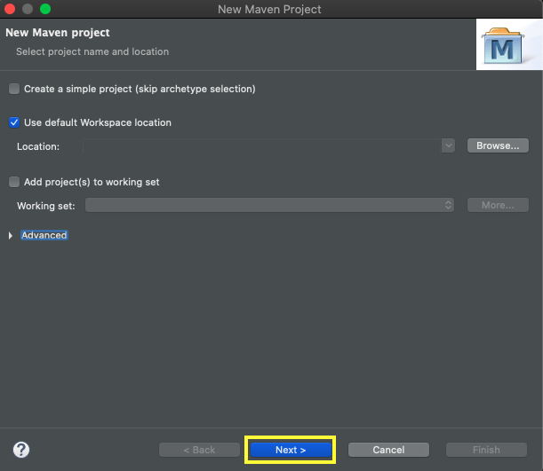
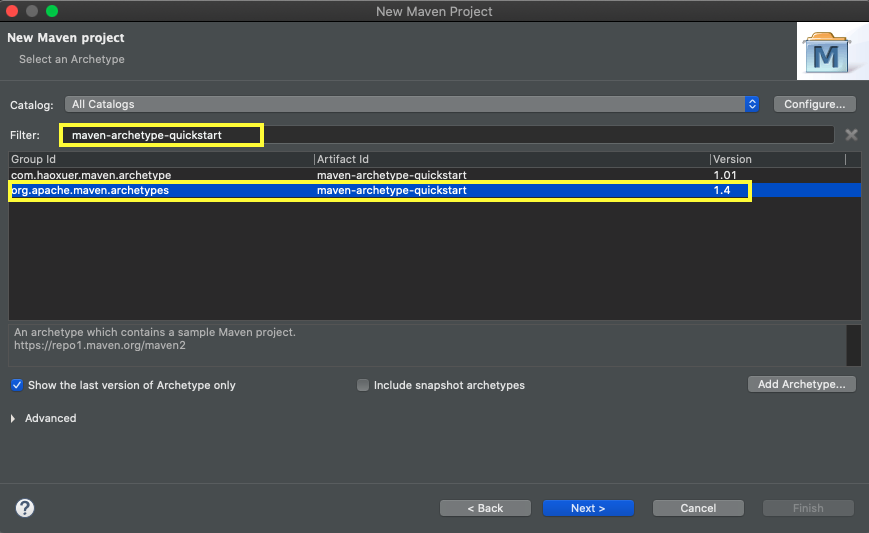
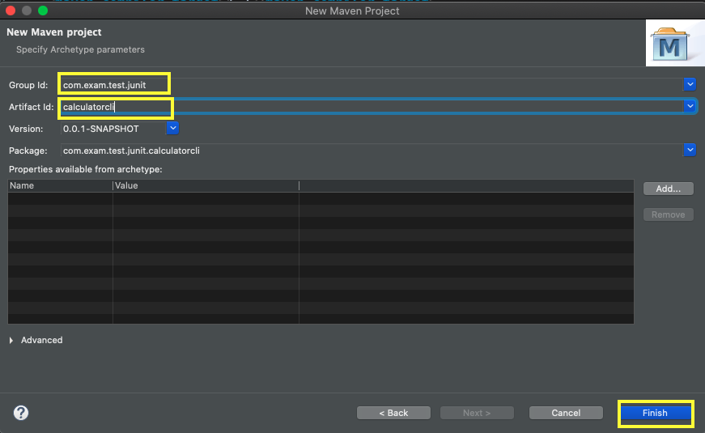
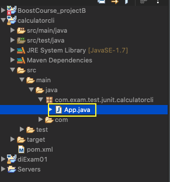
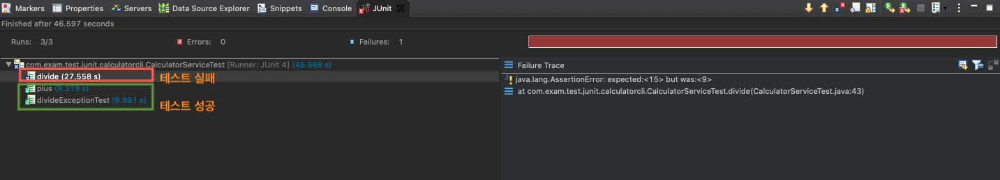

# Spring Test

- [강의자료](https://www.boostcourse.org/web326/lecture/58978/)

<details>
  <summary>요약</summary>

  - 테스팅 [:link:](#testing?)

  - JUnit [:link:](#JUnit)
  - Spring Test Annotation 사용하기 [:link:](#spring-test-annotation-사용하기)
  - 로직 단위테스트 구현 [:link:](#로직-단위테스트-구현)

</details>

> ## Testing?

- 응용프로그램 또는 시스템의 동작과 성능, 안정성이 요구하는 수준을 만족하는지 확인하기 위해 결함을 발견하는 과정

- 전통적인 테스팅
  - 응용프로그램, 시스템이 잘 동작하는지를 확인

- 현재의 테스팅
  - 사용자의 기대 수준과 요구사항에 맞게 구현되고 동작하는지를 확인
  - 결함을 발견하여, 최종적으로 결함데이터를 근간으로 개발 프로젝트의 리스크(Risk)에 대한 수치적인 판단근거를 프로젝트관리자에게 전달하는 것.

- **정적테스트** : 프로그램을 개발하기 전에 요구사항들을 리뷰하는 것.
- **동적테스트** : 프로그램 개발 이후에 실제 실행하면서 테스트를 하는 것.

<br>

- 소프트웨어 시스템의 문제를 최소화하기 위해서 필요
  - 소프트웨어 시스템의 문제 : 소프트웨어가 올바르게 동작하지 않는 경우에 발생하는 문제
    - 1) 금전적 손실
    - 2) 시간 낭비
    - 3) 비즈니스 이미지 손상
    - 4) 오동작으로 인한 사망

<br>

- 소프트웨어 결함 원인
  - 개발자가 잘못 작성한 오류로 인한 결함
    - 의도한 대로 소프트웨어가 동작하지 않는다.
    - 소프트웨어가 동작하지 않아야 하는 상황에서 동작하는 문제가 발생.

- 소프트웨어 개발 , 유지보수, 운영시 테스팅의 역할
  - 소프트웨어는 개발이 완료되면 실제 환경에 배포를 해야 운영이 된다.
  - 소프트웨어가 더이상 사용하지 않을 때까지 계속 유지 보수를 하게된다.
  - 테스팅은 '개발'할 때만 필요한 것이 아니라, '개발', '유지보수', '운영' 단계에서도 모두 필요하다.

  - 테스팅이 언제 필요할까?
    - 1) 테스팅을 통해 릴리즈 전에 발견되지 않은 결함들이 수정되면, 운영환경 내에서 발생하는 리스크를 줄이는데 기여할 수 있고, 소프트웨어 품질에도 도움을 준다.

    - 2) 테스팅은 개발초기의 요구사항 분석단계부터 리뷰 및 인스펙션을 통해 정적으로 이뤄질 수 있으며, 각각의 개발 단계에 대응하는 테스트레벨(test level)에 따른 테스팅이 이뤄진다.

    - 3) 기존에 운영되는 소프트웨어 시스템이 유지보수 활동으로 변경 및 단종되거나 환경이 변하는 경우, 변경된 소프트웨어에 대한 테스팅과 변경된 환경에서의 운영 테스팅이 요구된다.

    - 4) 소프트웨어 테스팅은 계약상(법적) 요구조건들, 산업에 특화된 표준들을 만족시키기 위해 필요하다.


  - 테스팅과 품질
    - 테스팅으로 발견된 결함이 거의 없다면 소프트웨어의 품질에 대한 확신(confidence)을 갖게된다.
    - 잘 설계된 테스트는 시스템의 전반적인 리스크를 감소시키고 결함을 발견한다.
    - 발견된 결함이 수정될 때 소프트웨어 시스템의 품질이 증가된다.
    - 소프트웨어 시스템의 품질을 높이려면, 많은 테스팅 경험과 정보가 필요하다.
    - 다른 프로젝트에서 발견된 결함의 근본적인 원인을 이해함으로써 프로세스를 개선할 수 있다.
    - 결함의 재발을 방지함으로써, 결과적으로 차후 시스템의 품질을 개선할 수 있게 된다.


  - 테스팅은 얼마나 해야 충분할까?
    - `기술적인 내용`, `비즈니스 제품`, `프로젝트 리스크`, `시간 비용` 을 고려해야한다.

    - 테스팅은 개발프로젝트 관련자들이 다음 개발 단계로의 릴리즈(release)에 대한 결정하거나 고객에게 이양(handover)하는 릴리즈에 대한 결정을 내릴 수 있도록 충분한 정보를 제공해야한다.


- 테스팅의 일반적인 원리
  - 원리 1) 테스팅은 결함이 존재함을 밝히는 활동이다.
    - 프로그램이 완벽하다고 증명할 수 없다.
    - 결함이 존재함을 드러낼 수 있지만, 결함이 없다는 것을 증명할 수 없다.

  - 원리 2) 완벽한 테스팅은 불가능하다.
    - 지극히 간단한 소프트웨어를 제외한, 모든 가능성을 테스팅 하는것은 불가능하다.
      - 왜?
        - **무한한 경로** : 한 프로그램 내의 내부 조건이 무수히 많다
        - **무한한 입력값** : 입력이 가질 수 있는 모든값의 조건이 무수히 많다.
        - **무한 타이밍** : GUI 이벤트 발생 순서에 대한 조합도 무수히 많다.

  - 원리 3) 테스팅을 개발 초기에 시작한다.
    - 테스팅활동은 소프트웨어나 시스템 개발 수명주기에서 가능한 초기에 시작된다.
    - 설정한 테스팅 목표에 집중해야한다.
    - 개발 초기 테스팅
      - 개발시작과 동시에 테스트를 계획
      - 요구사항 정의서(요구사항 분석서, 요구사항 설계서) 등의 개발 중간 산출물을 분석하여 테스트.

<br>

> # TDD (테스트 주도개발, Test Driven Developer)

- [참고자료 - (네이버 블로그) 슈어소프트테크](https://m.blog.naver.com/suresofttech/221569611618)


## "테스트를 염두에 둔 프로그램 개발방법"

개발을 하는데 있어서 테스트가 주가 되어 개발을 한다.

- TDD 의 장점
  - **객체지향적인 코드 개발** : 명확한 기능과 구조를 설계
  - **설계 수정 시간의 단축** : 최초설계안을 만족시킨 명확한 입/출력 구조와 기능을 정의
  - **디버깅 시간의 단축** : 각 모듈별 테스트 진행시 문제의 지점을 쉽게 찾을 수 있다.
  - **유지보수의 용이성** : 사용자관점으로 정의되고 진행된 테스트 요소. 명확한 흐름으로 수정이 쉽다.
  - **테스트 문서의 대체 가능** : 테스팅을 자동화시킴과 동시에 정확한 테스트 근거를 산출 가능.

<br>

<hr>

<br>

> # JUnit

## JUnit - 자바언어로된 테스팅 프레임워크

- JUnit은 pom.xml에 있다.
- Maven프로젝트를 생성하게되면 pom.xml에 존재한다.

```xml
<dependency>
      <groupId>junit</groupId>
      <artifactId>junit</artifactId>
      <version>4.11</version>
      <scope>test</scope>
</dependency>
```

<br>

> ## JUnit 에서 사용되는 Annotations

| Annotation 이름 | 설명 |
|:--:|:--:|
|@BeforeClass| 테스트 클래스가 실행되기전에 딱 한번 실행된다.|
|@AfterClass| 테스크 클래스의 모든 테스트 메소드 실행이 끝난 이후에 딱 한번 실행된다.|
|@Before|- 테스트 메소드가 실행되기 전에 실행된다.<br>-테스트 메소드가 5개 있는 테스트클래스를 실행하면 @Before이 붙은 메소드는 5번 실행된다.|
|@After|- 테스트 메소드가 실행된 후에 실행된다.<br>- 테스트메소드가 5개 있는 테스트 클래스를 실행하면 @After가 붙은 메소드는 5번 실행된다.|
|@Test|@Test 어노테이션이 붙은 메소드는 테스트 메소드이다.|

<br>

> ## JUnit의 Annotation들과 테스팅 과정

- 테스트 클래스에 테스트 메소드가 3개가 있다면, 각각의 메소드는 **`@Test`** 가 붙어있어야한다.

- **`@BeforeClass`**: **테스트 클래스가 실행되기 전**에 `@BeforeClass`가 붙은 메소드가 실행된다.
- **`@Before`** : **테스트 메소드가 실행되기 전**에 `@Before`가 붙은 메소드가 실행된다.
- **`@After`** : **테스트 메소드(@Test)가 실행된 후**에 `@Afger`가 붙은 메소드가 실행된다.
- **`@AfterClass`** : **모든 테스트 메소드가 실행된 후**에 `@AfterClass`가 붙은 메소드가 실행된다.
  - 테스트클래스에 3개의 테스트메소드를 실행한다면, 3개모두 실행후에 `@AfterClass` 가 붙은 메소드가 실행된다.


<br>

> ## JUnit의 Assert 클래스가 갖고 있는 주요 메소드

|메소드 이름|설명|
|:--:|:--:|
|assertEquals(x,y)| x(예상값)와 y(실제값)가 일치하면 테스트 성공|
|assertArrayEquals(a,b)| 배열a(예상)와 배열b(실제)가 일치하면 테스트 성공|
|fail()|테스트 실패|
|assertTrue(x)|- x가 `true`일 때 테스트 성공<br>- x가 `false`일때 테스트 실패|
|assertTrue(message, condition)| condition이 `true`이면 message를 표시하여 테스트 성공|
|assertNull(o)| 객체 o가 null이면 테스트 성공|
|assertNotNull(o)| 객체 o가 null이 아니면 테스트 성공|
|assertSame(o1, o2)|- 객체 o1과 객체 o2가 같은 객체일 때 테스트 성공<br>- o1과 o2가 같은 객체를 참조하고 있으면 테스트 성공(참조하고 있는 객체의 주소가 동일한 경우)<br>- `assertEquals()`는 **값이 같은지 확인**하는 것이고, `assertSame()`은 **같은 래퍼런스인지 확인**하는 것이다.|
|assertNotSame(o1, o2)| o1과 o2가 같은 객체를 참조하지 않는다면 테스트 성공|
- #### assert 메소드

테스트 클래스를 실행하고 눈으로 성공했는지 안했는지를 확인하기 위해 화면에 어떠한 결과값을 출력해야되는데, 이러한 불편함을 해소하기 위해서 만들어진 메소드이다.

결과값을 출력해야되는 코드를 만들지 않고 바로 결과값을 확인할 수 있는 메소드이다.


<br>

## JUnit을 이용하여 자바어플리케이션을 테스트해보자.

> ### 1. Maven프로젝트 만들기








<br>

초기에 생성되는 앱클래스를 삭제한다.(App.java 삭제)




<br>

> ### 2. CalculatorService 클래스 작성

```java
package com.exam.test.junit.calculatorcli;

public class CalculatorService {

	public int plus(int v1, int v2) {
		return v1+v2;
	}

	public int minus(int v1, int v2) {
		return v1-v2;
	}

	public int multiply(int v1, int v2) {
		return v1*v2;
	}

	public int divide(int v1, int v2) throws ArithmeticException{
		return v1/v2;
	}

	public int mod(int v1, int v2) throws ArithmeticException{
		return v1%v2;
	}
}

```

<br>

> ###  CalculatorServiceTest.java

- `src/test/java/com.exam.test.junit.calculatorcli` 에 CalculatorServiceTest 클래스를 만든다


```java
package com.exam.test.junit.calculatorcli;

import java.util.Scanner;

import org.junit.Before;
import org.junit.Test;

import org.junit.Assert;

public class CalculatorServiceTest {
	private static Scanner sc= new Scanner(System.in);
	CalculatorService calculatorService;

	// CalculatorService 클래스 생성
	@Before
	public void init() {
		this.calculatorService= new CalculatorService();
	}

	@Test
	public void plus() throws Exception {
		System.out.print("plus테스트 v1값 입력: ");
		int v1= Integer.parseInt(sc.next());

		System.out.print("plus테스트 v2값 입력: ");
		int v2= Integer.parseInt(sc.next());
		int result=calculatorService.plus(v1,v2);

		// 결과가 15일경우에 성공
		Assert.assertEquals(15, result);
	}

	@Test
	public void divide() throws Exception {
		System.out.print("divide테스트 v1값 입력: ");
		int v1= Integer.parseInt(sc.next());

		System.out.print("divide테스트 v2값 입력: ");
		int v2= Integer.parseInt(sc.next());
		try {
			int result=calculatorService.divide(v1,v2);
			// 결과가 15일경우에 성공
			Assert.assertEquals(15, result);
		}catch(ArithmeticException ae) {
			Assert.fail();
		}

	}


	@Test
	public void divideExceptionTest() throws Exception{
		System.out.print("divideException테스트 v1값 입력: ");
		int v1= Integer.parseInt(sc.next());

		System.out.print("divideException테스트 v2값 입력: ");
		int v2= Integer.parseInt(sc.next());

		try {
			calculatorService.divide(v1,v2);
		}catch(ArithmeticException ae) {
			Assert.assertTrue(true); // 실행성공.
			return;//메소드를 더이상 실행하지 않는다.
		}
		Assert.assertTrue(false); //Assert.fail()
	}


}

```


- JUnit으로 테스팅하는 방법: Run As > JUnit 클릭

- JUnit 테스팅 결과




<br>

> ## JUnit 테스트 성공은 무엇을 의미할까?

- ### 1) Exception이 발생하지 않고 테스트메소드가 잘 실행되었다.
- ### 2) Assert.assertXXXX() 메소드가 문제없이 잘 실행되었다.
  - `true`값을 리턴받은 경우.

- 스프링 프레임워크를 사용하면, 객체의 생성을 컨테이너가 하는데 그렇다면 컨테이너가 관리하는 객체(Bean)은 어떻게 테스트를 수행할까..?

<br>

<hr>

<br>

> # Spring Test Annotation 사용하기

> ## 1. pom.xml - 스프링 프레임워크를 사용하도록 기존코드 변경하기.

- http://mvnrepository.com 에서 라이브러리를 다운로드한다.
  - [spring-context](https://mvnrepository.com/artifact/org.springframework/spring-context)
  - [spring-test](https://mvnrepository.com/artifact/org.springframework/spring-test)

```xml
<project>
  ..(생략)..
  <properties>
    <project.build.sourceEncoding>UTF-8</project.build.sourceEncoding>
    <maven.compiler.source>1.7</maven.compiler.source>
    <maven.compiler.target>1.7</maven.compiler.target>

    <!--spring 프레임워크 버젼정보를 프로퍼티로 나타내기 -->
    <spring.version>5.2.12.RELEASE</spring.version>
  </properties>

  <dependencies>
  	<!-- Maven프로젝트 생성됨과 동시에 jUnit 라이브러리는 Junit 4.11 버젼이다.-->
    <!--그런데 SpringJUnit4ClassRunner.class는 4.12버젼이후에 지원한다-->
    <dependency>
      <groupId>junit</groupId>
      <artifactId>junit</artifactId>
      <version>4.12</version>
      <scope>test</scope>
    </dependency>

    <!-- spring-context와 spring-test를 의존성에 추가한다. -->
    <!-- spring-context 추가 -->
    <!-- https://mvnrepository.com/artifact/org.springframework/spring-context -->
	<dependency>
	    <groupId>org.springframework</groupId>
	    <artifactId>spring-context</artifactId>
	    <version>${spring.version}</version>
	</dependency>


	<!--spring-test 추가 -->
	<!-- https://mvnrepository.com/artifact/org.springframework/spring-test -->
	<dependency>
	    <groupId>org.springframework</groupId>
	    <artifactId>spring-test</artifactId>
	    <version>${spring.version}</version>
	    <scope>test</scope>
	</dependency>
  </dependencies>

  ..(생략)..
</project>
```

<br>

> ### ApplicationConfig.java - Java Config방법으로 스프링 설정 파일을 만든다.

- SpringFramework 를 사용하려면 설정파일을 작성해야된다.
- 설정파일을 작성할 수 있는 방법은 2가지가 있다.
  - 1) XML 파일 작성
  - 2) Java Config 클래스를 작성
    - `@Configuration` : spring 설정파일 의미를부여해주는 어노테이션
    - `@ComponentScan(basePackages={"패키지이름"})`
      - 특정 패키지 안에 들어있는 컴포넌트를 찾도록 한다.
      - **패키지 안에 있는 @이 붙어있는 모든 클래스들을 찾아서 bean으로 등록한다.**
        - ComponentScan은 어떤 @이 붙은 클래스들을 찾을까?
          - `@Component`
          - `@Controller`
          - `@RestController`
          - `@Repository`
          - `@Service`


```java
package com.exam.test.junit.calculatorcli;

import org.springframework.context.annotation.ComponentScan;
import org.springframework.context.annotation.Configuration;

@Configuration // 해당클래스가 spring설정 파일임을 의미를 부여해주는 어노테이션

// @ComponentScan
// "com.exam.test.junit.calculatorcli" 패키지안에 있는 컴포넌트를 찾도록한다.
//@어노테이션이 표시된 클래스를 찾아서 bean(객체)으로 등록한다.
@ComponentScan(basePackages={"com.exam.test.junit.calculatorcli"})
public class ApplicationConfig {

}
```

<br>

> ### CalculatorService.java - @Component 붙이기.

- 제어의 역전(IoC): Spring bean 컨테이너에서의 관리는 개발자가 직접 인스턴스를 생성하지 않고, spring bean 컨테이너가 객체를 생성한다.

- **`@Component`**: Spring bean Container가 CalculatorService 클래스를 찾아서 bean으로 등록할 수 있도록 한 어노테이션이다.

```java
package com.exam.test.junit.calculatorcli;

import org.springframework.stereotype.Component;

@Component // ComponentScan이 탐색해서 bean으로 등록하는 클래스라는 의미를 부여하는 어노테이션.
public class CalculatorService {

	public int plus(int v1, int v2) {
		return v1+v2;
	}

	public int minus(int v1, int v2) {
		return v1-v2;
	}

	public int multiply(int v1, int v2) {
		return v1*v2;
	}

	public int divide(int v1, int v2) throws ArithmeticException{
		return v1/v2;
	}

	public int mod(int v1, int v2) throws ArithmeticException{
		return v1%v2;
	}
}

```

> ### Main.java 를 만든다.

- `src/main/java/com.exam.test.junit.calculatorcli` 에 클래스를 생성.

```java
package com.exam.test.junit.calculatorcli;

import org.springframework.context.ApplicationContext;
import org.springframework.context.annotation.AnnotationConfigApplicationContext;

public class Main {

	public static void main(String[] args) {
		// ApplicationConfig.class 설정파일을 읽어들이는 Application 객체를 생성한다.
		// 설정파일을 읽게되면, 컴포넌트를 스캔하고, 컴포넌트를 찾으면 인스턴스를 생성하여
		// ApplicationContext가 관리하게 된다.
		ApplicationContext applicationContext= new AnnotationConfigApplicationContext(ApplicationConfig.class);


		// ApplicationContext가 관리하는 CalculatorService.class 타입의 객체를 요청한다.
		CalculatorService calculatorService = applicationContext.getBean(CalculatorService.class);


		// ApplicationContext 로부터 받은 객체를 이용하여 덧셈을 구한다.
		System.out.println(calculatorService.plus(10,50));

	}
}

```

<br>

> ## 2. CalculatorServiceTest.java - 테스트클래스를 스프링 빈 컨테이너를 사용하도록 수정하기

```java
package com.exam.test.junit.calculatorcli;

import java.util.Scanner;

import org.junit.Assert;
import org.junit.Before;
import org.junit.Test;
import org.junit.runner.RunWith;
import org.springframework.beans.factory.annotation.Autowired;
import org.springframework.test.context.ContextConfiguration;
import org.springframework.test.context.junit4.SpringJUnit4ClassRunner;

@RunWith(SpringJUnit4ClassRunner.class) // JUnit이 테스트 코드를 실행할 때 스프링 빈컨테이너가 내부적으로 생성하도록함.
@ContextConfiguration(classes= {ApplicationConfig.class}) //내부적으로 생성된 스프링 빈 컨테이너가 사용할 설정파일을 지정할 때 사용.
public class CalculatorServiceTest {
  // 스프링 빈 컨테이너가 CalculatorService를 주입하여, 주입한 클래스를 테스트한다.
	@Autowired
	CalculatorService calculatorService;

	private static Scanner sc= new Scanner(System.in);

	// CalculatorService 클래스 생성
	@Before
	public void init() {
		this.calculatorService= new CalculatorService();
	}

	@Test
	public void plus() throws Exception {
		System.out.print("plus테스트 v1값 입력: ");
		int v1= Integer.parseInt(sc.next());

		System.out.print("plus테스트 v2값 입력: ");
		int v2= Integer.parseInt(sc.next());
		int result=calculatorService.plus(v1,v2);

		// 결과가 15일경우에 성공
		Assert.assertEquals(15, result);
	}

	@Test
	public void divide() throws Exception {
		System.out.print("divide테스트 v1값 입력: ");
		int v1= Integer.parseInt(sc.next());

		System.out.print("divide테스트 v2값 입력: ");
		int v2= Integer.parseInt(sc.next());

		int result=0;
		try {
			result=calculatorService.divide(v1,v2);

		}catch(ArithmeticException ae) {
			Assert.fail();
		}
		// 결과가 15일경우에 성공
		Assert.assertEquals(15, result);
	}


	@Test
	public void divideExceptionTest() throws Exception{
		System.out.print("divideException테스트 v1값 입력: ");
		int v1= Integer.parseInt(sc.next());

		System.out.print("divideException테스트 v2값 입력: ");
		int v2= Integer.parseInt(sc.next());

		try {
			calculatorService.divide(v1,v2);
		}catch(ArithmeticException ae) {
			Assert.assertTrue(true); // 실행성공.
			return;//메소드를 더이상 실행하지 않는다.
		}
		Assert.assertTrue(false); //Assert.fail()
	}
}

```

## `@RunWith(SpringJUnit4ClassRunner.class)` 어노테이션
- JUnit이 제공하는 어노테이션
- JUnit은 확장기능을 가지는데, 스프링에서 JUnit을 확장하도록 SpringJUnit4ClassRunner.class 를 제공한다.

- JUnit이 테스트코드를 실행할 때, 스프링 빈 컨테이너가 내부적으로 생성되도록 한다.

<br>

## `@ContextConfiguration(classes={ApplicationConfig.class})` 어노테이션

- 내부적으로 생성된 스프링 bean 컨테이너가 사용할 설정파일을 지정할 때 사용된다.


```java
@Autowired
CalculatorService calculatorService;
```

- 테스트 클래스가 위에 있으면, 테스트 클래스 자체가 bean 객체가 되어 스프링에서 관리하게 된다.

- CalculatorServiceTest 클래스가 bean으로 관리되면서, Spring bean 컨테이너는 CalculatorService를 주입(Inject)할 수 있게 된다.


<br>

<hr>

<br>

> # Mockito를 이용한 단위 로직 단위테스트 구현

- 하나의 bean을 사용한다는 것은 관계된 bean들도 함께 동작한다는 것을 의미한다.

- **`통합테스트`**(integration test): 하나의 bean을 테스트를 할 때 **관련된 빈들이 모두 잘 동작**하는지 테스트

- **`단위 테스트`** (unit test): 관계된 다른 클래스와 상관없이 **특정 bean이 가지고있는 기능만을 잘 동작**하는지 확인하는 테스트


> ### MyService.java 추가

```java
package com.exam.test.junit.calculatorcli;
import org.springframework.stereotype.Service;

@Service
public class MyService {
	private final CalculatorService calculatorService;

	public MyService(CalculatorService calculatorService) {
		this.calculatorService= calculatorService;
	}

	public int execute(int v1, int v2) {
		return calculatorService.plus(v1, v2) *2;
	}
}
```

<br>

> ### MyServiceTest.java

```java
package com.exam.test.junit.calculatorcli;

import org.junit.Test;
import org.junit.runner.RunWith;
import org.springframework.beans.factory.annotation.Autowired;
import org.springframework.test.context.ContextConfiguration;
import org.springframework.test.context.junit4.SpringJUnit4ClassRunner;

import org.junit.Assert;

@RunWith(SpringJUnit4ClassRunner.class)
@ContextConfiguration(classes= {ApplicationConfig.class})
public class MyServiceTest {
	@Autowired
	MyService myService;

	@Test
	public void execute() throws Exception{
		int v1=5;
		int v2=10;

		int result=myService.execute(v1, v2);

		Assert.assertEquals(30, result);
	}
}
```

<br>

`@RunWith(SpringJUnit4ClassRunner.class)` 내부적으로 Spring bean 컨테이너를 생성한다.

Spring bean 컨테이너는 빈들을 찾아서 메모리에 올린다. 이후 myService 필드에 객체를 주입하게 된다.

위의 코드에서는 에러가 발생하지 않았지만, 만약에 MyService를 테스트하려고했는데 CalculatorService의 버그로 인해 에러가 발생했다면 어떻게 해결을 해야될까?

에러가 발생했을 때 목(Mock)객체를 이용하는 것이다.


MyService가 사용하던 CalculatorService를 사용하는 대신에 가짜 객체를 하나 생성하도록 하는 것이다.

내가 원하는 동작을 하는 Mock객체로 CalculatorService를 사용함으로써 MyService의 내용만 테스트를 수행할 수 있다.

<br>

> ### pom.xml - Mockito  라이브러리를 추가한다.

- Mockito는 오픈소스 Mock Framework 다.
- 테스트를 위해서 가짜 객체를 쉽게 만들어줄 수 있는 웹프레임워크이다.

```xml
<!-- test mock을 위한 라이브러리를 추가한다. -->
<!-- https://mvnrepository.com/artifact/org.mockito/mockito-core -->
<dependency>
    <groupId>org.mockito</groupId>
    <artifactId>mockito-core</artifactId>
    <version>3.7.7</version>
    <scope>test</scope>
</dependency>
```

> ### MyServiceTest.java - Mockito 프레임워크를 활용하자.

```java
package com.exam.test.junit.calculatorcli;

import org.junit.Assert;
import org.junit.Test;
import org.junit.runner.RunWith;
import org.mockito.InjectMocks;
import org.mockito.Mock;
import org.springframework.test.context.ContextConfiguration;
import org.springframework.test.context.junit4.SpringJUnit4ClassRunner;

import static org.mockito.BDDMockito.given;
import static org.mockito.ArgumentMatchers.anyInt;
import static org.mockito.Mockito.verify;

@RunWith(SpringJUnit4ClassRunner.class)
@ContextConfiguration(classes= {ApplicationConfig.class})
public class MyServiceTest {
	@InjectMocks
	MyService myService;

	@Mock
	CalculatorService calculatorService;

	@Test
	public void execute() throws Exception{
    //given
		int v1=5;
		int v2=10;
		given(calculatorService.plus(5, 10)).willReturn(15);

    //when
		int result=myService.execute(v1, v2);

    //then
		verify(calculatorService).plus(anyInt(), anyInt());
		Assert.assertEquals(30, result);
	}
}

```

<br>

- Mockito 가 제공하는 JUnit 확장 클래스 MockitoJunitRunner 을 이용하여 테스트 클래스를 실행한다.

```java
@RunWith(MockitoJunitRunner.class)
```

<br>

- `@Mock` 어노테이션은 calculatorService가 목(Mock)객체를 참조하도록 한다.
- 객체를 생성하지 않아도 자동으로 객체가 생성되고 해당 필드가 초기화 됨을 의미한다.

```java
@Mock
CalculatorService calculatorService;
```

<br>

- `@InjectMocks` 어노테이션이 붙은 필드는 목(mock)객체를 사용하는 MyService 객체를 생성하여 초기화하라는 의미를 갖는다.
- myService 역시 초기화하지 않아도 자동으로 MyService 객체가 생성되어 초기화 된다.

```java
@InjectMocks
MyService myService;
```

<br>

```java
given(calculatorService.plus(10,5)).willReturn(15);
```

- `calculatorService`는 가짜객체이다.
- **`given()`**
  - static 메소드이다. (import static org.mockito.BDDMockito.given)
  - `given()`은 까자 객체가 동작하는 방법을 규정한다.

- `calculatorService.plus(10,5)`을 호출하면 plus()메소드가 15를 반환하도록 하라는 의미를 갖는다.

<br>

```java
int result= myService.execute(v1, v2);
```

- `execute()` 메소드는 내부적으로 calculatorService의 plus메소드를 호출한다.
- 해당 메소드는 위에서 설정한대로 동작한다.
- v1, v2가 무슨 값이든지 간에 result는 30을 반환한다.

<br>

```java
verify(calculatorService).plus(anyInt(), anyInt());
```

- `plus(anyInt(), anyInt())`는 어떤 정수든지 2개의 파라미터로 넣어서 plust()메소드를 호출했는지를 검증한다.
- myService.execute() 메소드가 내부적으로 plus() 메소드를 호출했다면 해당 메소드에 대한 검증은 성공이다.
- 만약에 execute() 메소드에서 plus(anyInt(), anyInt())를 호출하지 않으면 오류가 발생한다.
  - 해당 메소드를 호출한적 없다는 Exception이 발생하여 테스트가 실패된다.

- `verify()`와 `anyInt()` 메소드도 static 메소드이다.
  - import static org.mockito.ArgumentMatchers.anyInt;
  - import static org.mockito.Mockito.verify;

- `verify()` 메소드
  - 파라미터로 들어온 객체의 plus() 메소드가 호출된적 있는지 검증한다.
