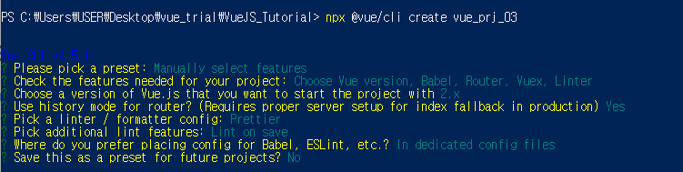

# 맨땅의 헤딩, Vue.js

- [강의자료- 1시간만에 끝내는 Vue.js ](https://www.youtube.com/watch?v=sqH0u8wN4Rs)

> # 1. Vue.js ?

- #### 웹프론트엔드 프레임워크
- SPA(Single Page Application), 컴포넌트(Component)을 구축해줄 수 있는 프레임워크

- #### 컴포넌트(Component)
  - 웹을 구성하는 로고, 메뉴바, 버튼, 모달창 등 웹 페이지 내의 다양한 UI 요소
  - 재사용 가능하도록 구조화 한 것

- #### SPA(Single Page Application)
  - 단일 페이지 어플리케이션
  - 하나의 페이지 안에서 필요한 영역부분만 로딩되는 형태
  - 빠른 페이지 변환
  - 적은 트래픽양

- 단점은, 모든파일을 외부에서 가져오기때문에 최초 로딩 때 너무 느리다.

<br>

- #### Vue CLI

```
npm i -g @vue/cli
```

<br>

- #### 프로젝트만들기

```
vue create 프로젝트명
```

<br>

- #### vue 초기 프로젝트 실행하기

```
npm run serve
```

<br>

- #### bootstrap 설치

```
npm install bootstrap@next
```

<br>

- #### bootstrap vue설치

```
npm i vue bootstrap bootstrap-vue
```

<br>

- #### vue router 설치

```
npm install vue-router --save
```

<br>

# vue의 구조

```vue
<template>

</template>

<script>
export default{
  ...
}
<script>
```

- `<template>`
  - 디자인과 관련된 코드를 넣습니다. template 안에는 HTML코드를 넣습니다.
- `<script>`
  - 자바스크립트 코드이며
  - 디자인의 동작을 나타내거나
  - 이벤트를 캐치하거나
  - 서버와의 통신할때 나타내는 코드입니다.


- ### vue에서의 `<input>`과 `v-model`
  - HTML5에서는 `<input>`태그의 속성 중 하나인 **value** 를 통해서 입력값을 저장한다.
  - 그런데 Vue.js에서는 value 대신에 **v-model**을 통해서 입력값을 바인딩한다.
  - v-model은 데이터바인딩을 하는데 사용된다.

<br>

- ### `@change데이터이름`
  - 데이터를 변경할 수 있는 이벤트메소드를 불러온다.

<br>

- ### `v-for`
  - 다중데이터를 핸들링할 수 있다.

<br>

- ### `v-show`
  - 조건에 상관없이 랜더링한다.
  - 실제화면에 랜더링을 하지만, 스타일을 보이고 안보이고 처리를 함.
  - 리소스를 훨씬 덜 잡아먹는다.

<br>

- ### `v-if`
  - 조건을 만족하면, 랜더링하겠다.
  - 조건을 만족하지 않으면, 아예 화면에 랜더링하지 않는다.
  - 조건에따라 랜더링여부를 결정한다.
  - 특정조건일 때만 보여주는 역할을 할 때 유용하다.

<br>

- ### watch
  - 데이터의 이름과 동일한 메소드이다.
  - 특정데이터를 모니터링하여 변경하는 순간에 호출하는 메소드이다.

<br>

> ### main.js

```js
import Vue from 'vue'
import App from './App.vue'

//router.js의 router을 사용
import router from './router'

//BootstrapVue 를 임포트
import {BootstrapVue, IconsPlugin} from 'bootstrap-vue'

import 'bootstrap/dist/css/bootstrap.css'
import 'bootstrap-vue/dist/bootstrap-vue.css'

Vue.use(BootstrapVue)
Vue.use(IconsPlugin)
//BootstrapVue 임포트끝

Vue.config.productionTip = false

//앱을 마운트할 때 router을 사용.
new Vue({
  router,
  render: h => h(App),
}).$mount('#app')

```

<br>

> ### router.js

```js
import Vue from "vue";
import VueRouter from "vue-router";

import Home from "./views/Home";
import About from "./views/About";

Vue.use(VueRouter);
const router = new VueRouter({
    mode: "history",
    routes: [{
        path: "/",
        component: Home
    }, {
        path: "/about",
        component: About
    }]
});

export default router;

```

<br>

> ### App.vue

```vue
<template>
  <div id="app">
    <!--component에 등록된 Header을 참조하여-->
    <!--Header.vue의 template코드를 불러와서 코드를 넣어준다.-->
    <Header />

    <!--자주바뀌는 컨텐츠 영역을 불러와서 router-view에 넣는다-->
    <div id="content" class="content">
      <router-view></router-view>
    </div>
  </div>
</template>

<script>
import Header from './components/layout/Header.vue';

export default {
  name: 'App',
  components: {
    Header,
  }
}
</script>

<style>
</style>

```


<br>

> ### Home.vue

```vue
<template>
    <div>
        <h1>Welcome {{user}}! ({{location}})</h1>
        <input type="text" v-model="input1" />

        <!--button을 클릭한 순간 input 태그에 있는 값을 갖고오기-->
        <!--click하면 getData()메소드 호출-->
        <button type="button" @click="getData()">Get Input Data</button>
        <button type="button" @click="setData()">Set Input Data</button>

        <!--
            options 배열형태의 데이터를 넣기
            d: data, i:index
            key: options의 원소의 유일한 값
            v-model을 통해서 region데이터로 바인딩.
        -->
        <select class="form-control" v-model="region"  @change="changeRegion">
            <option :key="i" :value="d.v" v-for="(d,i) in options">{{d.t}}</option>    
        </select>

        <!--table만들기-->
        <table class="table table-bordered" v-show="tableShow">
            <tr :key="i" v-for="(d,i) in options">
                <td>{{d.v}}</td>
                <td>{{d.t}}</td>
            </tr>
        </table>
    </div>
</template>

<script>
export default {
    //data handling
    data(){
        return {
            user: "ek12mv2",
            location: "Seoul",
            input1: "sampleInput",
            options: [
                {v: "S", t:"Seoul" },
                {v: "J", t:"Jeju"},
                {v: "B", t:"Busan"},
            ],
            region: "J", //기본값
            tableShow: true,
        };
    },

    //정의한 데이터를 method형식으로 할 수 있다.
    // 데이터의 변경을 캐치할 수 있다.
    // 특정데이터의 변경순간을 모니터링할 수 있는 기능이다.
    watch:{
        input1(){
            console.log(this.input1);
        }
    },

    //method function들을 만들 수 있다.
    //button클릭 이벤트도 해당된다.
    methods:{
        getData(){
            alert(this.input1);
        },

        setData(){
            this.input1="please input data";
        },

        changeRegion(){
            alert(this.region);
        }
    },

    //인스턴스 라이프 사이클 다이어그램을 기반으로 메소드를 만들어본다.
    beforeCreate(){
        console.log('before create');
    },
    created(){
        console.log('create');
    },
    beforeMount(){
        console.log('before mount');
    },
    mounted(){
        console.log('mount');
    },
    beforeUpdate(){
        //데이터변경전
        console.log('before update');
    },
    updated(){
        //데이터변경후
        console.log('update');
    },
    beforeDestroy(){
        console.log('before destroy');
    },
    destroyed(){
        console.log('destroyed');
    },
}
</script>
```

<br><br>


> # 2. Vuex 와 Router 실습예제 - 로그인 상태 관리하기

- [강의 자료 - 맨땅에 개발하기 ](https://www.youtube.com/watch?v=TSyS3hMaDfA)


- ### vue-cli 프로젝트 생성 및 세팅

- #### vue-cli 프로젝트 생성

```
npx @vue/cli create vue_prj_03
```

<br>

- #### 프로젝트 세팅



<BR>

- #### `vuetify` 추가하기

```
vue add vuetify
```

- *Choose a preset: Default* 로 합니다.


<br>
