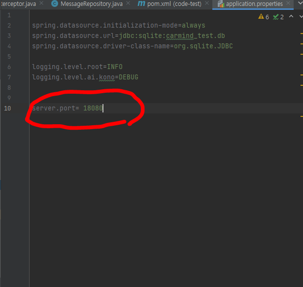
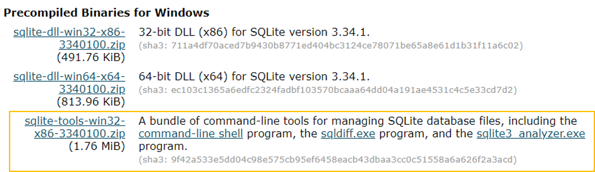
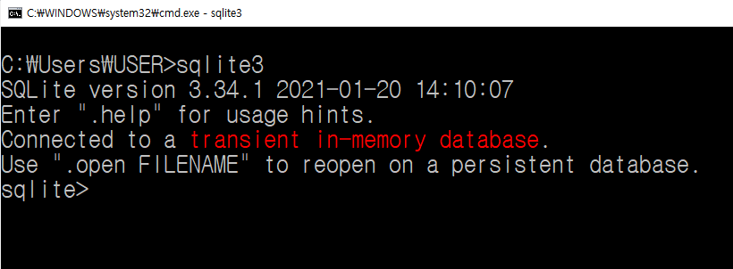

# 문제 해결 과정 1일차

- 진행 날짜: 2021년 2월 12일
- 사용 OS: Windows 10
- JDK Version: JDK 1.8
- 사용 IDE: InteliJ
- 사용 디자인패턴: MVC Pattern


- 당시 나의 상황
  - ReactJS는 노마드코더에서 잠깐 클론코딩을 해봤지만, VueJS도 사용해본적이 없습니다!
  - Spring은 익숙한데, SpringBoot는... 정말 해본적도 없고, 거의 아예 모르는 상태입니다!
  - MySQL, Oracle은 사용할 수 있는데 SQLite는 처음써봅니다!


# 1. InteliJ 에서 프로젝트 실행하기
- 참고자료
  - [InteliJ 실행 전 JDK설정하는 방법](https://atoz-develop.tistory.com/entry/JAVA-%EA%B0%9C%EB%B0%9C-%ED%99%98%EA%B2%BD-%EA%B5%AC%EC%B6%95-JDK-11-IntelliJ-%EC%84%A4%EC%B9%98-%EB%B0%8F-%EA%B8%B0%EB%B3%B8-%ED%99%98%EA%B2%BD-%EC%84%A4%EC%A0%95)
  - [InteliJ IDE에서 JDK설정 방법](https://moonscode.tistory.com/102)
  - [JDK_HOME is set to an invalid directory 에러 해결법](https://woodeekim.tistory.com/32)
  - [Spring Boot 서버포트 변경](https://jason-moon.tistory.com/104)
  - [InteliJ Document - JDK Setting](https://www.jetbrains.com/help/idea/sdk.html#set-up-jdk)

<BR>

> ## 문제상황 1 - JDK 불일치(JAVA_PATH is set to an invalid directory 에러)

- Spring Boot프로젝트를 InteliJ에 임포트하여 터미널명령으로 실행하려고 하는데 JDK불일치가 떴습니다.

- InteliJ 터미널 콘솔 에러메시지

```
Error: JAVA_HOME is set to an invalid directory.
JAVA_HOME = "C:\Program Files\Java\jdk1.8.0_261\bin"
Please set the JAVA_HOME variable in your environment to match the
location of your Java installation.
```

- InteliJ에서 JDK설정
  - File > Project Structure > Project
  - 프로젝트 버젼을 java 1.8로 변경했습니다.


<br>

- 환경 설정파일에서 **bin디렉토리를 포함시키면 안됩니다.**
  - 위의 에러 메시지에서 JAVA_HOME이라는 환경변수의 디렉토리를 `C:\ProgramFiles\Java\jdk1.8.0_261`로 변경해야됩니다.


<br>

> ## 문제상황 2 - 포트 사용불가능

- 프로젝트 생성시에 기본포트번호는 8080입니다. 그런데 제 컴퓨터에서는 Oracle JAVA가 8080을 사용하고 있으므로 포트번호를 변경해야됩니다.

<br>

- 에러메시지

```
***************************
APPLICATION FAILED TO START
***************************

Description:

The Tomcat connector configured to listen on port 8080 failed to start. The port may already be in use or the connector may be misconfigured.

Action:

Verify the connector's configuration, identify and stop any process that's listening on port 8080, or configure this application to listen on another port.

```

<br>

- `application.properties`에서 `server.port` 추가




<hr>

<br>

# 2. SQLite 설치 및 Spring Boot와 연결

- 참고자료
  - [SQLite 설치하기(Windows 10)](https://randstat.tistory.com/entry/sqlite3-%EC%84%A4%EC%B9%98%ED%95%98%EA%B8%B0)
  - [SQLite과 SpringBoot 프로젝트와 연결](https://www.baeldung.com/spring-boot-sqlite)
  - [How to integrate SQLite DB with Spring Boot?](https://fullstackdeveloper.guru/2020/05/01/how-to-integrate-sqlite-database-with-spring-boot/)
  - [Introduce SQLite](https://gywn.net/2013/08/let-me-intorduce-sqlite/)
  - [How to Download & Install SQLite Tools](https://www.sqlitetutorial.net/download-install-sqlite/)

<br>

> ## SQLite 설치 및 실행 Windows

- SQLite 설치



<br>

- path추가
  - 환경변수 > 시스템변수 > 편집 > sqlite 디렉토리 추가


<BR>

- sqlite 실행
  - windows 10에서는 cmd(window키 + R)를 켜서 실행을 합니다.
  - 명령어 `sqlite3` 라고 치면 SQLite가 실행됩니다.



<br>

- SQLite Studio설치
  - 사용목적
    - 편리한 GUI환경으로 데이터베이스 및 테이블을 관리.
    - 편안한 테이블 생성

<br>

> ## pom.xml에서 sqlite-jdbc 추가하기


<br>

<hr>

<br>


# 3. JWT (JSON Web Token)

- 참고자료
  - https://velopert.com/2350

- 서론
  - 미션과제물에 TokenDTO 클래스가 존재해서입니다. 이걸보고 떠오르는 생각은 로그인을 할때 토큰을 기반으로 한다는 것을 알게되었고, 토큰기반의 로그인이 `JWT`임을 알게되었습니다.


- Token 기반 인증은 웹서비스에 많이 사용됩니다.
- API를 사용하는 웹서비스를 개발할 때 토큰을 이용한 인증작업 처리를 합니다.

- **Stateful** Server
  - 클라이언트에게서 요청을 받을 때마다 클라이언트의 상태를 계속 유지시켜 서비스를 제공하는 서버 입니다.
  - 세션유지 웹서버가 대표적입니다.
    - 로그인
    - 아이디 저장

<br>

- **Stateless** Server
  - 토큰기반 시스템은 Stateless Server입니다.
  - 클라이언트의상태정보를 저장하지 않고, 클라이언트 측에 들어오는 요청으로 작업을 처리하는 서버입니다.

  - 상태가 없는 경우 클라이언트와 서버의 연결고리가 없기때문에 서버의 확장성(Scalability)이 높아집니다.

  - Stateless Server은 어떤 장점을 가질까요?
    - 모바일 앱에 적합합니다.
    - 인증정보를 다른 앱에 전달합니다.
    - 앱의 보안을 높일 수 있습니다.

<br>

- 토큰기반 인증시스템을 사용하는 서비스는...
  - GitHub
  - Facebook
  - Google
  - twitter

<br>

- 왜 토큰일까요?
  - 무상태이면서 `확장성`이 있습니다.
    - 토큰은 클라이언트 사이트에서 저장하기 때문에 완전히 stateless하고, 서버를 확장하기에 적합한 환경을 제공합니다.
    - `확장성` (Extensibility)
      - 로그인 정보가 사용되는 분야를 확장하는 것을 의미합니다.
      - 토큰을 사용하여 다른 서비스에서도 권한을 공유할 수 있습니다.
      - 예를 들어, 링크드인에서는 구글, 페이스북, 애플 아이디로 연동해서 로그인이 가능합니다.
    - `확장성` (Scalability)
      - 단순히 서버를 확장하는 것을 의미합니다.
