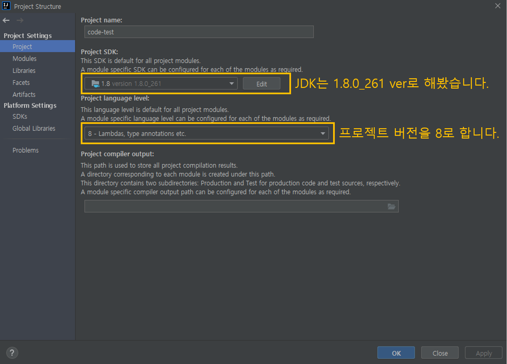

# 문제 해결 과정 1일차

- 진행 날짜: 2021년 2월 12일
- 사용 OS: Windows 10
- JDK Version: JDK 1.8
- 사용 IDE: InteliJ
- 사용 디자인패턴: MVC Pattern


- 당시 나의 상황
  - ReactJS는 노마드코더에서 잠깐 클론코딩을 해봤지만, VueJS도 사용해본적이 없습니다!
  - Spring은 익숙한데, SpringBoot는... 정말 해본적도 없고, 거의 아예 모르는 상태입니다!
  - MySQL, Oracle은 사용할 수 있는데 SQLite는 처음써봅니다!

# 1. Vue.js 설치하고 익숙해지기


- 참고자료
  - Vue JS
    - [Vue.js 설치하기](https://www.vuemastery.com/courses/real-world-vue-js/vue-cli/)
  - Spring Boot
  - [SpringBoot와 VueJS연동하기](https://amanokaze.github.io/blog/Vuejs-Setting-with-SB/)


<br>

> ## Node.js / npm 설치 (14.15.5 LTS)


<br>

> ## vue-cli - 프로젝트 생성하기


```
npm i -g @vue/cli
```

<BR>

```
npm i -g @vue/cli-init
```

<br>

```
vue init webpack 프로젝트이름
```

<BR>

- 프로젝트 설정


<br>

<hr>

<br>

# 2. InteliJ 에서 프로젝트 실행하기
- 참고자료
  - [InteliJ 실행 전 JDK설정하는 방법](https://atoz-develop.tistory.com/entry/JAVA-%EA%B0%9C%EB%B0%9C-%ED%99%98%EA%B2%BD-%EA%B5%AC%EC%B6%95-JDK-11-IntelliJ-%EC%84%A4%EC%B9%98-%EB%B0%8F-%EA%B8%B0%EB%B3%B8-%ED%99%98%EA%B2%BD-%EC%84%A4%EC%A0%95)
  - [InteliJ IDE에서 JDK설정 방법](https://moonscode.tistory.com/102)
  - [JDK_HOME is set to an invalid directory 에러 해결법](https://woodeekim.tistory.com/32)

<BR>

> ## 문제상황 1 - JDK 불일치(JAVA_PATH is set to an invalid directory 에러)

- Spring Boot프로젝트를 InteliJ에 임포트하여 터미널명령으로 실행하려고 하는데 JDK불일치가 떴습니다.

- InteliJ 터미널 콘솔 에러메시지

```
Error: JAVA_HOME is set to an invalid directory.
JAVA_HOME = "C:\Program Files\Java\jdk1.8.0_261\bin"
Please set the JAVA_HOME variable in your environment to match the
location of your Java installation.
```

- InteliJ에서 JDK설정
  - File > Project Structure > Project
  - 프로젝트 버젼을 java 1.8로 변경했습니다.



<br>

- 환경 설정파일에서 **bin디렉토리를 포함시키면 안됩니다.**
  - 위의 에러 메시지에서 JAVA_HOME이라는 환경변수의 디렉토리를 `C:\ProgramFiles\Java\jdk1.8.0_261`로 변경해야됩니다.


<br>

> ## 문제상황 2 - 포트 사용불가능

- 프로젝트 생성시에 기본포트번호는 8080입니다. 그런데 제 컴퓨터에서는 Oracle JAVA가 8080을 사용하고 있으므로 포트번호를 변경해야됩니다.

<br>

- 에러메시지

```
***************************
APPLICATION FAILED TO START
***************************

Description:

The Tomcat connector configured to listen on port 8080 failed to start. The port may already be in use or the connector may be misconfigured.

Action:

Verify the connector's configuration, identify and stop any process that's listening on port 8080, or configure this application to listen on another port.

```

<hr>

<br>

# 3. Vue.js를 View단으로 하기


<HR>

<br>

# 4. SQLite 설치 및 Spring Boot와 연결

- 참고자료
  - https://www.baeldung.com/spring-boot-sqlite
