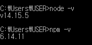
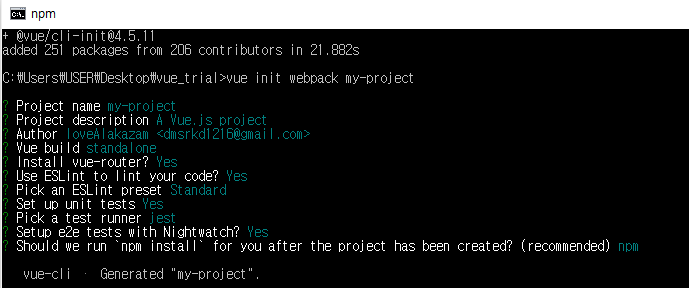

# 문제 해결과정 2일차

# 1. Vue.js 설치하고 익숙해지기


- 참고자료
  - Vue JS
    - [Vue.js 설치하기](https://www.vuemastery.com/courses/real-world-vue-js/vue-cli/)
  - Spring Boot
  - [SpringBoot와 VueJS연동하기](https://amanokaze.github.io/blog/Vuejs-Setting-with-SB/)


<br>

> ## Node.js / npm 설치 (14.15.5 LTS)

- 진행: 2021.02.12



<br><br>

> ## vue-cli - 프로젝트 생성하기

- 진행: 2021.02.12

```
npm i -g @vue/cli
```

<BR>

```
npm i -g @vue/cli-init
```

<br>

```
vue init webpack 프로젝트이름
```

<BR>

- 프로젝트 설정



<br>

<hr>

# 2. Spring Boot프로젝트와 SQLite 연결하기


<hr>
